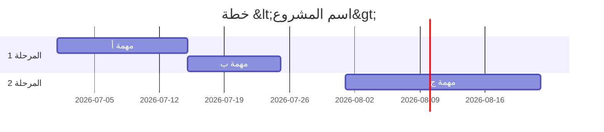

# 📊 المخططات

ضع هنا مخططات المشروع. يُفضَّل **Mermaid** (نصّيّ، قابل للمراجعة في PR)، وتُقبل الصور وملفات PDF.

## مثال Mermaid — مخطط Gantt

```mermaid
gantt
    title خطة <اسم المشروع>
    dateFormat YYYY-MM-DD
    section المرحلة 1
    مهمة أ           :a1, 2026-07-01, 14d
    مهمة ب           :after a1, 10d
    section المرحلة 2
    مهمة ج           :2026-08-01, 21d
```

