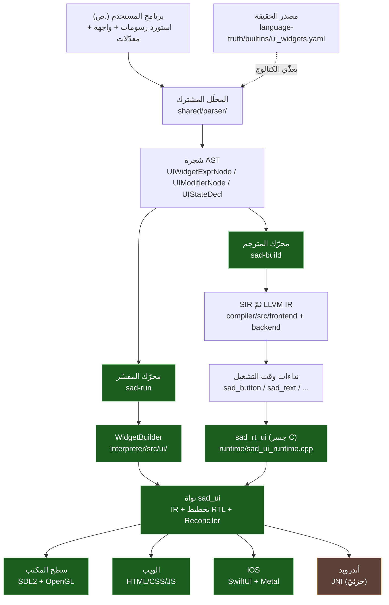
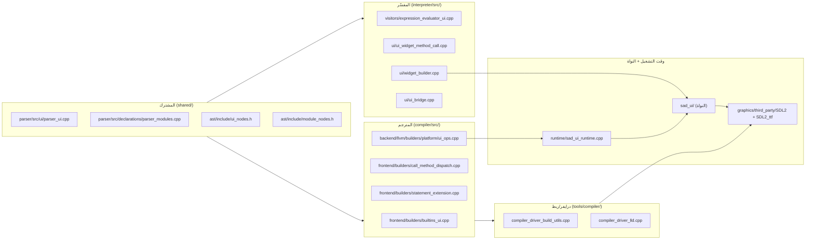
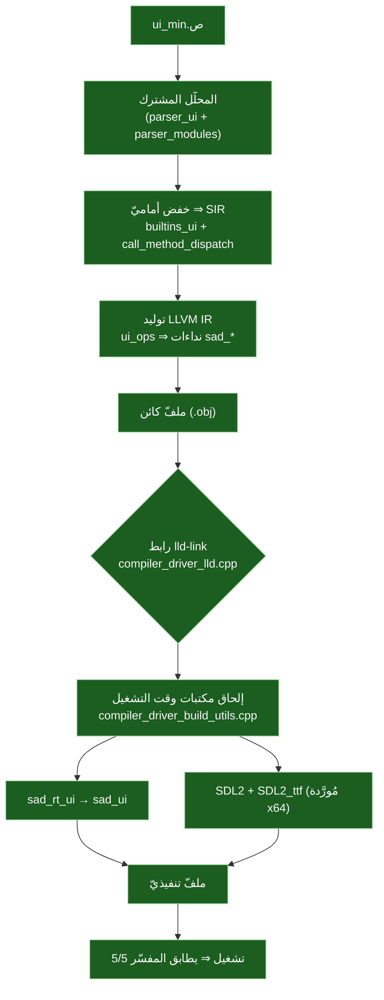
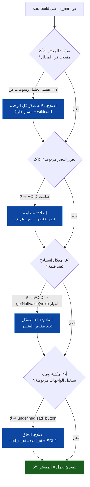
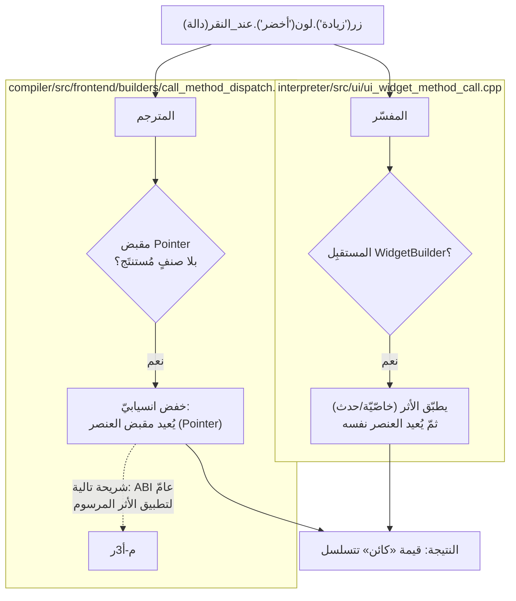
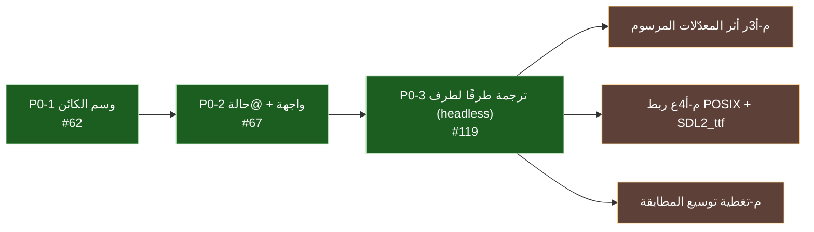
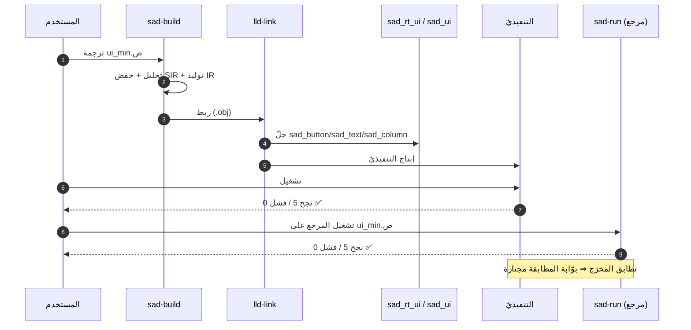

# 📐 مخططات مكتبة الرسومات (SadUI)

مخططات Mermaid تشغيليّة للمعماريّة ومسارات الكود وخطّ الربط وتدفّق إغلاق P0-3.

---

## 1) المعماريّة العامّة — مصدر واحد، محرّكان، بواطن متعدّدة

---

## 2) مسارات الكود — من المصدر إلى الإطار المرسوم

---

## 3) خطّ بناء وربط برنامج UI في المترجم

---

## 4) تدفّق إغلاق P0-3 — الطبقات الأربع

---

## 5) خفض المعدّلات: المفسّر مقابل المترجم

---

## 6) حالة المعالم

---

## 7) تسلسل التشغيل طرفًا لطرف

---

> ⚠️ محتوى **عامّ** — لا أرقام ماليّة ولا أسرار. راجع [GOVERNANCE.md](../../../GOVERNANCE.md).

