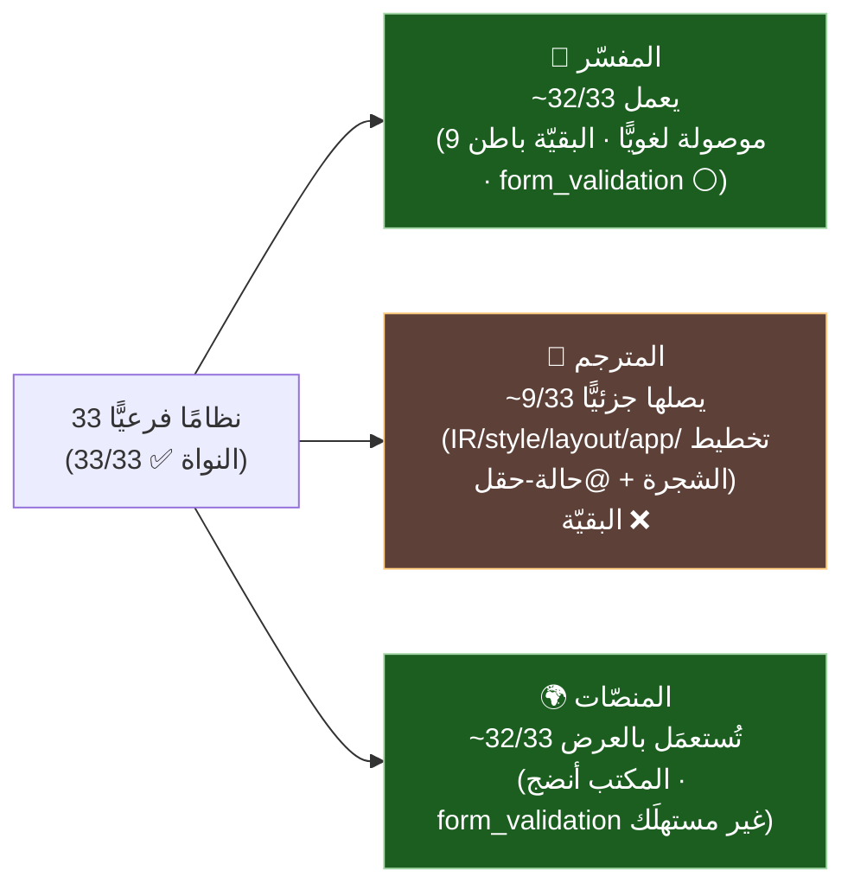

# 🧩 الأنظمة الفرعيّة لـSadUI ونسبة دعمها (مفسّر · مترجم · منصّات)

> توثيق **33 نظامًا فرعيًّا** في نواة `sad_ui/core/include/sad_ui/` (صُحِّح العدد من «34» إلى **33** رأسًا — تحقّق Amelia). لكلّ نظام: حضوره في النواة، ووصله من **المفسّر** (بنّاء `.ص`)، ومن **المترجم** (opcode/مطابقة)، واستعماله في **المنصّات** (العرض).
>
> **منهج (GR-01):** «النواة ✅» = مُجمَّع وموجود. «🔷 المفسّر» = هل يصله المستخدم لغويًّا؟ «🔶 المترجم» = هل له opcode/مطابقة في `builtins_ui.cpp`/`sir_types.h`؟ «🌍 المنصّات» = هل يُستعمَل في العرض؟ التمييز بين «موجود» و«موصول» مقصود ([قدرات-المكتبة](./قدرات-المكتبة-ومقارنة-flutter.md)).

**المفاتيح:** ✅ موصول/مدعوم · 🟡 باطن/جزئيّ (يعمل بلا بنّاء لغويّ مباشر) · ⚪ بلا وصل · ❌ لا opcode.

---

## 1) التفاعليّة (5)

| النظام | الملفّ | النواة | 🔷 المفسّر | 🔶 المترجم | 🌍 المنصّات |
|---|---|:---:|:---:|:---:|:---:|
| الإشارات | `signal.h` | ✅ | ✅ (خيط اللغة) | ❌ لا opcode | ✅ |
| الحالة | `state.h` | ✅ | ✅ (`@حالة` ⇒ `UIStateManager`) | 🟡 (`@حالة` كحقل تعمل؛ بنّاء `عين_الحالة` ❌) | ✅ |
| طابور الأوامر | `command_queue.h` | ✅ | ✅ (دفعات كلّ إطار) | ❌ | ✅ |
| ربط الخصائص | `property_binding.h` | ✅ | 🟡 (`@ربط` parse-only) | ❌ | ✅ |
| المطابقة (Virtual DOM) | `reconciler.h` | ✅ | ✅ (تلقائيّ، 8 رقع) | ❌ (لا مطابقة تفاضليّة في المخرَج) | ✅ |

## 2) التخطيط والعرض (5)

| النظام | الملفّ | النواة | 🔷 المفسّر | 🔶 المترجم | 🌍 المنصّات |
|---|---|:---:|:---:|:---:|:---:|
| التخطيط Flexbox+RTL | `layout.h` | ✅ | 🟡 (تلقائيّ) | ✅ (setters: `SET_FLEX/PADDING/ALIGNMENT`) | ✅ |
| راسم المنصّة | `platform_renderer.h` | ✅ | 🟡 (باطن) | 🟡 (`ارسم`=`APP_RENDER`) | ✅ |
| السمات/الثيم | `theme.h` | ✅ | ✅ (`عين_سمة`/`تبديل_الثيم`) | 🟡 (`SET_FOREGROUND/BACKGROUND` فقط؛ `عين_سمة` ❌) | ✅ |
| الأنماط | `style.h` | ✅ | 🟡 (setters) | ✅ (12 `SET_*` opcode) | ✅ |
| أدوات الألوان | `color_utils.h` | ✅ | 🟡 (مساعِد ضمنيّ) | 🟡 (ضمن setters اللون) | ✅ |

## 3) الإدخال والإيماءات (6)

| النظام | الملفّ | النواة | 🔷 المفسّر | 🔶 المترجم | 🌍 المنصّات |
|---|---|:---:|:---:|:---:|:---:|
| معالج الفأرة | `mouse_processor.h` | ✅ | 🟡 (باطن، HitTest) | ❌ | ✅ |
| معالج اللمس | `touch_processor.h` | ✅ | 🟡 (باطن) | ❌ | ✅ |
| معالج لوحة المفاتيح | `keyboard_processor.h` | ✅ | 🟡 (باطن) | ❌ | ✅ |
| الإيماءات | `gesture.h` | ✅ | ✅ (`عند_سحب`/`عند_قرص`/`عند_تدوير`) | ❌ | ✅ |
| التركيز | `focus.h` | ✅ | 🟡 (باطن) | ❌ | ✅ (مكتب) |
| فيزياء التمرير | `scroll_physics.h` | ✅ | 🟡 (باطن) | ❌ | ✅ |

## 4) جودة المنتج (5)

| النظام | الملفّ | النواة | 🔷 المفسّر | 🔶 المترجم | 🌍 المنصّات |
|---|---|:---:|:---:|:---:|:---:|
| التحريك | `animation.h` | ✅ | ✅ (`حرك`/`مدة`/`منحنى`) | ❌ | ✅ (مكتب) / 🟡 (توليد) |
| الإتاحة a11y | `accessibility.h` | ✅ | 🟡 (جسر) | ❌ | 🟡 (a11y المنصّة) |
| تحقّق النماذج | `form_validation.h` | ✅ | ⚪ **بلا وصل** | ❌ | ⚪ (غير مستهلَك) |
| الإشعارات | `notification.h` | ✅ | ✅ (`شريط_إشعار`) | ❌ (لا مصنع SNACKBAR) | ✅ |
| تخزين الصور | `image_cache.h` | ✅ | 🟡 (باطن) | ❌ | ✅ (عدا freestanding stub) |

## 5) البنية التحتيّة (12)

| النظام | الملفّ | النواة | 🔷 المفسّر | 🔶 المترجم | 🌍 المنصّات |
|---|---|:---:|:---:|:---:|:---:|
| شجرة IR | `ir.h` | ✅ | ✅ (يبني IRNode) | ✅ (مصانع `BUILTIN_UI_*`) | ✅ |
| باني IR | `ir_builder.h` | ✅ | ✅ | 🟡 | ✅ |
| العقدة | `node.h` | ✅ | ✅ | ✅ | ✅ |
| الأنواع | `types.h` | ✅ (100 نوع) | ✅ | 🟡 (20 مصنعًا) | ✅ |
| إدارة الشجرة | `widget_handle/id/node.h` | ✅ | ✅ | 🟡 (`ADD_CHILD`) | ✅ |
| مخصِّص الذاكرة | `ui_arena.h` | ✅ | 🟡 (ضمنيّ) | 🟡 | ✅ |
| أمر الواجهة | `ui_command.h` | ✅ | 🟡 (مع الطابور) | ❌ | ✅ |
| حلقة الإطار | `ui_event_loop.h` | ✅ | ✅ (flush) | 🟡 (`APP_RENDER`) | ✅ |
| التوجيه الهجين | `hybrid_routing.h` | ✅ | 🟡 (باطن) | ❌ | ✅ |
| جسر النظام | `system_bridge.h` | ✅ | 🟡 (باطن) | ❌ | ✅ (كلّ باطن) |

---

## 6) نسبة الدعم الإجماليّة (تقديريّة)

| المحرّك/الطبقة | نسبة الدعم التقديريّة | التفسير |
|---|:---:|---|
| **النواة (موجود)** | **33/33 ≈ 100%** | كلّها مُجمَّعة وجوهريّة (~10.8K سطر) |
| **🔷 المفسّر (يعمل)** | **~32/33 ≈ 97%** | 9 موصولة كبنّاءات `.ص` (تفاعليّة/ثيم/تحريك/إيماءات/إشعارات/IR…)؛ البقيّة بنية تحتيّة تعمل تلقائيًّا؛ **`form_validation` وحده بلا وصل ⚪** |
| **🔶 المترجم (يصلها)** | **~9/33 ≈ 27%** (جزئيًّا) | يصل: IR/العقدة/الأنواع (مصانع)، style/layout (12 setter)، تخطيط الشجرة (`ADD_CHILD`)، التطبيق (`APP_*`)، `@حالة`-كحقل. **يفتقد: التحريك/الإيماءات/التركيز/لوحة المفاتيح/فيزياء التمرير/الإتاحة/الإشعارات/تخزين الصور/التوجيه الهجين/ربط الخصائص/تحقّق النماذج** (لا opcode) |
| **🌍 المنصّات (تستعمل)** | **~32/33 ≈ 97%** | البواطن تستهلك النواة في العرض (محايدة المنصّة)؛ المكتب أنضج (يفتح نافذة)؛ `form_validation` غير مستهلَك؛ صور freestanding stub |

> **القراءة:** النواة شبه كاملة، والمفسّر يستهلكها شبه كاملةً (المرجع)، والمنصّات كذلك في العرض — **لكنّ المترجم يصل ~ربع الأنظمة فقط** (البنية + الأنماط + التطبيق + الحالة-كحقل)، ويفتقد كلّ أنظمة التفاعل/الإيماءات/الجودة المتقدّمة كـopcodes. هذا يتّسق مع نتيجة العناصر (13/42) ودوال التحكّم (0/20): **فجوة المترجم بنيويّة عبر الأنظمة لا في عنصرٍ بعينه** — وهي حصيلة الشرائح م-أ3ر/م-مصانع/م-أسماء/م-تحكّم مجتمعةً.
>
> ⚠️ النِّسب **تقديريّة** (تصنيف وصل لا قياس آليّ دقيق)؛ `form_validation` ⚪ مؤكَّد (نمط «معرّف لا موصول»)، ووصل المترجم مبنيّ على opcodes `sir_types.h` ومطابقات `builtins_ui.cpp` المؤكَّدة.

---

> ⚠️ محتوى **عامّ** — لا أرقام ماليّة ولا أسرار. راجع [GOVERNANCE.md](../../../GOVERNANCE.md).

