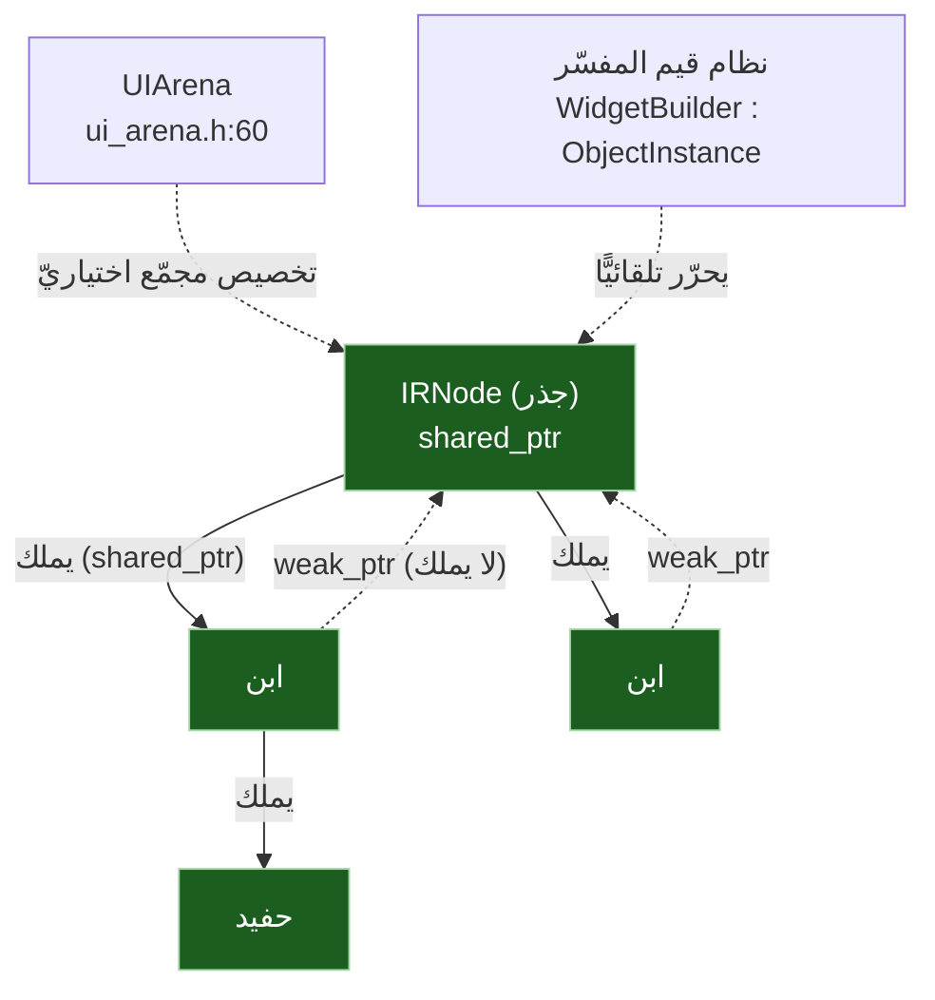
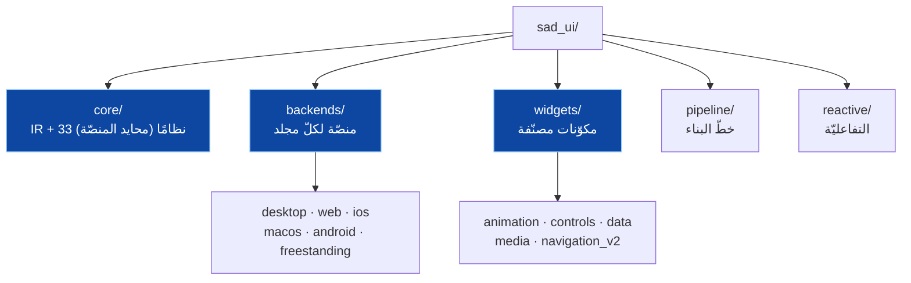

# 🧠 نظام الذاكرة والملكيّة وقابليّة توسّع البنية — SadUI

> يكمّل [تقرير-مسار-الكود-والالتزام](../reports/تقرير-مسار-الكود-والالتزام.md) (الذي غطّى الأنواع/الأخطاء/أمان null/الملكيّة الساكنة) بإجابة سؤالين: **كيف تُدار الذاكرة؟** و**هل بنية المجلدات قابلة للتوسّع؟** — كلٌّ بدليل من `s-programming-language/sad_ui/`.

---

## 1) نموذج الذاكرة (RAII بمؤشّرات ذكيّة — سليم)

| الجانب | الآليّة | الدليل |
|---|---|---|
| ملكيّة الأبناء | `std::shared_ptr<IRNode>` | `ir.h:523,530,570` (`addChild`/`children_`) |
| مرجع الأب | `std::weak_ptr<IRNode> parent_` (تصريح صريح، لا استنتاج) | `ir.h:571` (التصريح: `weak_ptr لتجنب دورات المراجع`) + `:538` (`getParent` ⇒ `parent_.lock()`) — **يكسر الدورات** |
| الإنشاء | مصنع `IRNode::create` ⇒ `shared_ptr` | `ir.h:440` (لا `new`/`delete` يدويّ) |
| التخصيص المجمّع | `UIArena` | `ui_arena.h:60` |
| التحرير في المفسّر | `WidgetBuilder : ObjectInstance` ⇒ نظام قيم المفسّر | `widget_builder.h:69` |
| تحرير صريح | `دمر_عنصر`/`sad_widget_destroy` · `دمر_تطبيق` | `runtime/sad_ui_runtime.cpp` |

**الحكم:** نموذج الذاكرة **سليم وحديث**: ملكيّة بـ`shared_ptr` + مرجع أبٍ بـ`weak_ptr` ⇒ **لا تسريب ولا دورات مرجعيّة** في شجرة العناصر؛ لا `new`/`delete` يدويّ في شجرة IR (`IRNode::create` ⇒ `make_shared`، `ir.cpp:34`)؛ والمفسّر يحرّر العناصر تلقائيًّا عبر نظام القيم. هذا التزام فعليّ بإدارة ذاكرة آمنة — وإن لم يكن عبر مدقّق الملكيّة الساكن (الذي يتجاوز عقد UI، انظر أدناه).

> ✅ **تأكيد لا-دورة عبر الأحداث (GR-01):** فحصتُ `IREvent` (`ir.h:119-136`): يحمل `type`/`expression`/`modifiedStates`/`customEventName`/`propagation` فقط — **لا `shared_ptr<IRNode>`**؛ المعالِج مُشار إليه بـ**اسم تعبيرٍ نصّيّ** لا بمؤشّر مالك. فلا دورة عقدة→حدث→عقدة. الدورة الوحيدة الممكنة (أب↔ابن) مكسورة بـ`weak_ptr`. **النتيجة: لا دورات في الشجرة.**

---

## 2) الملكيّة والأمان (تلخيص + ربط)

> التفصيل الكامل في [تقرير-مسار-الكود-والالتزام §5](../reports/تقرير-مسار-الكود-والالتزام.md). الخلاصة هنا للاكتمال:

| النظام | الحالة لعقد UI | ملاحظة |
|---|:---:|---|
| **الملكيّة الساكنة (borrow_checker)** | ⚪ يتجاوز عقد UI (`override {}`) | لا فحص ملكيّة ساكن خاصّ بالواجهات |
| **ملكيّة وقت التشغيل (الذاكرة)** | ✅ آمنة (shared_ptr/weak_ptr/RAII) | لا تسريب/دورات (هذه الوثيقة §1) |
| **أمان null** | 🟡 عامّ لا خاصّ (NS غير مبنيّ عالميًّا) | العناصر كائنات ⇒ أمان null العامّ |
| **الأنواع** | ✅ قيمةً (كائن) · ⚠️ لا فحص ساكن لـUI | `WidgetBuilder : ObjectInstance` |
| **الأخطاء** | ✅ موحَّد | `consume`/`addError`/`ExecutionError` |

> **تمييز جوهريّ:** «الملكيّة» لها وجهان: **ساكنة** (borrow checker — يتجاوز UI) و**وقت تشغيل** (إدارة ذاكرة الشجرة — آمنة بالمؤشّرات الذكيّة). الأولى فجوة فحصٍ، الثانية سليمة.

---

## 3) قابليّة توسّع بنية المجلدات (سليمة وطبقيّة)

| نقطة التوسّع | كيف تُضاف | التقييم |
|---|---|---|
| **منصّة جديدة** | مجلد `backends/<منصّة>/` + تطبيق `platform_renderer` + `system_bridge` | ✅ نقطة تمديد نظيفة (6 باطنات تثبت النمط) |
| **عنصر/مكوّن جديد** | `widgets/<فئة>/` (animation/controls/data/media/navigation) | ✅ مصنّفة بالمجال |
| **نظام نواة جديد** | رأس + تطبيق في `core/` (محايد المنصّة) | ✅ 33 نظامًا متعايشًا يثبت السعة |
| **مرحلة خطّ بناء** | `pipeline/` | ✅ منفصلة |

**الحكم:** البنية **طبقيّة وقابلة للتوسّع بوضوح**: فصلٌ نظيف بين **النواة المحايدة** (core) و**المنصّات القابلة للإضافة** (backends، نقطة تمديد مثبتة بـ6 باطنات) و**المكوّنات المصنّفة** (widgets) و**الخطّ** (pipeline) و**التفاعليّة** (reactive). إضافة منصّة أو عنصر = إضافة مجلد وفق نمطٍ قائم، لا تعديلٌ متشعّب. هذا **يدعم خارطة الطريق** (أفق 3: منصّات/مكوّنات جديدة) بنيويًّا.

> ملاحظة اتّساق: النمط نفسه في طبقة المترجم (`platform/<منصّة>` لأندرويد JNI) وطبقة المفسّر (`interpreter/src/ui/ui_*_builtins.cpp` مقسّمة بالمجال) — أيْ قابليّة التوسّع متّسقة عبر الطبقات الثلاث.

---

## 4) الأثر على الخطة

- **مُغطّى الآن**: الذاكرة (سليمة RAII) + قابليّة التوسّع (طبقيّة) — هذه الوثيقة.
- **مُغطّى سابقًا**: الأنواع/الأخطاء/أمان null/الملكيّة الساكنة — [تقرير-مسار-الكود-والالتزام](../reports/تقرير-مسار-الكود-والالتزام.md).
- **فجوة باقية مرتبطة**: لا فحص ملكيّة/أنواع/null **ساكن خاصّ بـUI** (زائرات لا-عمليّة) — تبقى شريحة تصميم اختياريّة (ضمانات ساكنة للواجهات) تُوزَن مقابل كلفتها؛ لا تمسّ سلامة الذاكرة وقت التشغيل (آمنة أصلًا).

---

> ⚠️ محتوى **عامّ** — لا أرقام ماليّة ولا أسرار. راجع [GOVERNANCE.md](../../../GOVERNANCE.md).

