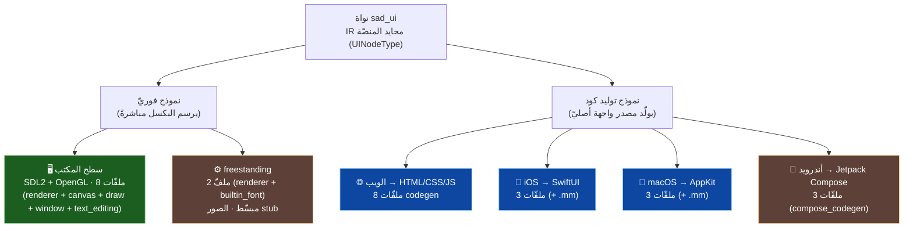
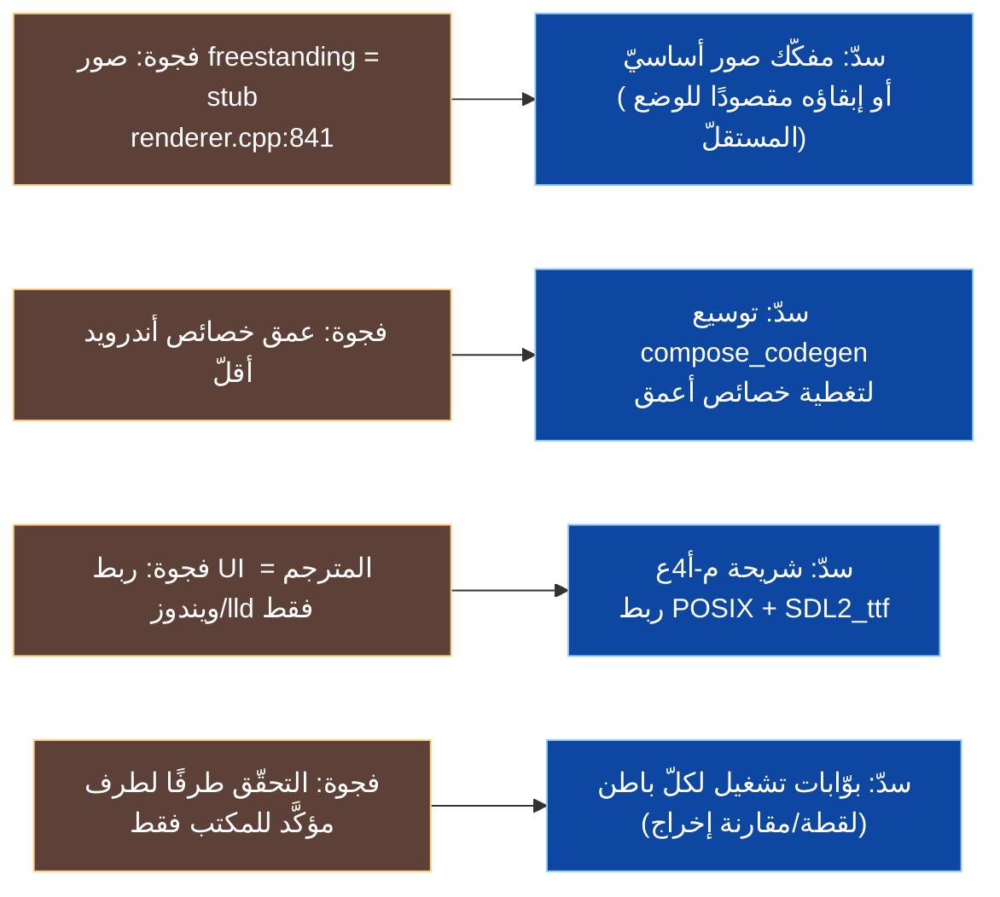
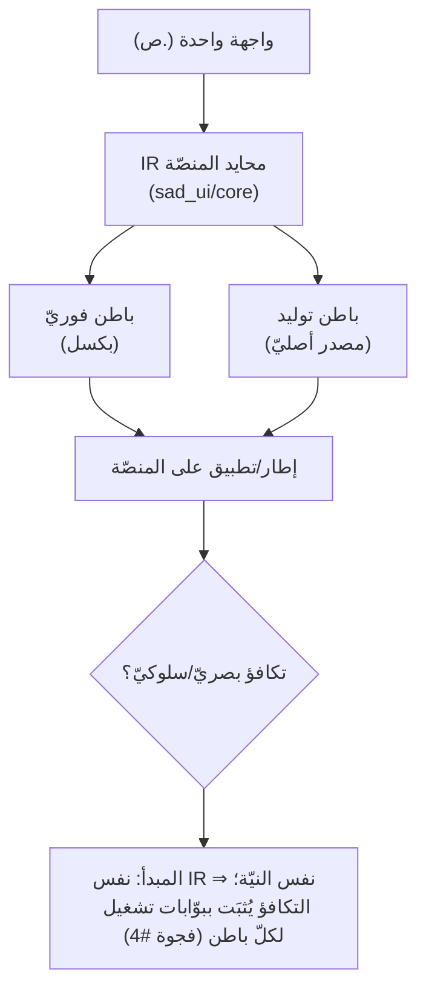

# 🌍 تكافؤ المنصّات — مصفوفة الفجوات وخطّة السدّ (SadUI)

> تخطيط دقيق لتكافؤ البواطن الستّة. كلّ توصيف مدعوم بملفّات `s-programming-language/sad_ui/backends/`.
>
> **تنبيه قياس (GR-01):** عدّ علامات `TODO/stub` **غير موثوق** كمقياس فجوات: فحص نصّيّ ساذج يَعُدّ كلمة «placeholder» (وهي تلميح حقل نصّ لا فجوة). الفحص المنقّى (استثناء التلميحات) يُظهر علامات فجوة صريحة ≈ **صفر** عبر الباطنات عدا **freestanding (صورة واحدة stub)**. لذا نقيس التكافؤ بـ**نموذج العرض + عمق التحقّق + الفجوات المؤكَّدة**، لا بعدّ العلامات.

---

## 1) تصنيف البواطن (نموذجان للعرض)

> ملاحظة طبقات أندرويد: يوجد مساران متمايزان — `sad_ui/backends/android/` (توليد **Compose** في النواة) و`platform/android/` (بنّاء **JNI** مباشر `native_ui_builder` في طبقة المترجم). الأوّل للنواة، الثاني لحزمة التطبيق الأصليّة.

---

## 2) مصفوفة الفجوات

| البُعد | 🖥️ مكتب | 🌐 ويب | 🍎 iOS | 🍏 macOS | 🤖 أندرويد | ⚙️ freestanding |
|---|:---:|:---:|:---:|:---:|:---:|:---:|
| نموذج العرض | فوريّ | توليد | توليد | توليد | توليد | فوريّ |
| عدد ملفّات المصدر | 8 | 8 | 3 | 3 | 3 | 2 |
| نافذة فعليّة / متحقَّق تشغيلًا | ✅ مرجع | 🟡 | 🟡 | 🟡 | 🟡 | 🟡 |
| تحرير نصّ تفاعليّ | ✅ (`text_editing`) | عبر المتصفّح | أصليّ | أصليّ | أصليّ | ⚪ محدود |
| رسم الصور | ✅ | ✅ | ✅ | ✅ | ✅ | ❌ **stub** (`renderer.cpp`) |
| خطوط/نصّ | SDL2_ttf (عند توفّره) | متصفّح | أصليّ | أصليّ | أصليّ | `builtin_font` |
| عمق الخصائص | كامل | كامل | كامل | كامل | 🟡 **أقلّ** | أساسيّ |
| ربط بـ`sad-build` (مترجم) | ✅ ويندوز/lld | ⚪ غير مُتحقَّق | ⚪ | ⚪ | عبر `platform/android` | ⚪ |

**رموز:** ✅ مؤكَّد · 🟡 موجود غير مُتحقَّق طرفًا لطرف · ⚪ غير منطبق/محدود · ❌ فجوة مؤكَّدة.

---

## 3) الفجوات المؤكَّدة (بالدليل) وخطّة السدّ

| # | الفجوة | الدليل | الأولويّة | السدّ المقترح |
|---|---|---|:---:|---|
| 1 | صور freestanding مستطيل رماديّ (stub) | `freestanding/src/renderer.cpp:841` | منخفضة | مفكّك صور أساسيّ، أو توثيقه قيدًا مقصودًا للوضع المستقلّ |
| 2 | عمق خصائص أندرويد أقلّ | بطاقة المشروع + `compose_codegen.cpp` | متوسّطة | توسيع توليد Compose لخصائص أعمق + اختبار 15/15 |
| 3 | ربط UI المترجم متحقَّق على ويندوز/lld فقط | تقرير إغلاق P0-3 | **عالية** | شريحة **م-أ4ع**: حراسة منصّة + مسار POSIX + توريد `SDL2_ttf` |
| 4 | التحقّق طرفًا لطرف للمكتب فقط | لا بوّابات تشغيل للبواطن الأخرى | متوسّطة | بوّابات تشغيل/لقطة لكلّ باطن تُقارَن بالمرجع |

---

## 4) مبدأ التكافؤ

**الخلاصة:** البنية تضمن **حياديّة المنصّة على مستوى IR** (مصدر واحد ⇒ ستّة بواطن). الفجوات ليست في «غياب» باطن بل في: عمق أندرويد، صور freestanding، وربط المترجم على غير ويندوز، **وأهمّها غياب التحقّق التشغيليّ المنهجيّ لغير المكتب**. الأولويّة الأعلى = **م-أ4ع** (ربط POSIX) ثمّ بوّابات التحقّق لكلّ باطن.

---

> ⚠️ محتوى **عامّ** — لا أرقام ماليّة ولا أسرار. راجع [GOVERNANCE.md](../../../GOVERNANCE.md).

