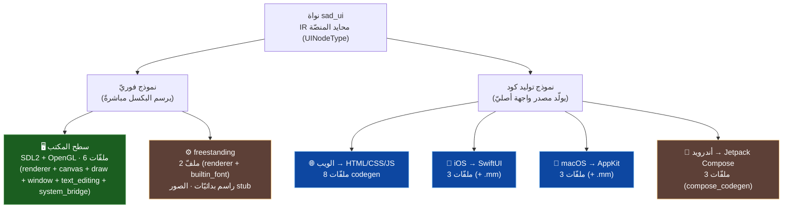
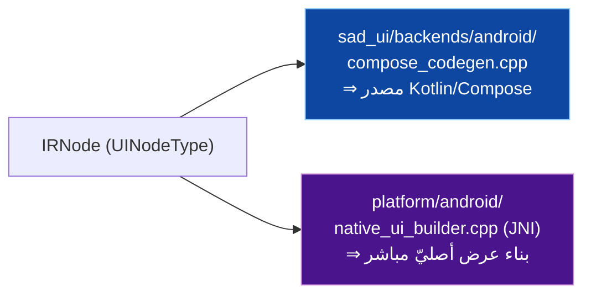
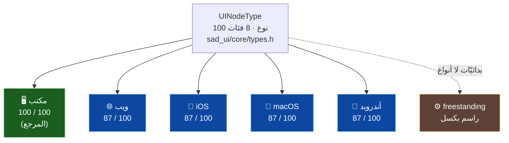
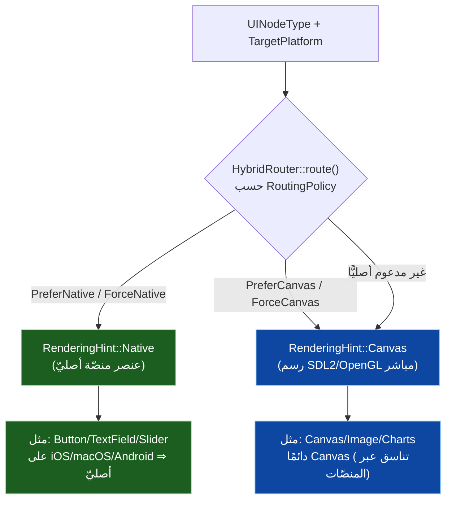
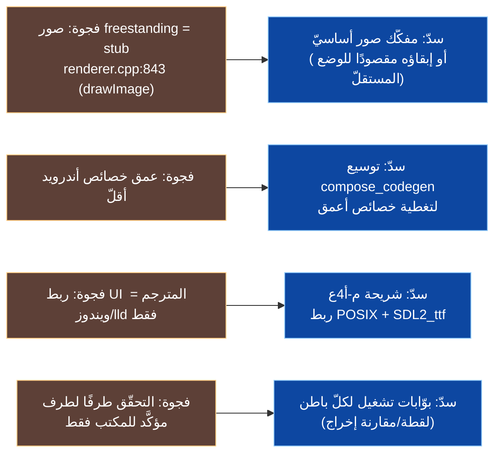
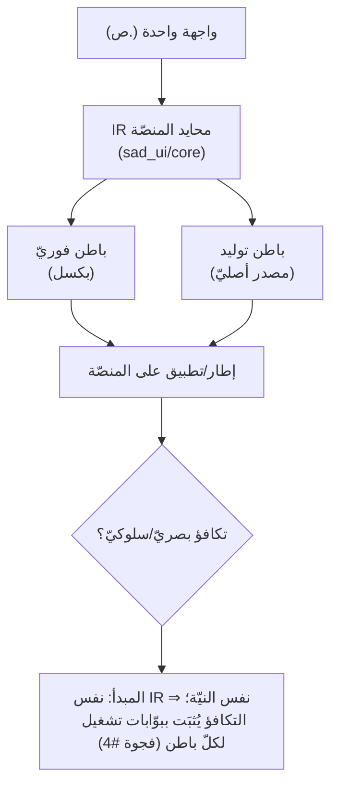

# 🌍 تكافؤ المنصّات — مصفوفة الفجوات وخطّة السدّ (SadUI)

> تخطيط دقيق لتكافؤ البواطن الستّة. كلّ توصيف مدعوم بملفّات `s-programming-language/sad_ui/backends/`.
>
> **تنبيه قياس (GR-01، مُتحقَّق):** عدّ علامات `TODO/stub` **غير موثوق** كمقياس فجوات. تحقّقتُ من الكود: **لا توجد أيّ علامة `TODO`/`FIXME` في الباطنات الستّة** (صفر مطلق)؛ وكلّ مطابقات «placeholder» (نحو 30) **مشروعة** — إمّا تلميح نصّ حقل (`TextField placeholder`/`::placeholder` في CSS) أو مستطيل رماديّ احتياطيّ عند تعذّر تحميل صورة (`desktop/renderer.cpp:570-576`). **الفجوة الحقيقيّة الوحيدة في العرض = صور freestanding** (`drawImage` stub، `renderer.cpp:843`). لذا نقيس التكافؤ بـ**نموذج العرض + تغطية أنواع العقد + الفجوات المؤكَّدة + عمق التحقّق**، لا بعدّ العلامات.

---

## 1) تصنيف البواطن (نموذجان للعرض)

> ملاحظة طبقات أندرويد: يوجد مساران متمايزان — `sad_ui/backends/android/src/compose_codegen.cpp` (توليد **Jetpack Compose** في النواة) و`platform/android/src/native_ui_builder.{cpp,h}` (بنّاء **JNI** مباشر في طبقة المترجم). الأوّل للنواة، الثاني لحزمة التطبيق الأصليّة.

---

## 1ب) تغطية أنواع العقد لكلّ باطن (`UINodeType`)

> النواة تُعرّف **100 نوع عقدة** (`types.h`، `enum class UINodeType`). المكتب مرجعٌ يعالجها كلّها؛ باطنات التوليد الأربعة تشترك في 87 نوعًا.

> الدليل: عدّ مراجع `UINodeType::` المتمايزة في `sad_ui/backends/<b>/src/` — مكتب=100، (ويب/iOS/macOS/أندرويد)=87، freestanding=0 (لا يوجد `switch` على النوع).

---

## 1ج) قرار العرض الهجين (Native مقابل Canvas)

> `sad_ui/core/include/sad_ui/hybrid_routing.h`: لكلّ نوع عقدة يُقرّر الموجِّه أيرسمه عنصرًا أصليًّا للمنصّة أم على لوحة Canvas (SDL2/OpenGL)، حسب `RoutingPolicy`.

> `RoutingPolicy` ∈ { `PreferNative`, `PreferCanvas`, `ForceNative`, `ForceCanvas` } (`hybrid_routing.h:63-68`)؛ والواجهتان `isNativelySupported(type)` و`shouldUseCanvas(type)` (`:123,128`) تُشكّلان القرار. هذا يفسّر صفّ «نموذج العرض» في المصفوفة: المكتب/freestanding فوريّان (Canvas دائمًا)، والأربعة الأخرى تُفضّل الأصليّ وتسقط إلى Canvas عند الحاجة.

---

## 1د) دور `system_bridge` (جسر خدمات النظام)

> موجود في **كلّ** باطن (`backends/<b>/src/system_bridge.cpp`). يربط خدمات النظام الثمانية (السمة/الوضع الداكن/الحافظة/المؤشّر/DPI/...) بآليّة المنصّة. على المكتب: «يربط الأنظمة الثمانية بـSDL2» (`desktop/src/system_bridge.cpp`، ترويسة الملفّ)؛ وعلى الويب: التحويل في JavaScript (`web/src/system_bridge.cpp:100`).

---

## 2) مصفوفة الفجوات

| البُعد | 🖥️ مكتب | 🌐 ويب | 🍎 iOS | 🍏 macOS | 🤖 أندرويد | ⚙️ freestanding |
|---|:---:|:---:|:---:|:---:|:---:|:---:|
| نموذج العرض | فوريّ | توليد | توليد | توليد | توليد | فوريّ (بدائيّات) |
| عدد ملفّات المصدر | 6 | 8 | 3 | 3 | 3 | 2 |
| أنواع `UINodeType` المُعالَجة | **100** (مرجع) | 87 | 87 | 87 | 87 | لا تُوجَّه بالنوع¹ |
| نافذة فعليّة / متحقَّق تشغيلًا | ✅ مرجع | 🟡 | 🟡 | 🟡 | 🟡 | 🟡 |
| تحرير نصّ تفاعليّ | ✅ (`text_editing`) | عبر المتصفّح | أصليّ | أصليّ | أصليّ | ⚪ محدود |
| رسم الصور | ✅ | ✅ | ✅ | ✅ | ✅ | ❌ **stub** (`renderer.cpp`) |
| خطوط/نصّ | SDL2_ttf (عند توفّره) | متصفّح | أصليّ | أصليّ | أصليّ | `builtin_font` |
| عمق الخصائص | كامل | كامل | كامل | كامل | 🟡 **أقلّ** | أساسيّ |
| ربط بـ`sad-build` (مترجم) | ✅ ويندوز/lld | ⚪ غير مُتحقَّق | ⚪ | ⚪ | عبر `platform/android` | ⚪ |

**رموز:** ✅ مؤكَّد · 🟡 موجود غير مُتحقَّق طرفًا لطرف · ⚪ غير منطبق/محدود · ❌ فجوة مؤكَّدة.

> ¹ **freestanding راسم بدائيّات لا موزِّع عُقَد:** لا يحوي `switch(UINodeType)` إطلاقًا (0 مرجع للنوع)، بل واجهة رسم منخفضة المستوى (`putPixel`/`drawFilledRect`/`drawLine`/`drawCircle`/`drawBitmapChar`، `freestanding/src/renderer.cpp`). تترجمه طبقةٌ أعلى (نظير المكتب) إلى بدائيّات؛ فعدم تعامله مع الأنواع **ليس فجوة تغطية** بل موضعٌ مختلف في الطبقات.
>
> **مصدر العدد 100/87:** نواة `sad_ui/core/include/sad_ui/types.h` تُعرّف `enum class UINodeType` بـ**100 نوع** عبر 8 فئات (عرض/إدخال/تخطيط/حاويات/تنقّل/قوائم/حوارات/متقدّمة) — وهي أوسع بكثير من الـ15 عنصرًا الأوّليّ في **المحلّل** (ADR-UI-02)؛ الـ15 هي البوّابة النحويّة، والـ100 هي IR النواة. المكتب (المرجع) يعالجها كلّها؛ باطنات التوليد الأربعة تعالج 87 نوعًا مشتركًا. **الفارق 13 نوعًا = مغلِّفات تخطيط بنمط Flutter** (Align، Center، Padding، Expanded، Flexible، SizedBox، ConstrainedBox، AspectRatio، SafeArea، GestureDetector، InkWell، ListView، FractionallySizedBox) — يعالجها المكتب بحالات `switch` صريحة، بينما تَطويها باطنات التوليد غالبًا في تنسيق الأب (CSS/Modifier) فلا تحتاج حالةً مستقلّة. **يلزم تأكيد** أنّ كلّ نوعٍ منها مُستوعَب فعلًا لا مُسقَط بصمت (فجوة #5).

---

## 3) الفجوات المؤكَّدة (بالدليل) وخطّة السدّ

| # | الفجوة | الدليل | الأولويّة | السدّ المقترح |
|---|---|---|:---:|---|
| 1 | صور freestanding مستطيل رماديّ + علامة × (stub) | `freestanding/src/renderer.cpp:843` (`FreestandingRenderer::drawImage`، التعليق `:841`) | منخفضة | مفكّك صور أساسيّ، أو توثيقه قيدًا مقصودًا للوضع المستقلّ (لا نظام ملفّات) |
| 2 | عمق خصائص أندرويد أقلّ | بطاقة المشروع + `compose_codegen.cpp` | متوسّطة | توسيع توليد Compose لخصائص أعمق + اختبار 15/15 |
| 3 | ربط UI المترجم متحقَّق على ويندوز/lld فقط | تقرير إغلاق P0-3 | **عالية** | شريحة **م-أ4ع**: حراسة منصّة + مسار POSIX + توريد `SDL2_ttf` |
| 4 | التحقّق طرفًا لطرف للمكتب فقط | لا بوّابات تشغيل للبواطن الأخرى | متوسّطة | بوّابات تشغيل/لقطة لكلّ باطن تُقارَن بالمرجع |
| 5 | باطنات التوليد تعالج 87/100 نوع عقدة (المكتب 100) | عدّ مراجع `UINodeType::` في `backends/{web,ios,macos,android}/src` = 87 مقابل المكتب 100؛ الفارق = 13 مغلِّف تخطيط (Align/Center/Padding/Expanded/...) | متوسّطة | تأكيد أنّ كلّ مغلِّف تخطيط مُستوعَب في تنسيق الأب لا مُسقَط بصمت؛ اختبار طيّ التخطيط لكلّ باطن توليد |

---

## 4) مبدأ التكافؤ

**الخلاصة:** البنية تضمن **حياديّة المنصّة على مستوى IR** (مصدر واحد ⇒ نواة `UINodeType` بـ100 نوع ⇒ ستّة بواطن، يوجّهها `HybridRouter` بين الأصليّ والـCanvas). الفجوات ليست في «غياب» باطن بل في: تغطية 87/100 نوع في باطنات التوليد (مغلِّفات تخطيط)، عمق أندرويد، صور freestanding، وربط المترجم على غير ويندوز، **وأهمّها غياب التحقّق التشغيليّ المنهجيّ لغير المكتب**. الأولويّة الأعلى = **م-أ4ع** (ربط POSIX) ثمّ بوّابات التحقّق لكلّ باطن. ملاحظة طبقات: المكتب يعالج كلّ الأنواع وهو المرجع؛ freestanding **راسم بدائيّات** (لا موزِّع عُقَد) في طبقة أدنى.

---

> ⚠️ محتوى **عامّ** — لا أرقام ماليّة ولا أسرار. راجع [GOVERNANCE.md](../../../GOVERNANCE.md).

