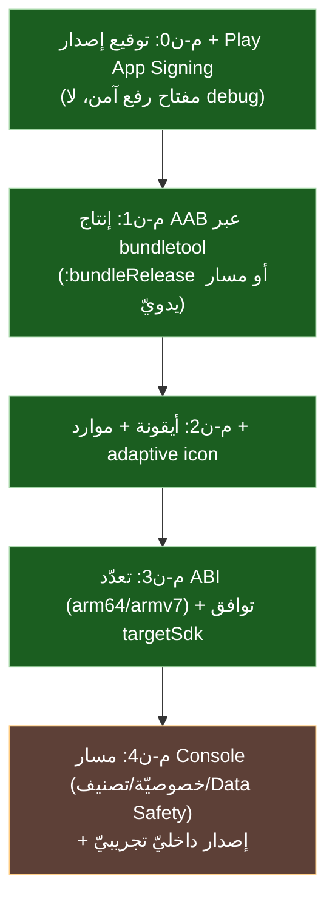

# 📱 جاهزيّة النشر ومُضيف أندرويد (`platform/android/`) — فجوة المتجر

> **النطاق:** هذه الوثيقة عن **طبقة المُضيف/النشر** (`platform/android/`)، لا عن مكتبة الرسومات نفسها ولا عن نقل `features/`. تُجيب: هل تطبيق أندرويد الحاليّ جاهز للنشر على **Google Play**؟ وما الفجوة؟
>
> ⚠️ **حدّ صريح (تمييز جوهريّ):** `platform/android/` **مُضيف** يستهلك المكتبة (يجمّع مصادر `sad_ui` core في الـAPK)، لا جزءًا منها — انظر [نقل-الرسومات-إلى-مجلد-الميزات §1.1](./نقل-الرسومات-إلى-مجلد-الميزات.md). فالنشر **عنصر خارطة طريق مُضيف**، لا نقل بنيويّ ولا قرار SoT لغويّ.

---

## 1) الوضع الحاليّ: مُشغِّل تطوير (APK تصحيح)

**الدليل (GR-01):**
- يبني `libsad_app.so` عبر NDK + Ninja (`platform/android/build_apk.ps1` الخطوة `[1/6]`؛ `platform/android/CMakeLists.txt:220,305`).
- يُحاذي بـ`zipalign` (`build_apk.ps1:145`) ثمّ يوقّع بـ`apksigner` على **`debug.keystore`** بكلمة سرّ `android` (`build_apk.ps1:154-163`) — يُولِّد المفتاح آليًّا إن غاب.
- `AndroidManifest.xml`: `versionCode=2`، `versionName=1.0.1`، `minSdk=24`، `targetSdk=34`، `supportsRtl=true` (`AndroidManifest.xml:4-12`).
- الافتراض `Abi=x86_64` (`build_apk.ps1:7`) — معماريّة **محاكي** لا جهاز شحن (يعزّز حكم «مُشغِّل تطوير»).
- قشرة Java: `MainActivity`/`SadEngine`/`SadViewFactory` (`app/java/com/sad/app/`).

**الحكم:** مُضيف **وظيفيّ** ينتج APK يعمل على جهاز عبر `adb install` — لكنّه **مسار تطوير** لا نشر.

---

## 2) فجوة Google Play (ما ينقص — مؤكَّد بالفحص)

| # | المتطلَّب (Play) | الحالة | الدليل/الملاحظة | الأولويّة |
|---|---|:---:|---|:---:|
| 1 | **توقيع إصدار** + Play App Signing (مفتاح رفع مستقلّ) | ❌ مفتاح تصحيح | `build_apk.ps1:154-163` (`debug.keystore`، `pass:android`) — Play يرفض debug | 🔴 حاجب |
| 2 | **حزمة AAB** (`.aab` إلزاميّة منذ 2021) | ❌ APK فقط | لا `bundletool`/`bundleRelease` في النصوص | 🔴 حاجب |
| 3 | **أيقونة التطبيق** (`ic_launcher` + adaptive) | ❌ غائبة | لا `*.png`/`res/mipmap` | 🔴 حاجب |
| 4 | **حزم تعدّد المعماريّات** في مُخرَج واحد | 🟡 البناء موجود، الحزم لا | `build_android.ps1:59-63` يبني arm64-v8a+armeabi-v7a (`.so` فقط)؛ لكن `build_apk.ps1:7,133` يحزم ABI واحدًا فقط — لا خطّ يحزمها معًا. AAB يقسّم آليًّا | 🟠 |
| 5 | موارد المتجر (strings، عنوان، لقطات) | ❌ لا `res/values/strings.xml` فعليّ | `build_apk.ps1:42` يُنشئ `res\values` فارغًا فقط، و`aapt package` (`:122`) لا يُمرَّر `-S res` — label مضمَّن في manifest فقط | 🟠 |
| 6 | توافق `targetSdk` مع حدّ Play الجاري | ❌ `34` **دون الحدّ** | `AndroidManifest.xml:7`=34؛ حدّ Play للتطبيقات الجديدة/المحدَّثة = **35** (أندرويد 15) منذ 2025-08-31 — رفعٌ **مطلوب لا اختياريّ** (تحقّق من الحدّ الجاري في Play Console عند النشر) | 🔴 حاجب |
| 7 | سياسة خصوصيّة + تصنيف محتوى + Data Safety | ❌ | جانب **Play Console** لا المستودع | 🟠 |
| 8 | حساب مطوّر Play + إصدار مرحليّ (internal/closed) | ❌ | إجراء تشغيليّ خارج الكود | 🟡 |

> **التمييز:** البنود 1-6 **تقنيّة في المستودع**؛ 7-8 **تشغيليّة في Play Console** (لا تُحلّ بكود). **أربعة حواجب** (1/2/3/6) تمنع أيّ رفع أصلًا — أبسطها رفع `targetSdk` (سطر manifest واحد)، وأثقلها AAB + توقيع الإصدار.

---

## 3) خارطة طريق النشر (شرائح مُضيف، مرتّبة)

- **م-ن0 (حاجب):** فصل مفتاح الرفع عن التصحيح + إعداد Play App Signing؛ حفظ المفتاح خارج المستودع (لا أسرار في Git).
- **م-ن1 (حاجب):** خطّ AAB (الأفضل عبر Gradle `bundleRelease`، أو `bundletool build-bundle` فوق البناء الحاليّ).
- **م-ن2 (حاجب):** أيقونة تطبيق + `res/` + adaptive icon (مطلب نشر).
- **م-ن3:** حزم AAB متعدّد ABI (بناء الـ`.so` متعدّد المعماريّات موجود في `build_android.ps1:59-63`؛ الناقص حزمها في مُخرَج واحد) + التحقّق من حدّ `targetSdk` الجاري.
- **م-ن4 (تشغيليّ):** إعداد Play Console — خارج المستودع.

---

## 4) العلاقة بالخطط الأخرى

- **منفصلة عن** نقل `features/` (بنيويّ بحت) — هذه شريحة **مُضيف/نشر**.
- **تقع في** «أفق 2/3» من [رؤية-تنافسيّة-وخارطة-طريق](./رؤية-تنافسيّة-وخارطة-طريق.md) (المنظومة/الوصول الأصليّ)، لا أفق التكافؤ البنيويّ.
- **تنبيه أمان:** مفاتيح **الإصدار/الرفع** والأسرار يجب أن **تبقى خارج المستودع حصرًا**. ملاحظة دقيقة: `debug.keystore` الحاليّ **متتبَّع في Git** (`platform/android/debug.keystore`) — مقبول لأنه مفتاح تصحيح اصطلاحيّ عامّ منخفض الحساسيّة، لكنّه **يثبّت العادة الصحيحة قبل أوانها**؛ أيّ مفتاح إصدار يُمنَع التزامه. (ودقّة أخرى: `build_apk.ps1:154` يستخدم نسخة في `build_android\apk_build` ويولّدها إن غابت — فالـ`debug.keystore` المتتبَّع **غير مستهلَك فعليًّا** في التوقيع.)
- **شرط مسبق منطقيّ:** اكتمال تكافؤ المحرّكين (أفق 1) أهمّ من النشر — لا قيمة لنشر مبكر لمكتبة ناقصة التكافؤ.

---

## 5) الخلاصة

`platform/android/` اليوم = **مُشغِّل تطوير** ينتج APK تصحيح يعمل على جهاز (`adb install`) — **ليس** خطّ نشر متجر. تحويله لجاهزيّة Google Play يتطلّب **أربعة حواجب** (توقيع إصدار + AAB + أيقونة + رفع `targetSdk` إلى حدّ Play الجاري) ثمّ تحسينات (حزم تعدّد ABI، موارد المتجر)، وإجراءات Console تشغيليّة. وكلّها **شريحة مُضيف منفصلة** عن نقل `features/` وعن تطوير المكتبة.

---

> ⚠️ محتوى **عامّ** — لا أرقام ماليّة ولا أسرار. راجع [GOVERNANCE.md](../../../GOVERNANCE.md).
> 🔍 دُقِّقت بـAmelia (bmad-agent-dev, GR-01) — جولتان: كلّ الادّعاءات وأرقام الأسطر مؤكَّدة من الملفّات؛ صُحِّح أنّ بناء تعدّد ABI موجود (`build_android.ps1`) والناقص حزمُه، وأُبرز أنّ `debug.keystore` **متتبَّع في Git** (تناقض في تنبيه الأمان الأصليّ)، وأنّ `targetSdk=34` **دون حدّ Play الحاليّ (35)** فصار حاجبًا لا اختياريًّا.

