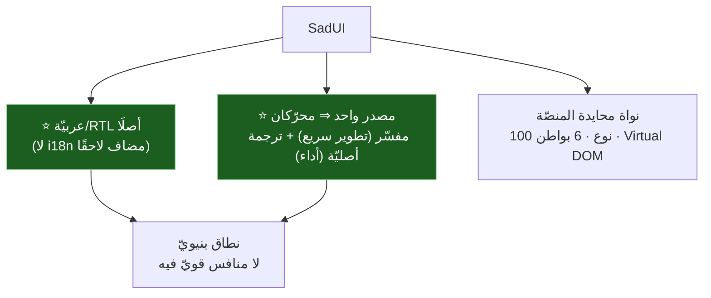
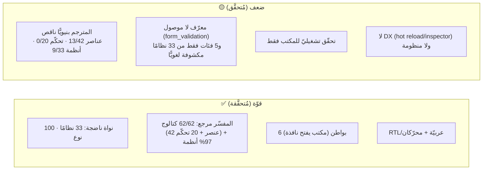
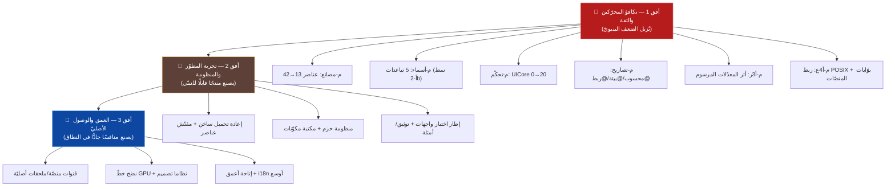
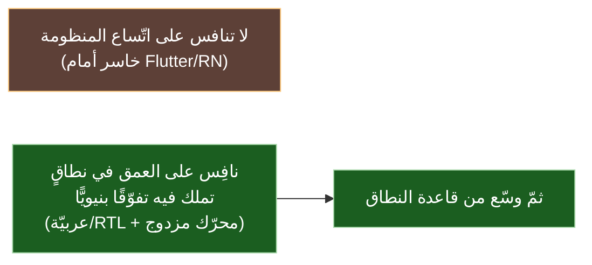

# 🎯 رؤية تنافسيّة وخارطة طريق — SadUI

> تقييم استراتيجيّ: هل يمكن لنظام الرسومات أن ينافس الأطر العالميّة؟ وما المسار؟
>
> ⚠️ **طبيعة الوثيقة:** تقييم ورأي مبنيّ على المعطيات المُتحقَّقة في هذا المجلد (جانب SadUI مدعوم بالكود؛ جانب المنافسين معرفة عامّة بالأطر). الأرقام (13/42 عنصر، 0/20 تحكّم، 9/33 نظام، 33 نظامًا، 100 نوع، 6 بواطن) مُتحقَّقة في الوثائق الأخرى.

---

## 1) الأطروحة: التمايز لا التقليد

SadUI **ليس استنساخًا لـFlutter**؛ له أطروحتان فريدتان لا يملكهما أيّ إطار عالميّ كبير:

**الخلاصة:** المنافسة على **العمق في نطاقٍ متمايز** (العربيّة + المحرّك المزدوج) واقعيّة؛ أمّا «هزيمة Flutter عالميًّا على اتّساع المنظومة» فغير واقعيّة (منظومة + مجتمع تراكَما ثمانية أعوام).

---

## 2) التقييم: قوّة ⇄ ضعف (مُتحقَّق)

> المبشّر: كثير من الفجوة = **توصيل مبنيّ** لا بناء جديد (النواة 97% يستهلكها المفسّر) ⇒ كلفة الوصول إلى التكافؤ أقلّ ممّا تبدو.

---

## 3) الميزات الناقصة مرتّبة بالأولويّة

| # | الفئة | الناقص | الأثر | الأفق |
|---|---|---|:---:|:---:|
| 1 | **تكافؤ المحرّكين** | مصانع/أسماء/تحكّم/أثر-مرسوم/POSIX (الشرائح م-*) | 🔴 أساس المصداقيّة | أفق 1 |
| 2 | **تحقّق المنصّات** | بوّابات تشغيل/لقطة لغير المكتب | 🟠 ثقة التعدّد | أفق 1 |
| 3 | **تجربة المطوّر** | إعادة تحميل ساخن • مفتّش عناصر • مصحّح | 🔴 ركيزة التبنّي | أفق 2 |
| 4 | **المنظومة** | حزم/مكتبات مكوّنات • أمثلة • توثيق | 🔴 لا منتج بلا منظومة | أفق 2 |
| 5 | **الاختبار** | إطار اختبار واجهات | 🟠 ثقة الإنتاج | أفق 2 |
| 6 | **الوصول الأصليّ** | قنوات منصّة/ملحقات (كاميرا/GPS/حسّاسات) | 🟠 تطبيقات حقيقيّة | أفق 3 |
| 7 | **الأداء** | نضج خطّ GPU (نظير Skia/Impeller) | 🟠 تطبيقات ثقيلة | أفق 3 |
| 8 | **التصميم** | نظاما تصميم (Material/Cupertino) • عمق ثيم | 🟡 جاذبيّة | أفق 3 |
| 9 | **التبنّي** | مجتمع • محتوى تعليميّ • شركات | 🔴 الأصعب (غير تقنيّ) | مستمرّ |

---

## 4) خارطة الطريق (ثلاثة آفاق)

**أفق 1 (الأقرب والأعلى عائدًا):** الشرائح الستّ المكتشفة بالتخطيط — معظمها **توصيل/توحيد** لا بناء جديد، وكلّها بمعايير قبول محدَّدة في [`README.md`](./README.md). إنجازها يحوّل وعد «التكافؤ مفسّر↔مترجم» إلى دليل عبر كلّ الكتالوج.

**أفق 2 (يصنع المنتج):** تجربة المطوّر والمنظومة — الركيزة التي بنى عليها Flutter تبنّيه؛ بدونها يبقى النظام «محرّكًا قويًّا بلا منتج».

**أفق 3 (يصنع المنافس):** العمق والوصول الأصليّ والأداء — لتطبيقات إنتاجيّة حقيقيّة ثقيلة.

---

## 5) التوصية الاستراتيجيّة

- **الموضع المقترح:** «الإطار العربيّ الأوّل الجادّ لبناء الواجهات متعدّدة المنصّات» — هدف واقعيّ حيث لا منافس قويّ، والميزة البنيويّة (RTL/عربيّة) تجعله الخيار الطبيعيّ.
- **الترتيب:** تكافؤ المحرّكين (أفق 1) **قبل** أيّ توسّع — فالمصداقيّة تسبق التبنّي.
- **الأولويّة بعد التكافؤ:** تجربة المطوّر (hot reload/inspector) + منظومة + توثيق — **لا مزيد من العناصر** (النواة غنيّة أصلًا).
- **الحكم:** **نعم، يمكن أن يصبح منافسًا جادًّا في نطاقه** لو اكتمل تكافؤ المحرّكين ثمّ بُنيت تجربة المطوّر والمنظومة؛ أمّا المنافسة العالميّة الشاملة فطموح بعيد المدى يعتمد على المجتمع لا التقنية وحدها.

---

> ⚠️ محتوى **عامّ** — لا أرقام ماليّة ولا أسرار. راجع [GOVERNANCE.md](../../../GOVERNANCE.md).

