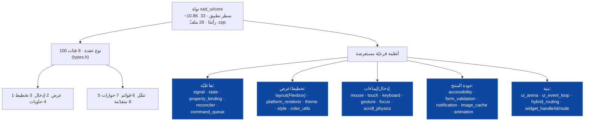
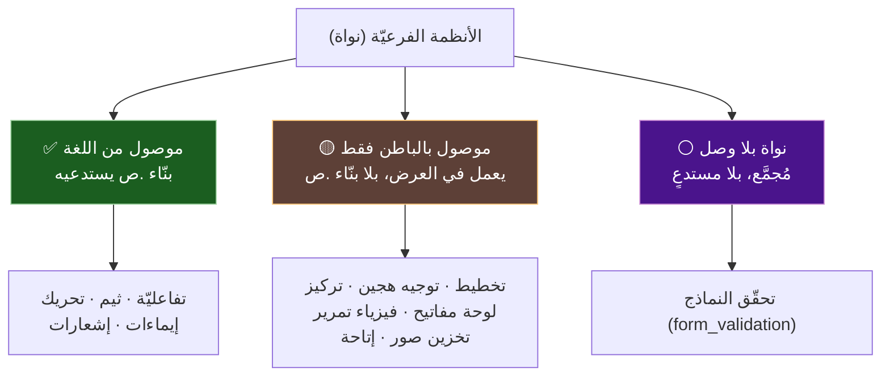
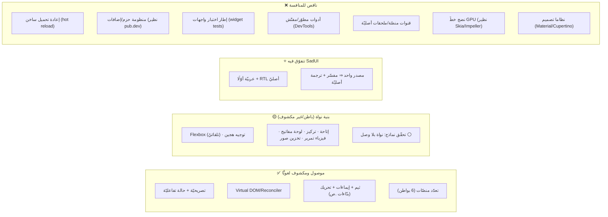
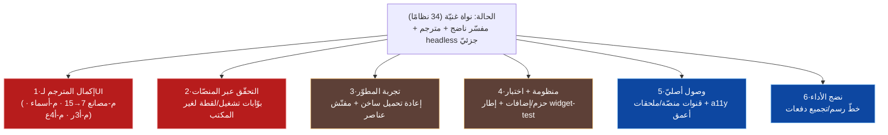

# 🏛️ قدرات المكتبة وما ينقصها لتنافس Flutter — SadUI

> سؤال: **عدا الـ15 عنصرًا الأوّليّ، ماذا تدعم المكتبة فعلًا، وما الناقص لتكون قويّةً تنافس Flutter؟**
>
> إجابة مدعومة بالكود (`s-programming-language/sad_ui/`). **تمييز جوهريّ:** الـ15 هي **البوّابة النحويّة** فقط؛ النواة المحايدة أوسع كثيرًا (**100 نوع عقدة + 33 رأسًا/28 ملفّ تطبيق، ~10.8K سطر تطبيق**). لكنّ «موجود في النواة» ≠ «موصول من اللغة» ≠ «مُترجَم/مُتحقَّق عبر المنصّات».
>
> ⚠️ **حسم الوصل (GR-01، أهمّ تصحيح):** «حجم رأس كبير» لا يعني «قدرة متاحة للمستخدم». تتبّعتُ المستدعِين خارج `sad_ui/core` و`tests` لكلّ نظام بارز (تفصيل §1ب). النتيجة: الأنظمة الـ34 ثلاث طبقات — **موصولة من اللغة** (بنّاء `.ص` يستدعيها)، **موصولة داخليًّا بالباطن** (تعمل في العرض لكن بلا بنّاء لغويّ)، و**نواة بلا وصل** (مُجمَّعة لكن بلا أيّ مستدعٍ — نمط «معرّف لا منفّذ»). نظام واحد على الأقلّ (`form_validation`) **بلا أيّ مستدعٍ** خارج النواة/الاختبارات.

---

## 1) السطح الحقيقيّ للقدرات (أوسع من 15 بكثير)

**أحجام مُتحقَّقة (سطور التطبيق، عيّنة):** `platform_renderer` 1980 · `layout` 760 · `reconciler` 729 · `mouse_processor` 706 · `hybrid_routing` 527 · `gesture` 511 · `theme` 382 · `scroll_physics` 355 · `image_cache` 302 · `focus` 285 · `accessibility` 283 · `form_validation` 277 · `keyboard_processor` 277. أيْ أنظمة جوهريّة لا هياكل فارغة — **لكنّ الحجم لا يثبت الوصل** (انظر §1ب).

---

## 1ب) حسم الوصل: موصول من اللغة مقابل بنية تحتيّة (GR-01)

> لكلّ نظام: هل يستدعيه مسار اللغة (بنّاء `.ص` في `interpreter/src/ui/*_builtins.cpp`)، أم الباطن فقط، أم لا أحد؟

| النظام | التصنيف | الدليل (المستدعِي أو غيابه) |
|---|:---:|---|
| تفاعليّة (signal/reconciler/state/command_queue) | ✅ موصول لغويًّا | `UIStateManager` + بنّاء `عيّن_الحالة`؛ الدورة كاملة (وثيقة الأحداث) |
| سمات/ثيم (`theme`) | ✅ موصول لغويًّا | بنّاءات `عين_سمة`/`احصل_سمة`/`سمة_النظام`/`تبديل_الثيم` (`ui_platform_builtins.cpp:263-285`، `ui_core_builtins.cpp:385`) |
| تحريك (`animation`) | ✅ موصول لغويًّا | بنّاءات `حرك`/`حركة_لون`/`أوقف_حركة`/`حالة_حركة`/`قيمة_حركة` (`ui_platform_builtins.cpp:52-133`) |
| إيماءات (`gesture`) | ✅ موصول لغويًّا | بنّاءات `عند_سحب`/`عند_قرص`/`عند_تدوير` ⇒ `bridge->setSwipeHandler` (`ui_platform_builtins.cpp:431-470`) |
| إشعارات (`notification`) | ✅ موصول لغويًّا | بنّاء `شريط_إشعار` (`widget_builtins.cpp:277`) + `اعرض_شريط_إشعار` (`ui_dialog_builtins.cpp:76`) |
| تخطيط Flexbox+RTL (`layout`) | 🟡 موصول بالباطن | يستدعيه العرض عبر المكتب؛ لا بنّاء لغويّ مباشر (تلقائيّ في إعادة البناء) |
| توجيه هجين (`hybrid_routing`) | 🟡 موصول بالباطن | `HybridRouter` في طبقة العرض؛ لا بنّاء لغويّ |
| تركيز (`focus`) | 🟡 باطن فقط | `window.h` + مكتب (`backends/desktop`)؛ **لا بنّاء `.ص`** (`ركّز/طلب_تركيز` = 0) |
| لوحة مفاتيح (`keyboard_processor`) | 🟡 باطن فقط | رؤوس كلّ الباطنات (`*_renderer.h`/`window.h`)؛ **لا بنّاء `.ص`** |
| فيزياء تمرير (`scroll_physics`) | 🟡 باطن فقط | مكتب+`system_bridge` (و android/ios bridges)؛ **لا بنّاء `.ص`** |
| تخزين صور (`image_cache`) | 🟡 باطن فقط | `renderer_draw.cpp`+`system_bridge.cpp`؛ **لا بنّاء `.ص`** |
| إتاحة (`accessibility`) | 🟡 باطن/جسر | `ui_bridge_platform.cpp` + جسور أندرويد؛ بلا بنّاء `.ص` مخصَّص |
| **تحقّق نماذج (`form_validation`)** | ⚪ **نواة بلا وصل** | مُجمَّع (`CMakeLists.txt:51`) لكن **صفر مستدعٍ** خارج `core`+`tests` — نمط «معرّف لا منفّذ» (نظير type_bridge الميّت) |

> **الحسم:** من الأنظمة الـ34، نحو **5 فئات قدرات متاحة للمستخدم مباشرةً بـ`.ص`** (تفاعليّة، ثيم، تحريك، إيماءات، إشعارات)، والبقيّة **بنية تحتيّة موصولة بالباطن** (تعمل في العرض لكنّها غير مكشوفة كبنّاء لغويّ)، و**نظام واحد على الأقلّ بلا وصل** (`form_validation`). أيْ النواة غنيّة فعلًا، لكنّ **السطح المكشوف للمستخدم أضيق من «34 نظامًا»** — معظمها يُستهلَك تلقائيًّا عبر العرض لا باستدعاء صريح.

---

## 2) ماذا تدعم المنصّات الستّ (عدا الـ15)

> القاعدة: الأنظمة الفرعيّة **محايدة المنصّة** (في النواة)؛ فما تدعمه النواة متاحٌ نظريًّا لكلّ باطن **بقدر ما يصِله الباطن**. التحقّق التشغيليّ مؤكَّد للمكتب.

| القدرة (نظام النواة) | متوفّرة بالنواة | المكتب (مرجع) | باطنات التوليد | freestanding |
|---|:---:|:---:|:---:|:---:|
| تخطيط Flexbox + RTL | ✅ `layout.cpp` | ✅ | ✅ (CSS/Modifier أصليّ) | 🟡 مبسّط |
| تفاعليّة (Virtual DOM + رقع) | ✅ `reconciler.cpp` | ✅ | ✅ | 🟡 |
| سمات/ثيم + داكن | ✅ `theme.cpp` | ✅ | ✅ | 🟡 |
| إيماءات (سحب/ضغط) | ✅ `gesture.cpp` | ✅ | أصليّ | ⚪ |
| فيزياء تمرير | ✅ `scroll_physics.cpp` | ✅ | أصليّ | ⚪ |
| إتاحة (accessibility) | ✅ `accessibility.cpp` | 🟡 | أصليّ (a11y المنصّة) | ⚪ |
| تركيز/لوحة مفاتيح | ✅ `focus`+`keyboard` | ✅ | أصليّ | ⚪ |
| تحقّق نماذج | ✅ `form_validation.cpp` | ✅ | ✅ | 🟡 |
| تحريك (animation) | ✅ `animation.h` | ✅ | جزئيّ | ⚪ |
| إشعارات | ✅ `notification.h` | ✅ | أصليّ | ⚪ |
| تخزين صور مؤقّت | ✅ `image_cache.cpp` | ✅ | المتصفّح/أصليّ | ❌ صور stub |
| توجيه هجين (أصليّ/Canvas) | ✅ `hybrid_routing.cpp` | ✅ | ✅ | ⚪ |
| **عبر المترجم `sad-build`** | — | 🟡 7/15 + headless | ⚪ غير مُتحقَّق | ⚪ |

> ⚠️ **قراءة الجدول:** «✅ متوفّرة بالنواة» تعني وجود النظام مُجمَّعًا، **لا أنّه مكشوف كبنّاء `.ص`** (انظر §1ب: 5 فئات فقط موصولة لغويًّا؛ البقيّة باطن-فقط أو بلا وصل). كذلك «أصليّ» لباطنات التوليد يعني أنّ الكود المولَّد (Compose/SwiftUI/CSS) يستعمل عنصر المنصّة الأصليّ — وهو مدعوم لمولّدات العناصر، لكنّ ربط أنظمة كـ`scroll_physics`/`focus` بالكود المولَّد لم يُتحقَّق طرفًا لطرف (مؤكَّد للمكتب فقط).
>
> الخلاصة: النواة تملك **منظومة قدرات بحجم إطار حديث** بنيةً، لكنّ **الوصل غير متجانس**: كامل ومكشوف لغويًّا في المفسّر+المكتب لخمس فئات؛ والباقي بنية تحتيّة تُستهلَك تلقائيًّا أو غير موصولة بعد؛ وغير مُتحقَّق عبر المترجم/بواطن التوليد.

---

## 3) مقارنة بـFlutter (تنافسيّة)

| المحور | SadUI (بالدليل) | Flutter | الفجوة |
|---|---|---|---|
| النموذج التصريحيّ | ✅ `واجهة`+`@حالة` | ✅ Widgets+State | متكافئ مفاهيميًّا |
| إعادة الرسم التفاضليّة | ✅ Reconciler (8 رقع) | ✅ Element tree | متكافئ |
| تعدّد المنصّات | ✅ 6 بواطن | ✅ (Skia موحَّد) | Flutter موحَّد العرض؛ SadUI هجين أصليّ/Canvas |
| اللغة/الاتّجاه | ⭐ **عربيّة + RTL أصليّ** | i18n مضاف | **تفوّق SadUI** |
| محرّكان | ⭐ **مفسّر + ترجمة أصليّة من مصدر واحد** | AOT/JIT (Dart) | **تميّز SadUI** |
| إعادة تحميل ساخن | ❌ لا دليل | ✅ ركيزة | **فجوة كبيرة** |
| منظومة الحزم | ❌ لا | ✅ pub.dev | **فجوة منظومة** |
| اختبار الواجهات | 🟡 بوّابات `.ص` ناشئة | ✅ flutter_test | فجوة نضج |
| أدوات المطوّر | 🟡 LSP موجود | ✅ DevTools | فجوة عمق |
| قنوات المنصّة/الملحقات | ❌ لا دليل | ✅ Platform channels | **فجوة وصول أصليّ** |
| اكتمال المترجم لـUI | 🟡 7/15 + headless | — (لا نظير) | داخليّ (شرائح م-مصانع/أ3ر/أ4ع) |

---

## 4) ما الناقص ليكون «قويًّا منافسًا» (مرتّب)

1. **إكمال المترجم لـUI** (أعلى أولويّة، داخليّ ومحدَّد): سدّ مصانع 7→15، تباعد الأسماء، الأثر المرسوم (م-أ3ر)، ربط POSIX (م-أ4ع). بدونها «التكافؤ مفسّر↔مترجم» ناقص.
2. **التحقّق عبر المنصّات**: بوّابات تشغيل/لقطة آليّة لكلّ باطن (اليوم المكتب فقط) — أساس الثقة بالتعدّد.
3. **تجربة المطوّر**: إعادة تحميل ساخن ومفتّش شجرة — ركيزة إنتاجيّة Flutter الكبرى المفقودة.
4. **منظومة + اختبار**: قناة حزم/إضافات + إطار اختبار واجهات أوّل-طرف.
5. **وصول أصليّ**: قنوات منصّة للوصول لواجهات النظام + إتاحة أعمق + i18n أوسع (مع الاحتفاظ بميزة RTL).
6. **نضج الأداء**: خطّ رسم/تجميع دفعات يقترب من Skia/Impeller.
7. **كشف البنية التحتيّة كقدرات لغويّة** (مستجدّ من §1ب): إضافة بنّاءات `.ص` للأنظمة الموصولة بالباطن فقط عند الحاجة (تركيز/فيزياء تمرير/إتاحة)، و**حسم `form_validation`**: وصله ببنّاء أو إزالته (نواة مُجمَّعة بلا مستدعٍ = دَيْن صيانة، نمط type_bridge).

---

## 5) خلاصة تنافسيّة أمينة

- **القوّة الحاليّة**: النواة **ليست لعبة** — 33 رأسًا/28 ملفّ تطبيق (~10.8K سطر) و100 نوع عقدة، بنيةُ قدراتٍ بحجم إطار حديث، مع **ميزتين فريدتين مدعومتين بالكود**: العربيّة/RTL أصلًا (`layout.h`/`ir.h` يحملان دلالة الاتّجاه)، ومحرّكان (تفسير + ترجمة أصليّة) من مصدر واحد.
- **الضعف الحاليّ (مزدوج)**: (1) **سطح الوصل أضيق من البنية** — 5 فئات فقط مكشوفة كبنّاءات `.ص` (تفاعليّة/ثيم/تحريك/إيماءات/إشعارات)؛ الباقي بنية باطن تُستهلَك تلقائيًّا، ونظام واحد (`form_validation`) **بلا وصل إطلاقًا**. أيْ بعض «القدرات» بنية تحتيّة لا ميزة مستخدم بعد. (2) النضج **غير متجانس عبر الإخراج** — كامل في المفسّر+المكتب، ناقص في المترجم (7/15 + headless)، غير مُتحقَّق عبر بواطن التوليد. وتنقص **تجربة المطوّر (hot reload/DevTools) والمنظومة (حزم/اختبار)** — ركائز تبنّي Flutter.
- **المسار للمنافسة**: ليس بناء قدرات جديدة بقدر **إنضاج وتوحيد الموجود عبر الطبقات** (أولًا المترجم والتحقّق)، ثمّ بناء تجربة المطوّر والمنظومة.

> هذه الوثيقة تخطيطيّة وتقديريّة؛ جانب SadUI مدعوم بمسارات كود، وجانب Flutter معرفة عامّة بالإطار. الأرقام (100 نوع، 34 نظامًا، الأسطر) مُتحقَّقة من `sad_ui/core`.

---

> ⚠️ محتوى **عامّ** — لا أرقام ماليّة ولا أسرار. راجع [GOVERNANCE.md](../../../GOVERNANCE.md).

