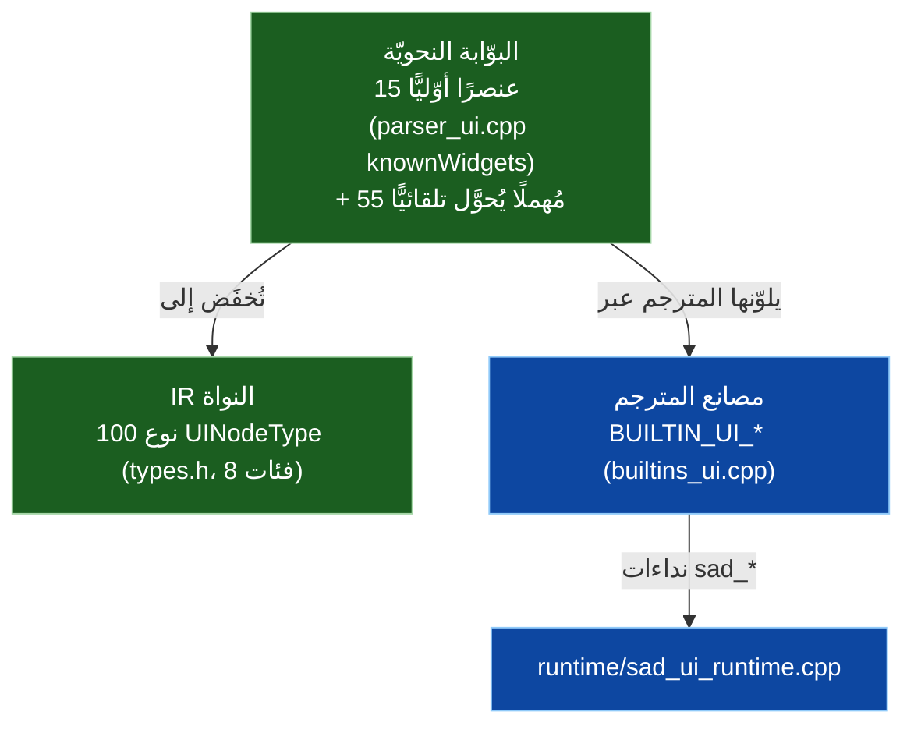
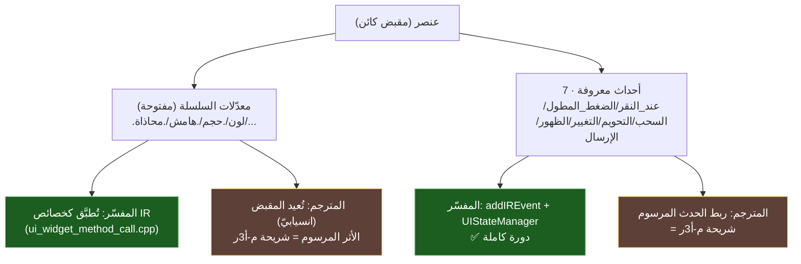
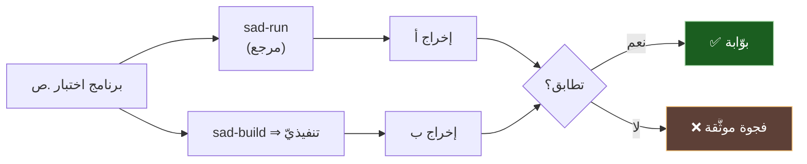

# 🧩 كتالوج العناصر ومصفوفة الاختبار — SadUI

> الكتالوج الأوّليّ (15 عنصرًا) وعلاقته بأنواع النواة (100)، وتغطية المحرّكين لكلّ عنصر، ومصفوفة بوّابة المطابقة مفسّر↔مترجم. كلّ تغطية مدعومة بدليل من `s-programming-language`.
>
> **ملاحظة دقّة (GR-01):** «التغطية في المترجم» تعني وجود **مصنع `BUILTIN_UI_*` مُطابَق صراحةً** في `compiler/src/frontend/builders/builtins_ui.cpp`. غياب التطابق لا يعني استحالة الترجمة بل **فجوة مصنع مؤكَّدة تحتاج سدًّا**.

---

## 1) طبقات الكتالوج (15 محلّل ⊂ 100 نواة)

> الـ15 الأوّليّ هي ما **يكتبه المستخدم**؛ الـ100 هي تمثيل النواة الأوسع (يشمل مغلِّفات تخطيط وعناصر متقدّمة)؛ ومصانع المترجم هي ما يُخفَض اليوم في `sad-build`.

---

## 2) العناصر الأوّليّة الـ15 × تغطية المحرّكين

| # | العنصر | الفئة | المفسّر | مصنع المترجم (`BUILTIN_UI_*`) |
|---|---|---|:---:|---|
| 1 | عمود | تخطيط | ✅ | ✅ `COLUMN` |
| 2 | صف | تخطيط | ✅ | ✅ `ROW` |
| 3 | رصة | تخطيط | ✅ | 🟡 `STACK`/«مكدس» (تطابق الاسم يحتاج تأكيد) |
| 4 | شبكة | تخطيط | ✅ | ❌ **لا مصنع مُطابَق** |
| 5 | نص | عرض | ✅ | ✅ `TEXT` (بعد أ-2b: نص_عنصر + نص_عرض) |
| 6 | صورة | عرض | ✅ | ❌ **لا مصنع مُطابَق** |
| 7 | أيقونة | عرض | ✅ | ❌ **لا مصنع مُطابَق** (يوجد `ICON_BUTTON`=زر_أيقونة فقط) |
| 8 | زر | تفاعل | ✅ | ✅ `BUTTON` |
| 9 | حقل_نص | تفاعل | ✅ | ✅ `TEXT_FIELD` |
| 10 | مفتاح | تفاعل | ✅ | 🟡 `SWITCH`/«مبدل» (تطابق الاسم يحتاج تأكيد) |
| 11 | منزلق | تفاعل | ✅ | ✅ `SLIDER` |
| 12 | حاوية | هيكل | ✅ | ✅ `CONTAINER` |
| 13 | عرض_تمرير | هيكل | ✅ | ❌ **لا مصنع مُطابَق** (`SCROLL_VIEW` في الكتالوج لا في مصانع المترجم) |
| 14 | قائمة_كسولة | هيكل | ✅ | ❌ **لا مصنع مُطابَق** (`LAZY_COLUMN/ROW` في الكتالوج لا في المترجم) |
| 15 | فاصل | فراغ | ✅ | ✅ `SPACER` |

**الخلاصة:** المفسّر يغطّي الـ15 كلّها (بدائيّات + WidgetBuilder عامّ). المترجم يملك مصنعًا مؤكَّدًا لـ**~9** (عمود/صف/نص/زر/حقل_نص/منزلق/حاوية/فاصل + رصة؟/مفتاح؟)، وفيه **فجوات مصنع مؤكَّدة لـ4–5**: شبكة، صورة، أيقونة، عرض_تمرير، قائمة_كسولة.

---

## 3) المعدّلات والأحداث

> تصاريح الحالة `@حالة` مُنفَّذة (عبر `UIStateManager`)؛ بينما `@محسوب/@بيئة/@ربط` التصريحيّة **parse-only** (انظر [معماريّة-الأحداث-والحالة](./معماريّة-الأحداث-والحالة.md)).

---

## 4) الاختبارات الموجودة (مُتحقَّقة)

| الاختبار | يغطّي | المسار |
|---|---|---|
| `ui_min.ص` | إنشاء عنصر + وسم + سلسلة معدّلات + حدث + واجهة/@حالة (بوّابة مفسّر↔مترجم) | `tests/integration/` |
| `gr.adv.widget/001_show` | تعبير عنصر بـ«اعرض» | `tests/behavior/rules_matrix/60_advanced/` |
| `gr.adv.ui_decl/001_component` | تصريح `واجهة` | نفسه |
| `gr.adv.ui_state/001_state_field` | حقل `@حالة` | نفسه |
| `gr.adv.ui_event/001_on_click` | حدث `عند_النقر` | نفسه |
| `gr.adv.ui_modifier_chain/001_chain` | سلسلة معدّلات | نفسه |
| `012/013_ui_decl_*` | إنشاء واجهة + طرق/وراثة | `tests/behavior/grammar_gaps/كائني/` |
| `test_event_system.ص` | نظام الأحداث (صياغة قديمة جزئيًّا) | `tests/unit/integration/` |
| تفاعلات مولّدة | type×ui_state، ui_decl×ui_state، ui_decl×function | `rules_matrix/_interactions/_generated/` |

---

## 5) مصفوفة بوّابة المطابقة المقترحة (عنصر/ميزة × محرّك)

> الهدف: لكلّ صفّ، برنامج `.ص` صغير يُشغَّل في المفسّر والمترجم ويُقارَن إخراجه (نظير `ui_min.ص`).

| الميزة | مفسّر | مترجم (توليد) | مترجم (تشغيل، ويندوز) | فجوة |
|---|:---:|:---:|:---:|---|
| إنشاء عنصر + `نوع`=«كائن» | ✅ | ✅ | ✅ | — |
| سلسلة معدّلات (تسلسل/نوع) | ✅ | ✅ | ✅ | الأثر المرسوم (م-أ3ر) |
| حدث `عند_النقر` (تسجيل) | ✅ | ✅ | ✅ | التنفيذ المرسوم (م-أ3ر) |
| `واجهة` + `@حالة` (تعديل) | ✅ | ✅ | ✅ | — |
| عناصر بلا مصنع مترجم (شبكة/صورة/أيقونة/عرض_تمرير/قائمة_كسولة) | ✅ | ❌ | ❌ | **فجوة مصانع** |
| `@محسوب/@بيئة/@ربط` تصريحيّ | 🟡 parse-only | 🟡 | 🟡 | إكمال الدلالة |
| تشغيل على POSIX | ✅ | ✅ | ⚪ | شريحة م-أ4ع |

---

## 6) بنود التخطيط لهذا المحور

1. **سدّ فجوات مصانع المترجم** للعناصر الخمسة (شبكة/صورة/أيقونة/عرض_تمرير/قائمة_كسولة): إضافة `BUILTIN_UI_*` + خفض + نداء وقت تشغيل.
2. **تأكيد تطابق اسمَي رصة↔STACK ومفتاح↔SWITCH** في `builtins_ui.cpp` (إزالة الالتباس).
3. **توسيع `ui_min.ص`** إلى مجموعة بوّابات: عنصر لكلّ فئة + حاويات متداخلة + حدثان + @حالة مركّبة.
4. **أتمتة المقارنة** مفسّر↔مترجم في CI (الصفوف أعلاه) — يتطلّب حلّ ربط POSIX (م-أ4ع) للتشغيل عبر المنصّات.
5. **تثبيت الاختبارات القديمة** (`test_event_system.ص` يستعمل صياغة قديمة جزئيًّا) أو تحديثها.

> يتقاطع البند 1 مع كتالوج العناصر، والبندان 3–4 مع [تكافؤ-المنصّات](./تكافؤ-المنصّات.md) (فجوة بوّابات غير المكتب).

---

> ⚠️ محتوى **عامّ** — لا أرقام ماليّة ولا أسرار. راجع [GOVERNANCE.md](../../../GOVERNANCE.md).

