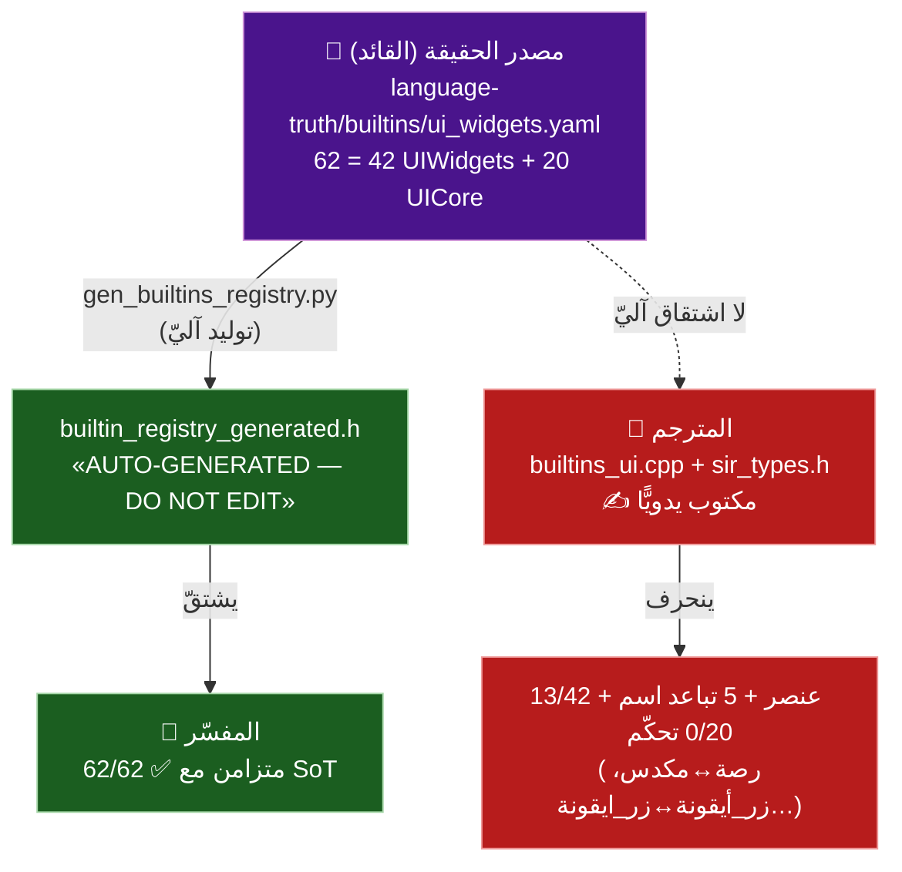
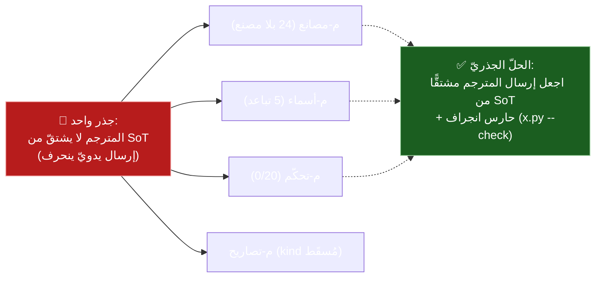
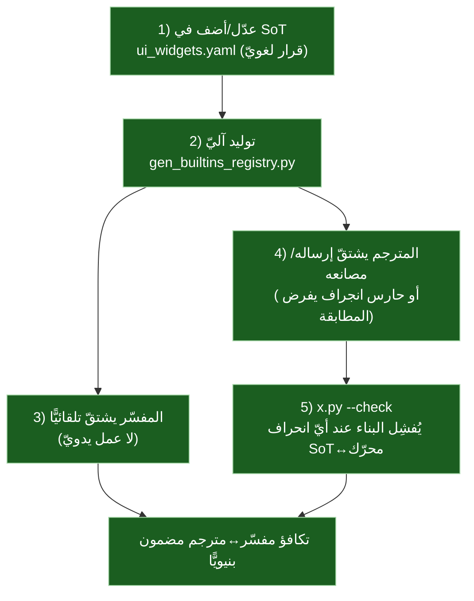

# 🧭 مصدر الحقيقة هو القائد — منهجيّة تطوير SadUI

> **المبدأ المؤسِّس:** التطوير يبدأ من **مصدر الحقيقة** (`language-truth/builtins/ui_widgets.yaml`)، والمحرّكان (مفسّر/مترجم) والمنصّات **تشتقّ منه** لا تسبقه. كلّ فجوة وثّقناها (المترجم 13/42، تباعد الأسماء، 0/20 تحكّم) **عَرَضٌ لجذرٍ واحد: المترجم لا يشتقّ من القائد**.
>
> هذه الوثيقة **تسبق** بقيّة وثائق التخطيط منطقيًّا (نقطة البداية)، وتتّسق مع مبدأ «الأدوات لا توسّع SoT اللغة، بل تشتقّ منه».

---

## 1) الواقع المُتحقَّق: مَن يشتقّ ومَن ينحرف

| الطبقة | علاقتها بالـSoT | الأثر | الدليل |
|---|---|---|---|
| **مصدر الحقيقة** | القائد | يعرّف 62 دالّة + الكتالوج | `language-truth/builtins/ui_widgets.yaml` |
| **الرجستري المولَّد** | **يشتقّ آليًّا** | متزامن دائمًا | `builtin_registry_generated.h` (ترويسة «AUTO-GENERATED … DO NOT EDIT»، `gen_builtins_registry.py`) |
| **🔷 المفسّر** | يستهلك الرجستري المولَّد | **62/62 ✅** (لا انحراف) | يسجّل أسماء `UIWidgets::`/`UICore::` المولَّدة |
| **🔶 المترجم** | **مكتوب يدويًّا** (لا ترويسة توليد) | **ينحرف**: 13/42 + تباعد أسماء | `builtins_ui.cpp` يطابق `funcName==` يدويًّا؛ `sir_types.h` تعداد يدويّ |

> **الاكتشاف الجوهريّ:** أسماء `UIWidgets::` التي يستعملها المترجم **مشتقّة من SoT** (ثوابت مولَّدة)، لكنّ **منطق الإرسال** (أيّ اسم يطابقه أيّ مصنع) **يدويّ** — فينشأ الانحراف هناك: المصنع يطابق `مكدس` بينما SoT يسمّي العنصر `رصة`.

---

## 2) لماذا هذا هو الجذر (لا 6 فجوات منفصلة)

الشرائح م-مصانع/م-أسماء/م-تحكّم ليست أعطالًا متفرّقة بل **تجلّيات لانحراف بنيويّ واحد**: المترجم يُصان يدويًّا فيتخلّف عن SoT. ترقيع كلّ عنصر على حدة **يُبقي الانحراف ممكنًا مستقبلًا**؛ الحلّ القائد-من-SoT يمنع تكرار النمط.

---

## 3) المنهجيّة المقترحة: ابدأ من القائد

**الخطوات:**
1. **SoT أوّلًا**: أيّ عنصر/دالّة جديدة تُعرَّف في `ui_widgets.yaml` (قرار لغويّ حصرًا — الأدوات لا توسّع SoT).
2. **التوليد الآليّ** يحدّث الرجستري؛ المفسّر يشتقّ بلا عمل يدويّ (كما هو اليوم).
3. **المترجم يُلحَق بالقائد**: إمّا **توليد** إرسال/مصانع UI من SoT (نظير الرجستري)، أو **حارس انجراف** (`x.py --check`) يقارن مصانع المترجم بأسماء SoT ويُفشِل عند أيّ نقص/تباعد.
4. **بوّابة التكافؤ** تصبح بنيويّة لا يدويّة.

> هذا يعمّم نمط حارس الانجراف القائم في القلب الموحَّد (`x.py gen/--check`) ليشمل **إرسال UI في المترجم** — وهو المفقود حاليًّا (الانحراف غير مكتشَف آليًّا).

---

## 4) إعادة ترتيب الأولويّات على ضوء «القائد»

| قبل (ترقيعيّ) | بعد (قائد-من-SoT) |
|---|---|
| م-مصانع: أضف 24 مصنعًا يدويًّا | **حارس انجراف SoT↔مترجم** يكشف الـ24 آليًّا + توليد/إلحاق |
| م-أسماء: صحّح 5 أسماء يدويًّا | المطابقة المزدوجة تُشتقّ من SoT (لا تكرار للنمط) |
| م-تحكّم: أضف 20 دالّة يدويًّا | اشتقاق UICore في المترجم من SoT |

**النتيجة:** بدل 6 شرائح ترقيعيّة، **شريحة جذريّة واحدة** («إلحاق إرسال المترجم بالـSoT + حارس انجراف») تُغلق عائلات الفجوات معًا وتمنع عودتها. الشرائح الأخرى (م-أ3ر أثر مرسوم، م-أ4ع POSIX) تبقى مستقلّة (ليست انحراف SoT بل ميزات ناقصة).

---

## 5) الخلاصة

- **القائد هو SoT** (`ui_widgets.yaml`)، والتوليد الآليّ يجعل **المفسّر متزامنًا (62/62)** — هذا هو النموذج الصحيح القائم فعلًا.
- **المترجم خارج هذا النموذج** (يدويّ) ⇒ كلّ فجواته انحرافٌ عن القائد.
- **نقطة بدء التطوير الصحيحة**: ليست ترقيع المترجم عنصرًا عنصرًا، بل **إلحاقه بالقائد** (توليد + حارس انجراف `x.py --check`)، فتُغلق الفجوات بنيويًّا ويُضمَن ألّا تتكرّر.

> يتّسق مع: مبدأ «الأدوات تشتقّ من SoT ولا توسّعه»، وحارس الانجراف `x.py gen/--check` في القلب الموحَّد. ويعيد تأطير الشرائح م-مصانع/م-أسماء/م-تحكّم كـ**شريحة جذريّة واحدة**.

---

> ⚠️ محتوى **عامّ** — لا أرقام ماليّة ولا أسرار. راجع [GOVERNANCE.md](../../../GOVERNANCE.md).

