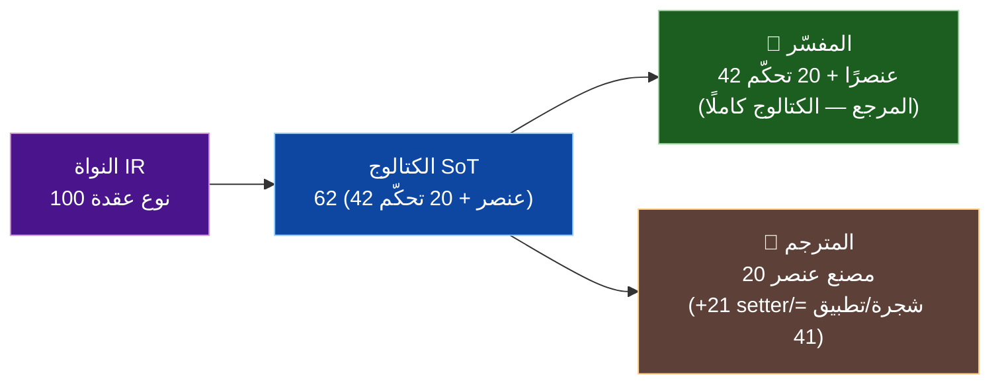
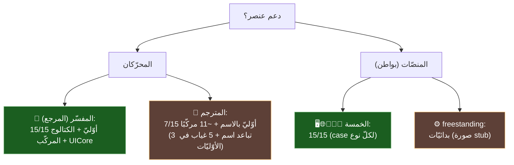

# 🧮 مصفوفة دعم كل عنصر × كل محرّك ومنصّة — SadUI

> لكلّ عنصر: ماذا يدعمه **المفسّر** و**المترجم** (المحرّكان)، وأيّ **المنصّات** (البواطن) تدعمه. مدعومة بفحص آليّ: تسجيلات المفسّر (`interpreter/src/ui/*_builtins.cpp`)، ومطابقات مصنع المترجم (`compiler/src/frontend/builders/builtins_ui.cpp`)، ومراجع `UINodeType::`/`case` في كلّ باطن.
>
> **منهج (GR-01):** «المفسّر» = يسجّل العنصر كبنّاء. «المترجم» = له مصنع `BUILTIN_UI_*` يطابق اسمه المعياريّ. «باطن» = يحوي `case` للنوع. التمييز بين الطبقات مقصود (راجع [كتالوج-العناصر](./كتالوج-العناصر-ومصفوفة-الاختبار.md) و[تكافؤ-المنصّات](./تكافؤ-المنصّات.md)).

---

## ٠) العدد الحقيقيّ للعناصر المدعومة (ليست 15!)

> الـ15 هي **مجموعة المحلّل الأوّليّة المنسَّقة** فقط (ADR-UI-02). العدد الفعليّ الذي يدعمه الكود أكبر بكثير — مؤكَّد بعدّ الثوابت المتمايزة في الرجستري المولَّد (`shared/builtins/generated/builtin_registry_generated.h`) وتعداد `UINodeType`.

| الطبقة | العدد المتمايز | الدليل |
|---|:---:|---|
| **النواة IR — `UINodeType`** | **100** | `sad_ui/core/include/sad_ui/types.h` (8 فئات) — أقصى مفردات العناصر |
| **الكتالوج (SoT) — `ui_widgets.yaml`** | **62** | 42 `UIWidgets` (عناصر/ودجات) + 20 `UICore` (تحكّم) |
| **🔷 المفسّر — عناصر/ودجات (`UIWidgets`)** | **42** | 42 ثابت `UIWidgets::` متمايز في الرجستري المولَّد |
| **🔷 المفسّر — دوال تحكّم (`UICore`)** | **20** | 20 ثابت `UICore::` متمايز (تطبيق/تنقّل/ثيم/حالة) |
| **🔶 المترجم — مصانع عناصر (`BUILTIN_UI_*` factory)** | **20** | مؤكَّد (Amelia + sir_types.h) |
| **🔶 المترجم — opcodes UI إجماليّة** | **41** | 20 مصنع + 12 setter + 3 شجرة + 6 تطبيق |
| **المحلّل — أسماء مقبولة** | **~70** | 15 أوّليّ + ~55 مُهمل (يُحوَّل لأوّليّ) |

> **الجواب المباشر:** المفسّر يدعم **42 عنصرًا/ودجة** (+20 دالّة تحكّم) فوق **100 نوع نواة**؛ المترجم يدعم **20 مصنع عنصر**. الـ15 ليست سقف الدعم بل البوّابة النحويّة المنسَّقة. الجداول أدناه تفصّل الأوّليّات الـ15 والمركّبات.

---

## و) القائمة الكاملة — الـ42 عنصر `UIWidgets` بأسمائها

> مستخرجة من الرجستري المولَّد (`builtin_registry_generated.h:3390–3431`). 🔷 المفسّر يسجّلها كلّها (42/42). 🔶 المترجم: ✅ مصنع بالاسم · 🟡 مصنع باسمٍ مرادف (يفشل الاسم المعياريّ) · ❌ لا مصنع.

| # | العنصر | الثابت | 🔶 المترجم | # | العنصر | الثابت | 🔶 المترجم |
|---|---|---|:---:|---|---|---|:---:|
| 1 | نص_عنصر | `TEXT_WIDGET` | ✅ | 22 | فاصل | `SPACER` | ✅ |
| 2 | صورة | `IMAGE` | ❌ | 23 | فاصل_خط | `DIVIDER` | 🟡 (خط_فاصل) |
| 3 | أيقونة | `ICON` | ❌ | 24 | التفاف | `WRAP` | ❌ |
| 4 | زر | `BUTTON` | ✅ | 25 | حاوية | `CONTAINER` | ✅ |
| 5 | زر_عائم | `FAB` | ✅ | 26 | بطاقة | `CARD` | ✅ |
| 6 | زر_نصي | `TEXT_BUTTON` | ❌ | 27 | هيكل | `SCAFFOLD` | ✅ |
| 7 | زر_أيقونة | `ICON_BUTTON` | 🟡 (ايقونة بلا همزة) | 28 | صندوق | `BOX` | ❌ |
| 8 | حقل_نص | `TEXT_FIELD` | ✅ | 29 | عرض_تمرير | `SCROLL_VIEW` | ❌ |
| 9 | مفتاح | `TOGGLE` | 🟡 (مبدل) | 30 | شريط_تطبيق | `APP_BAR` | ✅ |
| 10 | خانة_اختيار | `CHECKBOX` | 🟡 (مربع_تحقق) | 31 | تنقل_سفلي | `BOTTOM_NAV` | ❌ |
| 11 | منزلق | `SLIDER` | ✅ | 32 | حوار | `DIALOG` | ✅ |
| 12 | عمود | `COLUMN` | ✅ | 33 | شريط_إشعار | `SNACKBAR` | ❌ |
| 13 | صف | `ROW` | ✅ | 34 | تلميح | `TOOLTIP` | ❌ |
| 14 | رصة | `STACK` | 🟡 (مكدس) | 35 | شريط_تقدم | `PROGRESS` | ❌ |
| 15 | شبكة | `GRID` | ❌ | 36 | عمود_كسول | `LAZY_COLUMN` | ❌ |
| 16 | وسط | `CENTER` | ❌ | 37 | صف_كسول | `LAZY_ROW` | ❌ |
| 17 | حشوة | `PADDING` | ❌ | 38 | قائمة | `LIST_VIEW` | ❌ |
| 18 | محاذاة | `ALIGN` | ❌ | 39 | منطقة_نص | `TEXT_AREA` | ❌ |
| 19 | موسع | `EXPANDED` | ❌ | 40 | درج | `DRAWER` | ❌ |
| 20 | مرن | `FLEXIBLE` | ❌ | 41 | منطقة_آمنة | `SAFE_AREA` | ❌ |
| 21 | مقاس | `SIZED_BOX` | ❌ | 42 | سطح | `SURFACE` | ❌ |

> **الحصيلة (🔶 المترجم على الـ42، مُتحقَّقة بالبايتات):** **13 ✅ بالاسم** (نص_عنصر/زر/زر_عائم/حقل_نص/منزلق/عمود/صف/فاصل/حاوية/بطاقة/هيكل/شريط_تطبيق/حوار) + **5 🟡 تباعد اسم** (رصة→مكدس، مفتاح→مبدل، خانة_اختيار→مربع_تحقق، فاصل_خط→خط_فاصل، **زر_أيقونة→زر_ايقونة بلا همزة**) + **24 ❌ بلا مصنع**. أيْ المترجم يصل فعليًّا (بالاسم المعياريّ) إلى **13/42**، و18/42 إن أُضيفت المرادفات الخمسة (نمط أ-2b). أمّا 🔷 المفسّر فـ**42/42**. (مصانع المترجم الـ20 تشمل أيضًا نص_منسق/زر_نوع/نص_عرض خارج هذه القائمة.)
>
> ⚠️ **تصحيح زر_أيقونة (GR-01، بايت ببايت):** المصنع يطابق `CompilerUi::UI_8` (`builtins_ui.cpp:152`) وقيمته `"زر_ايقونة"` (ألف `d8 a7` بلا همزة)، بينما الاسم المعياريّ `UIWidgets::ICON_BUTTON = "زر_أيقونة"` (ألف-همزة `d8 a3`). يختلفان ببايت واحد ⇒ الاسم المعياريّ يفشل في المترجم ⇒ 🟡 لا ✅.
>
> ✅ **حُسِم نهائيًّا (بايت ببايت):** `زر_أيقونة` تباعد همزة مؤكَّد (🟡 أعلاه)؛ و`خط_فاصل` (UI_18) ≠ الاسم المعياريّ `فاصل_خط` (DIVIDER) ⇒ 🟡 مؤكَّد. حالة 🔶 مبنيّة على مطابقة اسم المصنع الفعليّة في `builtins_ui.cpp`.

---

## ز) القائمة الكاملة — الـ20 دالّة تحكّم `UICore` بأسمائها

> مستخرجة من الرجستري المولَّد. هذه **دوال تحكّم لا عناصر رسم** (تطبيق/تنقّل/ثيم/حالة/نافذة/ويب). 🔷 المفسّر يدعمها كلّها (المرجع). 🔶 المترجم: **لا يطابق أيّ اسم منها** (0/20 في `builtins_ui.cpp`) — بل له **API تطبيق منخفض مستوى موازٍ** بأسماء مختلفة (انظر أسفل).

| # | الدالّة | الثابت | الفئة | 🔷 المفسّر | 🔶 المترجم |
|---|---|---|---|:---:|:---:|
| 1 | _محرك_واجهات | `ENGINE` | محرّك | ✅ | ❌ |
| 2 | تشغيل_تطبيق | `RUN_APP` | تطبيق | ✅ | ❌¹ |
| 3 | طباعة_شجرة | `PRINT_TREE` | تنقيح | ✅ | ❌ |
| 4 | انتقل | `NAVIGATE` | تنقّل | ✅ | ❌ |
| 5 | انتقل_بتحريك | `NAVIGATE_TRANSITION` | تنقّل | ✅ | ❌ |
| 6 | انتقل_بتحريك_كامل | `NAVIGATE_EXIT_TRANSITION` | تنقّل | ✅ | ❌ |
| 7 | عودة | `BACK` | تنقّل | ✅ | ❌ |
| 8 | عودة_بتحريك | `BACK_TRANSITION` | تنقّل | ✅ | ❌ |
| 9 | عودة_للبداية | `BACK_TO_ROOT` | تنقّل | ✅ | ❌ |
| 10 | استبدل | `REPLACE_PAGE` | تنقّل | ✅ | ❌ |
| 11 | تبديل_الثيم | `TOGGLE_THEME` | ثيم | ✅ | ❌ |
| 12 | وضع_داكن | `DARK_MODE` | ثيم | ✅ | ❌ |
| 13 | وضع_فاتح | `LIGHT_MODE` | ثيم | ✅ | ❌ |
| 14 | هل_داكن | `IS_DARK` | ثيم | ✅ | ❌ |
| 15 | تحديث_حالة | `UPDATE_STATE` | حالة | ✅ | ❌² |
| 16 | عنوان_النافذة | `SET_TITLE` | نافذة | ✅ | ❌ |
| 17 | عدد_الصفحات | `PAGE_COUNT` | نافذة | ✅ | ❌ |
| 18 | أغلق_النافذة | `CLOSE_WINDOW` | نافذة | ✅ | ❌ |
| 19 | عين_الحالة | `SET_STATE` | حالة | ✅ | ❌² |
| 20 | توليد_ويب | `GEN_WEB` | ويب | ✅ | ❌ |

> **¹ API التطبيق الموازي في المترجم:** المترجم لا يطابق `تشغيل_تطبيق` لكن لديه opcodes منخفضة المستوى بأسماء مختلفة: `انشئ_تطبيق`(APP_CREATE) · `عين_الجذر`(APP_SET_ROOT) · `خطط`(APP_LAYOUT) · `ارسم`(APP_RENDER) · `دمر_تطبيق`(APP_DESTROY) · `دمر_عنصر`(WIDGET_DESTROY) — أيْ دورة حياة تطبيق منخفضة المستوى، لا الواجهة العالية الموحَّدة `تشغيل_تطبيق`.
>
> **² الحالة:** `عين_الحالة`/`تحديث_حالة` (كبنّاءات) غير مطابَقة في المترجم؛ **لكن** `@حالة` كحقل صنف **تعمل في المترجم** (أثبتها `ui_min.ص`: تعديل `هذا.عدد` ⇒ التنفيذيّ طابق المفسّر). أيْ: الحالة-كحقل ✅، الحالة-كبنّاء-تحكّم ❌.
>
> **الخلاصة:** 🔷 المفسّر **20/20**؛ 🔶 المترجم **0/20** بالاسم (له API تطبيق منخفض موازٍ بـ5 opcodes). فالتنقّل والثيم وتوليد الويب والنافذة **غير متاحة عبر المترجم** كبنّاءات — فجوة تحكّم تُضاف لفجوات العناصر.

---

## أ) العناصر الأوّليّة الـ15

| # | العنصر | النوع | 🔷 المفسّر | 🔶 المترجم | 🖥️ مكتب | 🌐 ويب | 🍎 iOS | 🍏 macOS | 🤖 أندرويد | ⚙️ freestand |
|---|---|---|:---:|:---:|:---:|:---:|:---:|:---:|:---:|:---:|
| 1 | عمود | `Column` | ✅ | ✅ | ✅ | ✅ | ✅ | ✅ | ✅ | ◐ |
| 2 | صف | `Row` | ✅ | ✅ | ✅ | ✅ | ✅ | ✅ | ✅ | ◐ |
| 3 | رصة | `Stack` | ✅ | 🟡¹ | ✅ | ✅ | ✅ | ✅ | ✅ | ◐ |
| 4 | شبكة | `Grid` | ✅ | ❌² | ✅ | ✅ | ✅ | ✅ | ✅ | ◐ |
| 5 | نص | `Text` | ✅ | 🟡¹ | ✅ | ✅ | ✅ | ✅ | ✅ | ◐ |
| 6 | صورة | `Image` | ✅ | ❌² | ✅ | ✅ | ✅ | ✅ | ✅ | ❌ stub |
| 7 | أيقونة | `Icon` | ✅ | ❌² | ✅ | ✅ | ✅ | ✅ | ✅ | ◐ |
| 8 | زر | `Button` | ✅ | ✅ | ✅ | ✅ | ✅ | ✅ | ✅ | ◐ |
| 9 | حقل_نص | `TextField` | ✅ | ✅ | ✅ | ✅ | ✅ | ✅ | ✅ | ◐ |
| 10 | مفتاح | `Toggle` | ✅ | 🟡¹ | ✅ | ✅ | ✅ | ✅ | ✅ | ◐ |
| 11 | منزلق | `Slider` | ✅ | ✅ | ✅ | ✅ | ✅ | ✅ | ✅ | ◐ |
| 12 | حاوية | `Container` | ✅ | ✅ | ✅ | ✅ | ✅ | ✅ | ✅ | ◐ |
| 13 | عرض_تمرير | `ScrollView` | ✅ | ❌² | ✅ | ✅ | ✅ | ✅ | ✅ | ◐ |
| 14 | قائمة_كسولة | `LazyColumn` | ✅ | ❌² | ✅ | ✅ | ✅ | ✅ | ✅ | ◐ |
| 15 | فاصل | `Spacer` | ✅ | ✅ | ✅ | ✅ | ✅ | ✅ | ✅ | ◐ |

**حواشٍ:** ¹ **تباعد اسم** — المصنع موجود لكن باسمٍ آخر (رصة→`مكدس`، نص→`نص_عنصر`، مفتاح→`مبدل`)؛ فالاسم المعياريّ الذي يكتبه المستخدم **يفشل** في المترجم حتى يُضاف مرادفًا (نمط أ-2b). ² **غياب مصنع** — لا مصنع `BUILTIN_UI_*` لهذا العنصر.

> **خلاصة الأوّليّات:** المفسّر **15/15**؛ البواطن الخمسة **15/15**؛ المترجم **7/15** (✅) + 3 تباعد اسم (🟡) + 5 غياب (❌)؛ freestanding بدائيّات (صورة stub).

---

## ب) عناصر مركّبة/إضافيّة لها مصنع مترجم مخصَّص

> هذه ليست ضمن الـ15 الأوّليّ، لكنّ **المترجم يلوّنها بمصنع خاصّ** (مطابقة اسمها مباشرةً في `builtins_ui.cpp`)، والمفسّر يسجّلها، والمحلّل يقبلها (بعضها مُهمل يُحوَّل لأوّليّ عند الرسم).

| العنصر | مصنع المترجم | 🔷 المفسّر | 🔶 المترجم | البواطن الخمسة |
|---|---|:---:|:---:|:---:|
| نص_منسق | `TEXT_STYLED` | ✅ | ✅ | ✅ |
| نص_عرض (مرادف نص_عنصر) | `UI_4` | ✅ | ✅ | ✅ |
| زر_نوع | `BUTTON_VARIANT` | ✅ | ✅ | ✅ |
| زر_ايقونة (المصنع `UI_8` بلا همزة؛ الاسم المعياريّ `زر_أيقونة` بهمزة يفشل) | `UI_8`→`BUILTIN_UI_ICON_BUTTON` | ✅ | 🟡 | ✅ |
| زر_عائم | `FAB` | ✅ | ✅ | ✅ |
| مربع_تحقق (المصنع يطابق هذا الاسم؛ خانة_اختيار اسم النوع) | `CHECKBOX`/`UI_11` | ✅ | ✅ | ✅ |
| بطاقة | `CARD` | ✅ | ✅ | ✅ (→حاوية) |
| هيكل | `SCAFFOLD` | ✅ | ✅ | ✅ |
| شريط_تطبيق | `APP_BAR` | ✅ | ✅ | ✅ (→حاوية) |
| خط_فاصل (فاصل_خط) | `DIVIDER` | ✅ | ✅ | ✅ |
| حوار | `DIALOG` | ✅ | ✅ | ✅ (→رصة) |

> أيْ مصانع المترجم الإجماليّة للعناصر = **20 مصنعًا متمايزًا** (21 مع عدّ مرادف `نص_عرض`/`UI_4` منفصلًا) — **مؤكَّد بتحقّق Amelia الجزئيّ** (مطابقات `builtins_ui.cpp` الأسطر 45–290 مصانع؛ UI_20–UI_40 غير-مصانع = أضف_ابن/عين_*/تطبيق). منها 7 من الأوّليّات الـ15 بالاسم + 3 بأسماء مرادفة + ~10 مركّبًا/إضافيًّا. الفجوة في الـ15 الأوّليّ تحديدًا (شبكة/صورة/أيقونة/عرض_تمرير/قائمة_كسولة + تباعد رصة/مفتاح/نص).

---

## ج) عناصر مُهملة (يقبلها المحلّل ويحوّلها لأوّليّ)

> ~55 اسمًا مُهملًا (`deprecatedWidgets` في `parser_ui.cpp`) تُقبَل بتحذير وتُحوَّل تلقائيًّا لعنصرٍ أوّليّ معادل. أمثلة: وسط/حشوة/محاذاة/موسع/مرن/مقاس→حاوية أو صف، صندوق/سطح→حاوية، قائمة_عرض→قائمة_كسولة، تبويبات→صف، ملاح→رصة. فدعمها = دعم العنصر الأوّليّ الذي تُحوَّل إليه (المفسّر ✅ والبواطن ✅؛ المترجم بحسب الأوّليّ الهدف).

---

## د) دوال UICore (تحكّم لا عناصر — ~20)

> ليست عناصر رسم بل تحكّم: `تشغيل_تطبيق`، `ارسم`، `انتقل/عودة/استبدل` (تنقّل)، `تبديل_الثيم/وضع_داكن/هل_داكن` (ثيم)، `عين_الحالة/تحديث_حالة` (حالة)، `عنوان_النافذة/أغلق_النافذة`، `توليد_ويب`، `طباعة_شجرة`.

| الفئة | 🔷 المفسّر | 🔶 المترجم |
|---|:---:|:---:|
| إدارة التطبيق (تشغيل/ارسم/جذر/خطط) | ✅ | ✅ opcodes `APP_CREATE/SET_ROOT/LAYOUT/RENDER/DESTROY` |
| الثيم (تبديل/داكن/فاتح) | ✅ بنّاءات | 🟡 جزئيّ (راجع وثيقة القدرات) |
| التنقّل (انتقل/عودة/استبدل) | ✅ بنّاءات | ⚪ غير مُتحقَّق |
| الحالة (عين_الحالة/تحديث_حالة) | ✅ عبر `UIStateManager` | ✅ (دورة @حالة) |

---

## هـ) القراءة الحاسمة

- **«ما المنصّات غير المدعومة لعنصر؟»** — لا منصّة عرضٍ كاملة (الخمسة) تفتقد أيّ عنصر من الـ15؛ الاستثناء freestanding (بدائيّات + صورة stub).
- **«ماذا يدعم كلّ محرّك؟»** — المفسّر يدعم الكتالوج كاملًا (المرجع)؛ المترجم يدعم 7/15 أوّليًّا بالاسم + ~11 عنصرًا مركّبًا، وفجواته في الأوّليّات الثمانية (3 تباعد اسم + 5 غياب مصنع).
- **الفجوة الجوهريّة** بين المحرّكين ليست في المنصّات بل في **مصانع المترجم** (شريحتا م-مصانع + م-أسماء).

---

> ⚠️ محتوى **عامّ** — لا أرقام ماليّة ولا أسرار. راجع [GOVERNANCE.md](../../../GOVERNANCE.md).

