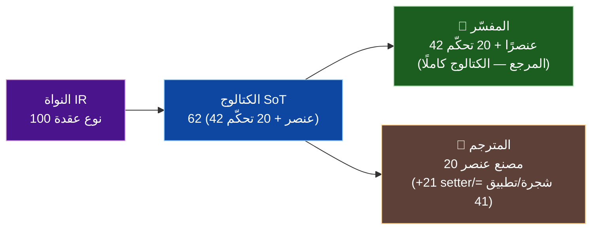
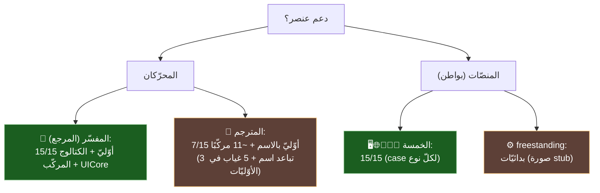

# 🧮 مصفوفة دعم كل عنصر × كل محرّك ومنصّة — SadUI

> لكلّ عنصر: ماذا يدعمه **المفسّر** و**المترجم** (المحرّكان)، وأيّ **المنصّات** (البواطن) تدعمه. مدعومة بفحص آليّ: تسجيلات المفسّر (`interpreter/src/ui/*_builtins.cpp`)، ومطابقات مصنع المترجم (`compiler/src/frontend/builders/builtins_ui.cpp`)، ومراجع `UINodeType::`/`case` في كلّ باطن.
>
> **منهج (GR-01):** «المفسّر» = يسجّل العنصر كبنّاء. «المترجم» = له مصنع `BUILTIN_UI_*` يطابق اسمه المعياريّ. «باطن» = يحوي `case` للنوع. التمييز بين الطبقات مقصود (راجع [كتالوج-العناصر](./كتالوج-العناصر-ومصفوفة-الاختبار.md) و[تكافؤ-المنصّات](./تكافؤ-المنصّات.md)).

---

## ٠) العدد الحقيقيّ للعناصر المدعومة (ليست 15!)

> الـ15 هي **مجموعة المحلّل الأوّليّة المنسَّقة** فقط (ADR-UI-02). العدد الفعليّ الذي يدعمه الكود أكبر بكثير — مؤكَّد بعدّ الثوابت المتمايزة في الرجستري المولَّد (`shared/builtins/generated/builtin_registry_generated.h`) وتعداد `UINodeType`.

| الطبقة | العدد المتمايز | الدليل |
|---|:---:|---|
| **النواة IR — `UINodeType`** | **100** | `sad_ui/core/include/sad_ui/types.h` (8 فئات) — أقصى مفردات العناصر |
| **الكتالوج (SoT) — `ui_widgets.yaml`** | **62** | 42 `UIWidgets` (عناصر/ودجات) + 20 `UICore` (تحكّم) |
| **🔷 المفسّر — عناصر/ودجات (`UIWidgets`)** | **42** | 42 ثابت `UIWidgets::` متمايز في الرجستري المولَّد |
| **🔷 المفسّر — دوال تحكّم (`UICore`)** | **20** | 20 ثابت `UICore::` متمايز (تطبيق/تنقّل/ثيم/حالة) |
| **🔶 المترجم — مصانع عناصر (`BUILTIN_UI_*` factory)** | **20** | مؤكَّد (Amelia + sir_types.h) |
| **🔶 المترجم — opcodes UI إجماليّة** | **41** | 20 مصنع + 12 setter + 3 شجرة + 6 تطبيق |
| **المحلّل — أسماء مقبولة** | **~70** | 15 أوّليّ + ~55 مُهمل (يُحوَّل لأوّليّ) |

> **الجواب المباشر:** المفسّر يدعم **42 عنصرًا/ودجة** (+20 دالّة تحكّم) فوق **100 نوع نواة**؛ المترجم يدعم **20 مصنع عنصر**. الـ15 ليست سقف الدعم بل البوّابة النحويّة المنسَّقة. الجداول أدناه تفصّل الأوّليّات الـ15 والمركّبات.

---

## أ) العناصر الأوّليّة الـ15

| # | العنصر | النوع | 🔷 المفسّر | 🔶 المترجم | 🖥️ مكتب | 🌐 ويب | 🍎 iOS | 🍏 macOS | 🤖 أندرويد | ⚙️ freestand |
|---|---|---|:---:|:---:|:---:|:---:|:---:|:---:|:---:|:---:|
| 1 | عمود | `Column` | ✅ | ✅ | ✅ | ✅ | ✅ | ✅ | ✅ | ◐ |
| 2 | صف | `Row` | ✅ | ✅ | ✅ | ✅ | ✅ | ✅ | ✅ | ◐ |
| 3 | رصة | `Stack` | ✅ | 🟡¹ | ✅ | ✅ | ✅ | ✅ | ✅ | ◐ |
| 4 | شبكة | `Grid` | ✅ | ❌² | ✅ | ✅ | ✅ | ✅ | ✅ | ◐ |
| 5 | نص | `Text` | ✅ | 🟡¹ | ✅ | ✅ | ✅ | ✅ | ✅ | ◐ |
| 6 | صورة | `Image` | ✅ | ❌² | ✅ | ✅ | ✅ | ✅ | ✅ | ❌ stub |
| 7 | أيقونة | `Icon` | ✅ | ❌² | ✅ | ✅ | ✅ | ✅ | ✅ | ◐ |
| 8 | زر | `Button` | ✅ | ✅ | ✅ | ✅ | ✅ | ✅ | ✅ | ◐ |
| 9 | حقل_نص | `TextField` | ✅ | ✅ | ✅ | ✅ | ✅ | ✅ | ✅ | ◐ |
| 10 | مفتاح | `Toggle` | ✅ | 🟡¹ | ✅ | ✅ | ✅ | ✅ | ✅ | ◐ |
| 11 | منزلق | `Slider` | ✅ | ✅ | ✅ | ✅ | ✅ | ✅ | ✅ | ◐ |
| 12 | حاوية | `Container` | ✅ | ✅ | ✅ | ✅ | ✅ | ✅ | ✅ | ◐ |
| 13 | عرض_تمرير | `ScrollView` | ✅ | ❌² | ✅ | ✅ | ✅ | ✅ | ✅ | ◐ |
| 14 | قائمة_كسولة | `LazyColumn` | ✅ | ❌² | ✅ | ✅ | ✅ | ✅ | ✅ | ◐ |
| 15 | فاصل | `Spacer` | ✅ | ✅ | ✅ | ✅ | ✅ | ✅ | ✅ | ◐ |

**حواشٍ:** ¹ **تباعد اسم** — المصنع موجود لكن باسمٍ آخر (رصة→`مكدس`، نص→`نص_عنصر`، مفتاح→`مبدل`)؛ فالاسم المعياريّ الذي يكتبه المستخدم **يفشل** في المترجم حتى يُضاف مرادفًا (نمط أ-2b). ² **غياب مصنع** — لا مصنع `BUILTIN_UI_*` لهذا العنصر.

> **خلاصة الأوّليّات:** المفسّر **15/15**؛ البواطن الخمسة **15/15**؛ المترجم **7/15** (✅) + 3 تباعد اسم (🟡) + 5 غياب (❌)؛ freestanding بدائيّات (صورة stub).

---

## ب) عناصر مركّبة/إضافيّة لها مصنع مترجم مخصَّص

> هذه ليست ضمن الـ15 الأوّليّ، لكنّ **المترجم يلوّنها بمصنع خاصّ** (مطابقة اسمها مباشرةً في `builtins_ui.cpp`)، والمفسّر يسجّلها، والمحلّل يقبلها (بعضها مُهمل يُحوَّل لأوّليّ عند الرسم).

| العنصر | مصنع المترجم | 🔷 المفسّر | 🔶 المترجم | البواطن الخمسة |
|---|---|:---:|:---:|:---:|
| نص_منسق | `TEXT_STYLED` | ✅ | ✅ | ✅ |
| نص_عرض (مرادف نص_عنصر) | `UI_4` | ✅ | ✅ | ✅ |
| زر_نوع | `BUTTON_VARIANT` | ✅ | ✅ | ✅ |
| زر_أيقونة | `ICON_BUTTON` | ✅ | ✅ | ✅ |
| زر_عائم | `FAB` | ✅ | ✅ | ✅ |
| مربع_تحقق (المصنع يطابق هذا الاسم؛ خانة_اختيار اسم النوع) | `CHECKBOX`/`UI_11` | ✅ | ✅ | ✅ |
| بطاقة | `CARD` | ✅ | ✅ | ✅ (→حاوية) |
| هيكل | `SCAFFOLD` | ✅ | ✅ | ✅ |
| شريط_تطبيق | `APP_BAR` | ✅ | ✅ | ✅ (→حاوية) |
| خط_فاصل (فاصل_خط) | `DIVIDER` | ✅ | ✅ | ✅ |
| حوار | `DIALOG` | ✅ | ✅ | ✅ (→رصة) |

> أيْ مصانع المترجم الإجماليّة للعناصر = **20 مصنعًا متمايزًا** (21 مع عدّ مرادف `نص_عرض`/`UI_4` منفصلًا) — **مؤكَّد بتحقّق Amelia الجزئيّ** (مطابقات `builtins_ui.cpp` الأسطر 45–290 مصانع؛ UI_20–UI_40 غير-مصانع = أضف_ابن/عين_*/تطبيق). منها 7 من الأوّليّات الـ15 بالاسم + 3 بأسماء مرادفة + ~10 مركّبًا/إضافيًّا. الفجوة في الـ15 الأوّليّ تحديدًا (شبكة/صورة/أيقونة/عرض_تمرير/قائمة_كسولة + تباعد رصة/مفتاح/نص).

---

## ج) عناصر مُهملة (يقبلها المحلّل ويحوّلها لأوّليّ)

> ~55 اسمًا مُهملًا (`deprecatedWidgets` في `parser_ui.cpp`) تُقبَل بتحذير وتُحوَّل تلقائيًّا لعنصرٍ أوّليّ معادل. أمثلة: وسط/حشوة/محاذاة/موسع/مرن/مقاس→حاوية أو صف، صندوق/سطح→حاوية، قائمة_عرض→قائمة_كسولة، تبويبات→صف، ملاح→رصة. فدعمها = دعم العنصر الأوّليّ الذي تُحوَّل إليه (المفسّر ✅ والبواطن ✅؛ المترجم بحسب الأوّليّ الهدف).

---

## د) دوال UICore (تحكّم لا عناصر — ~20)

> ليست عناصر رسم بل تحكّم: `تشغيل_تطبيق`، `ارسم`، `انتقل/عودة/استبدل` (تنقّل)، `تبديل_الثيم/وضع_داكن/هل_داكن` (ثيم)، `عين_الحالة/تحديث_حالة` (حالة)، `عنوان_النافذة/أغلق_النافذة`، `توليد_ويب`، `طباعة_شجرة`.

| الفئة | 🔷 المفسّر | 🔶 المترجم |
|---|:---:|:---:|
| إدارة التطبيق (تشغيل/ارسم/جذر/خطط) | ✅ | ✅ opcodes `APP_CREATE/SET_ROOT/LAYOUT/RENDER/DESTROY` |
| الثيم (تبديل/داكن/فاتح) | ✅ بنّاءات | 🟡 جزئيّ (راجع وثيقة القدرات) |
| التنقّل (انتقل/عودة/استبدل) | ✅ بنّاءات | ⚪ غير مُتحقَّق |
| الحالة (عين_الحالة/تحديث_حالة) | ✅ عبر `UIStateManager` | ✅ (دورة @حالة) |

---

## هـ) القراءة الحاسمة

- **«ما المنصّات غير المدعومة لعنصر؟»** — لا منصّة عرضٍ كاملة (الخمسة) تفتقد أيّ عنصر من الـ15؛ الاستثناء freestanding (بدائيّات + صورة stub).
- **«ماذا يدعم كلّ محرّك؟»** — المفسّر يدعم الكتالوج كاملًا (المرجع)؛ المترجم يدعم 7/15 أوّليًّا بالاسم + ~11 عنصرًا مركّبًا، وفجواته في الأوّليّات الثمانية (3 تباعد اسم + 5 غياب مصنع).
- **الفجوة الجوهريّة** بين المحرّكين ليست في المنصّات بل في **مصانع المترجم** (شريحتا م-مصانع + م-أسماء).

---

> ⚠️ محتوى **عامّ** — لا أرقام ماليّة ولا أسرار. راجع [GOVERNANCE.md](../../../GOVERNANCE.md).

