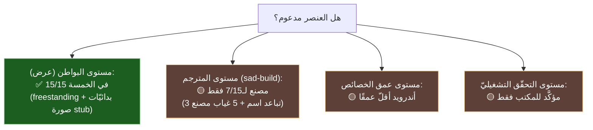

# 🧮 مصفوفة دعم كل عنصر × كل منصّة — SadUI

> لكلّ عنصر أوّليّ: أيّ المنصّات (البواطن) **تدعمه** وأيّها **لا**. مدعومة بفحص آليّ لمراجع `UINodeType::`/`case` في كلّ باطن (`sad_ui/backends/<b>/src/`).
>
> **منهج القياس (GR-01):** «مدعوم في باطن» = الباطن يحوي حالة معالجة (`case النوع` أو `UINodeType::النوع`) لذلك العنصر. هذا قياس **حضور المعالجة** لا **عمق الخصائص**.

---

## 1) المصفوفة (15 عنصرًا × 6 بواطن)

| # | العنصر | النوع | 🖥️ مكتب | 🌐 ويب | 🍎 iOS | 🍏 macOS | 🤖 أندرويد | ⚙️ freestanding |
|---|---|---|:---:|:---:|:---:|:---:|:---:|:---:|
| 1 | عمود | `Column` | ✅ | ✅ | ✅ | ✅ | ✅ | ◐ |
| 2 | صف | `Row` | ✅ | ✅ | ✅ | ✅ | ✅ | ◐ |
| 3 | رصة | `Stack` | ✅ | ✅ | ✅ | ✅ | ✅ | ◐ |
| 4 | شبكة | `Grid` | ✅ | ✅ | ✅ | ✅ | ✅ | ◐ |
| 5 | نص | `Text` | ✅ | ✅ | ✅ | ✅ | ✅ | ◐ |
| 6 | صورة | `Image` | ✅ | ✅ | ✅ | ✅ | ✅ | ❌ stub |
| 7 | أيقونة | `Icon` | ✅ | ✅ | ✅ | ✅ | ✅ | ◐ |
| 8 | زر | `Button` | ✅ | ✅ | ✅ | ✅ | ✅ | ◐ |
| 9 | حقل_نص | `TextField` | ✅ | ✅ | ✅ | ✅ | ✅ | ◐ |
| 10 | مفتاح | `Toggle` | ✅ | ✅ | ✅ | ✅ | ✅ | ◐ |
| 11 | منزلق | `Slider` | ✅ | ✅ | ✅ | ✅ | ✅ | ◐ |
| 12 | حاوية | `Container` | ✅ | ✅ | ✅ | ✅ | ✅ | ◐ |
| 13 | عرض_تمرير | `ScrollView` | ✅ | ✅ | ✅ | ✅ | ✅ | ◐ |
| 14 | قائمة_كسولة | `LazyColumn` | ✅ | ✅ | ✅ | ✅ | ✅ | ◐ |
| 15 | فاصل | `Spacer` | ✅ | ✅ | ✅ | ✅ | ✅ | ◐ |

**الرموز:** ✅ يعالجه الباطن صراحةً (حالة `case`) · ◐ يُرسَم عبر طبقة البدائيّات لا بمعالجة نوعٍ خاصّة · ❌ stub (غير مرسوم فعليًّا).

> **النتيجة الحاسمة:** الباطنات الخمسة الكاملة (مكتب/ويب/iOS/macOS/أندرويد) **تدعم الـ15 جميعًا** — لا عنصر «غير مدعوم» في أيٍّ منها على مستوى المعالجة. **freestanding** حالة خاصّة: لا يعالج بالنوع إطلاقًا (صفر `case`)، بل يرسم عبر بدائيّات منخفضة المستوى تُغذّيه بها طبقة أعلى (نظير مسار رسم المكتب)؛ فالعناصر تظهر فيه عدا **الصورة (stub)**.

---

## 2) أين الفجوات إذًا؟ (ليست في حضور العنصر)

الدعم ثلاث طبقات يجب عدم خلطها:

| الطبقة | الحالة | المرجع |
|---|---|---|
| **حضور العنصر في الباطن (عرض)** | ✅ 15/15 عبر الخمسة | هذه المصفوفة (فحص `case`) |
| **مصنع المترجم `sad-build`** | 🟡 7/15 (3 تباعد اسم + 5 غياب) | [كتالوج-العناصر-ومصفوفة-الاختبار](./كتالوج-العناصر-ومصفوفة-الاختبار.md) |
| **عمق الخصائص + التحقّق التشغيليّ** | 🟡 أندرويد أقلّ؛ المكتب وحده متحقَّق طرفًا لطرف | [تكافؤ-المنصّات](./تكافؤ-المنصّات.md) |

> أيْ: العنصر «مدعوم» في كلّ باطن عرضٍ كامل، لكنّ «الوصول إليه عبر المترجم» و«عمقه/تحقّقه» يتفاوت. سؤال «ما المنصّات غير المدعومة لعنصر؟» جوابه: **لا منصّة عرضٍ كاملة تفتقد أيّ عنصر**؛ الاستثناءات الحقيقيّة هي freestanding (بدائيّات + صورة stub) ومسار المترجم (8 عناصر بفجوة مصنع/اسم).

---

## 3) ملاحظة «خادم الودجات» في `tools/`

بحثتُ `tools/` فوجدت: `hub` (موزّع أدوات `sad-*`)، `lsp` (خادم لغة LSP)، `pkg` (نظام حزم)، `wasm` (`sad_wasm_runtime.js`)، `formatter`، `analyze`، `apk_builder`، `profiler`، `repl`، `sadinfo`، `security-scanner` — **لا أداة باسم «خادم ودجات» صريح**. إن كان المقصود إحدى هذه (LSP؟ wasm playground؟ pkg؟) أو أداةً بمسارٍ محدَّد، فحدِّدها لأوثّقها هنا بدقّة. _(هذا القسم مؤقّت بانتظار التوضيح.)_

---

> ⚠️ محتوى **عامّ** — لا أرقام ماليّة ولا أسرار. راجع [GOVERNANCE.md](../../../GOVERNANCE.md).

