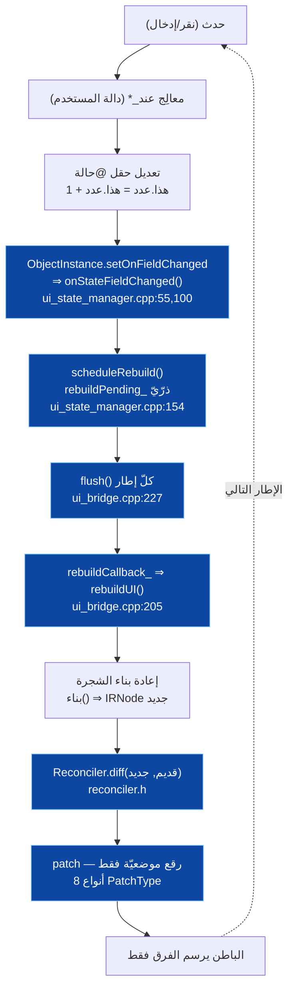
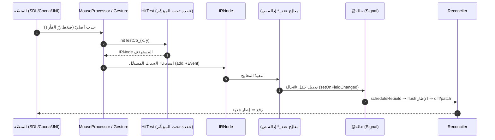
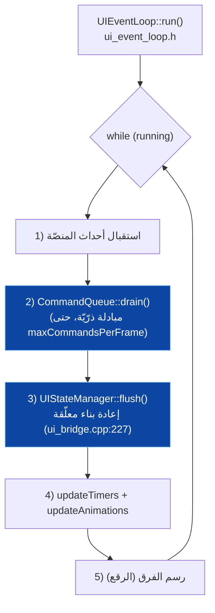
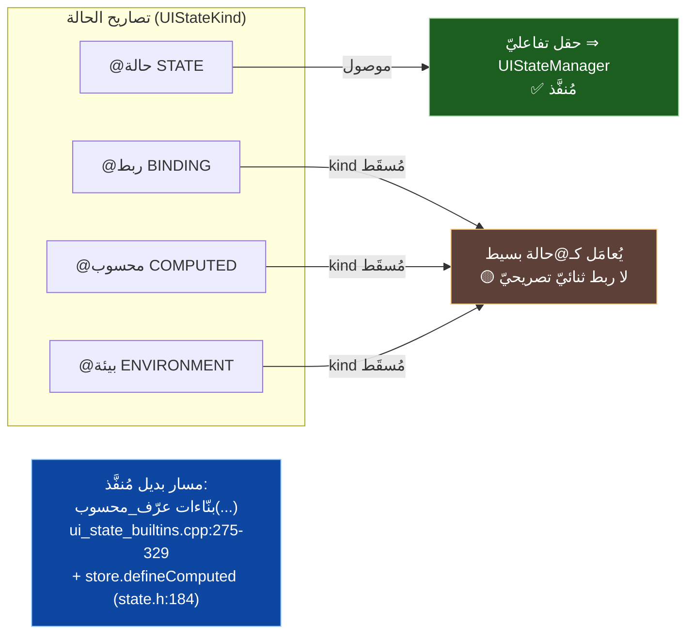
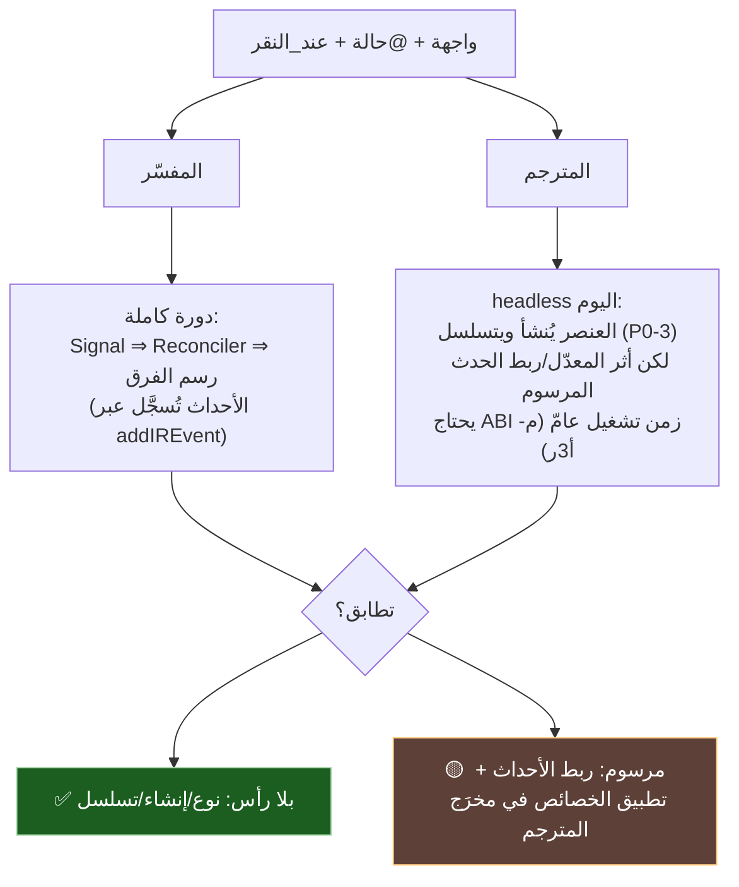

# ⚡ معماريّة الأحداث والحالة (الدورة التفاعليّة) — SadUI

> تخطيط دقيق للدورة التفاعليّة: كيف يُحدِّث `@حالة` الواجهةَ، وكيف تُوزَّع الأحداث (`عند_النقر`)، وكيف تتطابق الدلالة عبر المحرّكين. كلّ مكوّن مدعوم بملفّ من `s-programming-language`.

---

## 1) المكوّنات (مُتحقَّقة بالكود)

| المكوّن | الملفّ | الدور | خيوط؟ |
|---|---|---|:---:|
| **Signal** | `sad_ui/core/include/sad_ui/signal.h` (`template class Signal<T>`) | نمط المُراقِب: `subscribe`/`unsubscribe`/`notifyAll` (+`set`/`get`) — أساس التفاعليّة | ❌ خيط اللغة فقط (بالتصميم، `signal.h:30`) |
| **CommandQueue** | `sad_ui/core/include/sad_ui/command_queue.h` (`class CommandQueue`) | حاجز منتِج/مستهلِك مزدوج المخزن: المنتج يدفع، `drain()` يُبادِل ذرّيًّا، `notify()` يوقظ خيط الواجهة، `waitForCommands()` يحجب بمهلة | ✅ `std::mutex`+`std::atomic`+`condition_variable` (`:155-163`) |
| **PropertyBinding** | `sad_ui/core/include/sad_ui/property_binding.h` | يربط `@ربط`: يشترك على `Signal<T>` ⇒ يُصدِر أمرًا عبر `queue_` (`CommandQueue&` `:207`) | يَعبُر الحاجز عبر CommandQueue |
| **Reconciler** | `sad_ui/core/include/sad_ui/reconciler.h` (`class Reconciler`) | Virtual DOM: `diff`/`patch`، **8 أنواع `PatchType`** (انظر §4ب) | — |
| **IR** | `sad_ui/core/include/sad_ui/ir.h` (`IRNode`/`UINodeType`) | شجرة العناصر المحايدة | — |
| **UIEventLoop** | `sad_ui/core/include/sad_ui/ui_event_loop.h` (`class UIEventLoop`) | حلقة الإطار الثابت: `while(running){ … CommandQueue::drain … }`؛ `run()` حاجب، `tick()` إطار واحد | خيط الواجهة |
| **HybridRouting** | `sad_ui/core/include/sad_ui/hybrid_routing.h` | توجيه `UINodeType` ⇒ أصليّ أم لوحة رسم (`route`) | — |
| **MouseProcessor** | `sad_ui/core/include/sad_ui/mouse_processor.h` | `HitTestCallback` — يحوّل أحداث المنصّة الأصليّة إلى عقدة | — |
| **GestureProcessor** | `sad_ui/core/include/sad_ui/gesture.h` (`GestureState`) | إيماءات (سحب/ضغط مطوّل) | — |
| **UIStateManager** | `interpreter/src/ui/ui_state_manager.cpp` (`UIStateManager::instance()`) | **مدير الحالة الفعليّ في المفسّر**: `registerComponent` ⇒ مراقبة `setOnFieldChanged` ⇒ `onStateFieldChanged` ⇒ `scheduleRebuild` (ذرّيّ) ⇒ `flush` ⇒ `rebuildCallback_` | `std::atomic<bool> rebuildPending_` |
| **مُسجِّل الأحداث** | `interpreter/src/ui/widget_builder.cpp` (`addIREvent`) | يربط معالِج `عند_*` بعقدة IR | — |

> **نموذج الخيوط (موثَّق ومقصود):** `Signal` يعيش على **خيط اللغة** ويُقرأ/يُكتب منه فقط (`signal.h:30-31`)، فعدم أمانه للخيوط **ليس فجوة بل تصميم**؛ العبور الآمن للخيوط يحدث حصرًا عبر `CommandQueue` (مزدوج المخزن + قفل + متغيّر شرط). أيْ: مُنتِج واحد (اللغة) ⇄ مستهلِك واحد (الواجهة) عبر حاجز واحد.

---

## 2) دورة الحالة → إعادة الرسم

> هذا هو **المسار المُنفَّذ فعلًا في المفسّر** (مُتحقَّق بمسار:سطر)، لا تصوّر مجرّد.

**الفكرة:** لا إعادة رسم كاملة؛ تعديل حقل `@حالة` يُلتقَط عبر `setOnFieldChanged` على `ObjectInstance`، فيُجدوِل `UIStateManager` إعادة بناء (علم ذرّيّ)، ويُصرَّف مرّةً كلّ إطار (`flush`)، فيُعاد بناء شجرة افتراضيّة يقارنها الـReconciler ويُصدِر **رقعًا موضعيّة** فقط (Virtual DOM). ملاحظة: `Signal`/`CommandQueue` هما آليّة النواة العامّة؛ ووصل المفسّر يمرّ عبر `UIStateManager` (نظير عمليّ للإشارة على مستوى حقول الكائن).

---

## 3) تدفّق الأحداث (من المنصّة إلى المعالِج)

---

## 3ب) حلقة الإطار (تستهلك CommandQueue)

> توجد حلقة إطار ثابت في النواة (`UIEventLoop`) وتكامل فعليّ في المفسّر عبر ردّ تحديث المؤقّت كلّ إطار.

> `tick()` ينفّذ إطارًا واحدًا (للاختبار)؛ و`run()` يحجب حتى الإيقاف. `maxCommandsPerFrame` يحدّ الأوامر لكلّ إطار تفاديًا للتعطّل (`ui_event_loop.h`).

---

## 4) أنواع تصاريح الحالة (الدلالة المُنفَّذة فعلًا)

> ⚠️ **حسم GR-01 (مُتحقَّق):** العقدة `UIStateDecl` تحمل `UIStateKind kind` (STATE/BINDING/ENVIRONMENT/COMPUTED) ويضبطها المحلّل صحيحًا (`ui_nodes.h:74-82`). **لكنّ** مُنفِّذ `واجهة` في المفسّر (`statement_executor_oop_struct_test.cpp:532-552`) يمرّ على `node.stateDecls` **متجاهلًا `kind` كلّيًّا** — فيُسجّل كلّ تصريح (بما فيه @محسوب/@بيئة/@ربط) حقلًا تفاعليًّا عاديًّا (`addField` + `uiStateFields.insert`). أيْ: **@محسوب/@بيئة/@ربط التصريحيّة = تُحلَّل بنوعها الصحيح لكنّ نوعها يُسقَط عند الوصل الدلاليّ** ⇒ سلوكها = @حالة بسيط، بلا إعادة حساب تلقائيّة (@محسوب) ولا حقن سياق (@بيئة) ولا ربط ثنائيّ (@ربط) من المسار التصريحيّ.

> دلالة @محسوب الحقيقيّة (تبعيّات + إعادة حساب) موجودة في النواة (`StateStore::defineComputed`، `state.h:184`) وتُستدعى عبر **البنّاء** `عرّف_محسوب(اسم, اعتمادات, دالة)` (`ui_state_builtins.cpp:275`) — لا عبر `@محسوب` التصريحيّ. كذلك `StateBindingType` يعرّف State/Binding/Observable/Environment/Computed/Published (`types.h:566`)، مُستعمَلًا من واجهة المخزن لا من المُنفِّذ التصريحيّ.

### 4ب) أنواع الرقع الثمانية (`PatchType`، مُتحقَّقة)

`reconciler.h:76-86` — ثمانية بالضبط:

| # | النوع | الدلالة |
|---|---|---|
| 1 | `REPLACE` | استبدال عقدة بأخرى (اختلف النوع) |
| 2 | `UPDATE_PROPS` | تغيّرت/أُضيفت/حُذفت خصائص |
| 3 | `UPDATE_EVENTS` | معالِجات أحداث جديدة |
| 4 | `INSERT_CHILD` | إدراج ابن في موضع |
| 5 | `REMOVE_CHILD` | حذف ابن من موضع |
| 6 | `REORDER_CHILDREN` | إعادة ترتيب الأبناء |
| 7 | `UPDATE_ANIMATIONS` | تحديث التحريكات |
| 8 | `UPDATE_STATE_REFS` | تحديث إشارات الحالة |

---

## 5) تطابق الدلالة عبر المحرّكين (الفجوة الحاليّة)

---

## 6) بنود التخطيط لهذه الشريحة

> تحديث حسب التدقيق: **البند 1 (وصل @حالة) مُنجَز فعلًا في المفسّر** — وُثِّق بمسار:سطر في §1/§2 (السلسلة: `oop_new.cpp:624` تسجيل ⇒ `ui_state_manager.cpp:55,100,154` ⇒ `ui_bridge.cpp:205,227`). لم يَعُد بندًا مفتوحًا بل تثبيتٌ مرجعيّ.

1. ✅ **(مُنجَز) وصل `@حالة` في المفسّر** — موثَّق أعلاه. يبقى توثيقه في الدليل المرجعيّ فقط.
2. 🟡 **(فجوة مؤكَّدة) وصل `kind` لـ@محسوب/@بيئة/@ربط التصريحيّة** — المُنفِّذ يُسقِط `UIStateKind` (`struct_test.cpp:532-552`). السدّ: تفريع على `stateDecl->kind` لاستدعاء `defineComputed`/حقن البيئة/الربط الثنائيّ بدل معاملتها @حالة، أو توثيق أنّ الطريق الرسميّ هو البنّاءات (`عرّف_محسوب`).
3. **ABI أحداث المترجم** (يرتبط بـ**م-أ3ر**): تمرير معالِج `عند_*` إلى وقت التشغيل وتسجيله على عقدة IR في المخرَج المرسوم — تصميم + توقيع C.
4. **تطبيق الخصائص العامّة** في المترجم (نظير `setIRProperty`) لتطابق أثر المعدّلات مرسومًا.
5. **مصفوفة تطابق تفاعليّة**: سيناريوهات (نقر يزيد عدّادًا، ربط حقل نصّ، @محسوب) تُختبَر مفسّر↔مترجم.
6. **التزامن**: مُتحقَّق أنّ `CommandQueue` آمن للخيوط (قفل+ذرّيّ+متغيّر شرط) و`Signal` خيط-لغة-فقط بالتصميم؛ يبقى توثيق ضمانات الترتيب وحدود الحاجز في الدليل.

> هذه الوثيقة **تخطيطيّة**؛ البنود 3–4 تتقاطع مع الشريحة **م-أ3ر** في [`README.md`](./README.md).

---

> ⚠️ محتوى **عامّ** — لا أرقام ماليّة ولا أسرار. راجع [GOVERNANCE.md](../../../GOVERNANCE.md).

