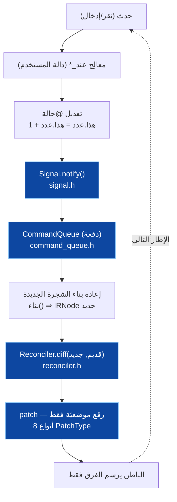
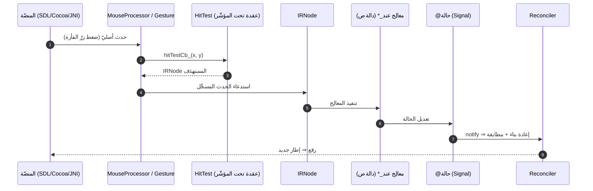
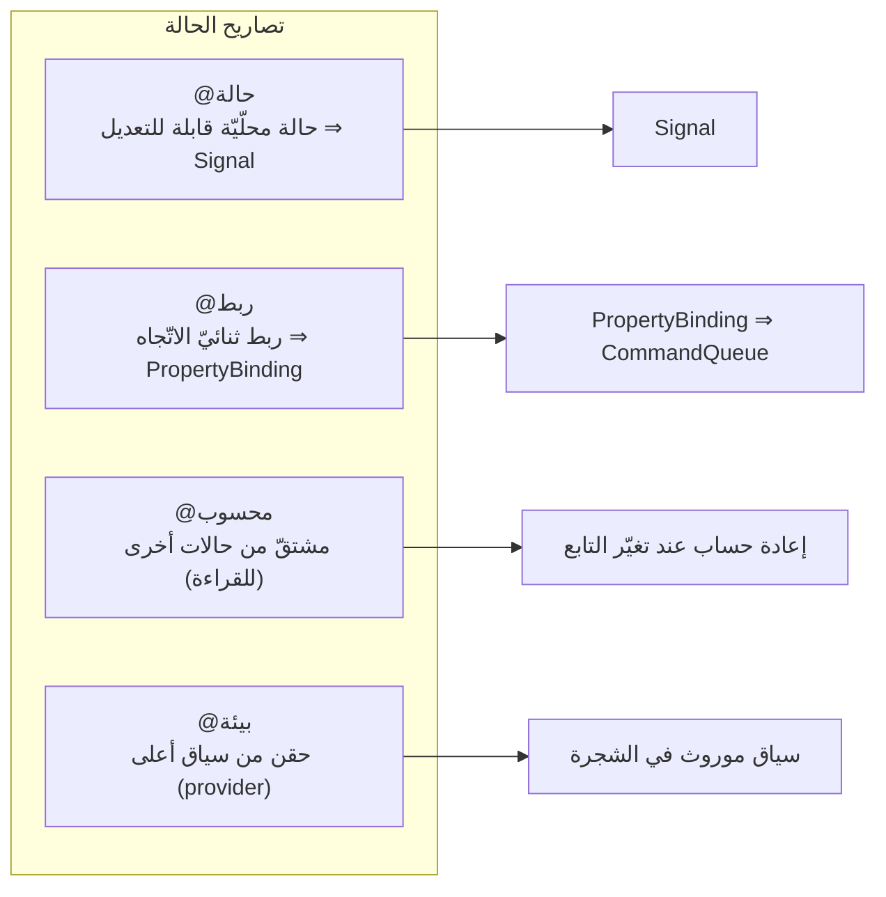
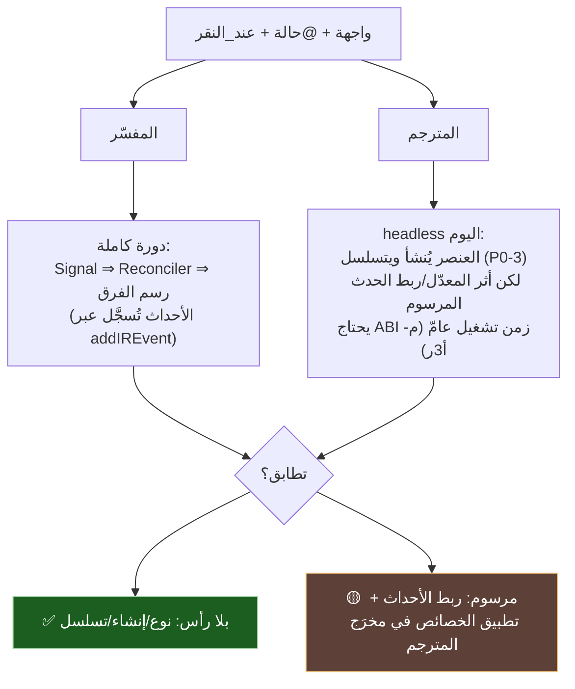

# ⚡ معماريّة الأحداث والحالة (الدورة التفاعليّة) — SadUI

> تخطيط دقيق للدورة التفاعليّة: كيف يُحدِّث `@حالة` الواجهةَ، وكيف تُوزَّع الأحداث (`عند_النقر`)، وكيف تتطابق الدلالة عبر المحرّكين. كلّ مكوّن مدعوم بملفّ من `s-programming-language`.

---

## 1) المكوّنات (مُتحقَّقة بالكود)

| المكوّن | الملفّ | الدور |
|---|---|---|
| **Signal** | `sad_ui/core/include/sad_ui/signal.h` (`class Signal`) | نمط المُراقِب: `subscribe`/`unsubscribe`/`notify` — أساس التفاعليّة |
| **CommandQueue** | `sad_ui/core/include/sad_ui/command_queue.h` (`class CommandQueue`) | تجميع الأوامر بدفعات عبر `notify()` (batching) |
| **PropertyBinding** | `sad_ui/core/include/sad_ui/property_binding.h` | يربط `@ربط`: `signal.subscribe(...)` ⇒ `queue_.notify()` |
| **Reconciler** | `sad_ui/core/include/sad_ui/reconciler.h` (`class Reconciler`) | Virtual DOM: `diff`/`patch`، **8 أنواع رقع** (`PatchType`)، رَدّ `OnNodeUpdated` |
| **IR** | `sad_ui/core/include/sad_ui/ir.h` (`IRNode`/`UINodeType`) | شجرة العناصر المحايدة |
| **HybridRouting** | `sad_ui/core/include/sad_ui/hybrid_routing.h` | توجيه `UINodeType` ⇒ أصليّ أم لوحة رسم (`route`) |
| **MouseProcessor** | `sad_ui/core/include/sad_ui/mouse_processor.h` | `HitTestCallback` — يحوّل أحداث المنصّة الأصليّة إلى عقدة |
| **GestureProcessor** | `sad_ui/core/include/sad_ui/gesture.h` (`GestureState`) | إيماءات (سحب/ضغط مطوّل) |
| **مُسجِّل الأحداث** | `interpreter/src/ui/widget_builder.cpp` (`addIREvent`) | يربط معالِج `عند_*` بعقدة IR |

> ملاحظة دلاليّة: تصاريح `@حالة/@ربط/@محسوب/@بيئة` تُحلَّل في `shared/parser/src/ui/parser_ui.cpp` (`parseUIStateDecl`)، وتُوصَل وقت التقييم في المفسّر (وصل الحالة ⇒ إعادة بناء، حسب W15).

---

## 2) دورة الحالة → إعادة الرسم

**الفكرة:** لا إعادة رسم كاملة؛ التغيير في `@حالة` يُجمَّع بدفعة، يُعاد بناء شجرة افتراضيّة، ثمّ يقارنها الـReconciler ويُصدِر **رقعًا موضعيّة** فقط (Virtual DOM).

---

## 3) تدفّق الأحداث (من المنصّة إلى المعالِج)

---

## 4) أنواع تصاريح الحالة (الدلالة)

---

## 5) تطابق الدلالة عبر المحرّكين (الفجوة الحاليّة)

---

## 6) بنود التخطيط لهذه الشريحة

1. **توثيق نقطة وصل `@حالة` في المفسّر بدقّة** (الملفّ/الدالّة التي تربط تقييم `@حالة` بـ`Signal`/إعادة البناء) — تثبيت مرجعيّ.
2. **ABI أحداث المترجم** (يرتبط بـ**م-أ3ر**): كيف يُمرَّر معالِج `عند_*` (مؤشّر دالّة) إلى وقت التشغيل ويُسجَّل على عقدة IR في المخرَج المرسوم — تصميم + توقيع C.
3. **تطبيق الخصائص العامّة** في المترجم (نظير `setIRProperty`) لتطابق أثر المعدّلات مرسومًا.
4. **مصفوفة تطابق تفاعليّة**: سيناريوهات (نقر يزيد عدّادًا، ربط حقل نصّ، @محسوب) تُختبَر مفسّر↔مترجم.
5. **التزامن**: سلوك `CommandQueue`/الإشارات تحت الخيوط (يرتبط ببُعد «التزامن» في تقرير الالتزام).

> هذه الوثيقة **تخطيطيّة**؛ البنود 1–3 تتقاطع مع الشريحة **م-أ3ر** في [`README.md`](./README.md).

---

> ⚠️ محتوى **عامّ** — لا أرقام ماليّة ولا أسرار. راجع [GOVERNANCE.md](../../../GOVERNANCE.md).

