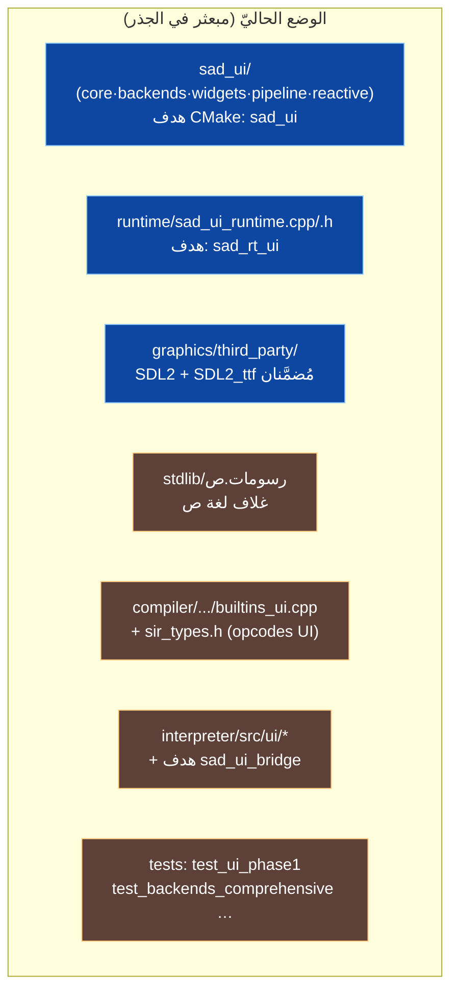
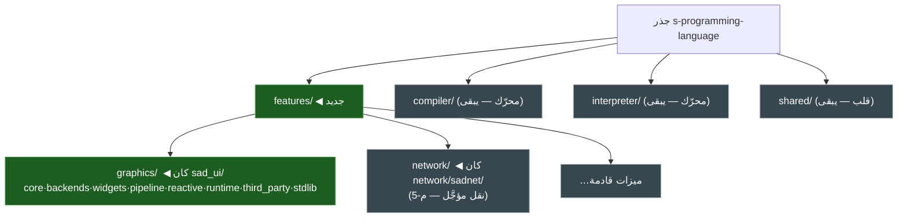
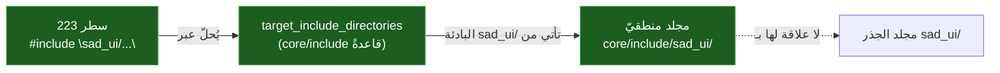
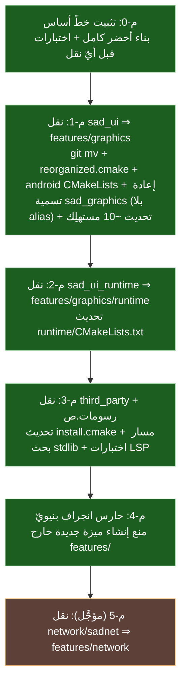

<div dir="rtl">

# 📦 خطة نقل مكتبة الرسومات إلى مجلد «الميزات» (`features/`)

> **الهدف:** نقل مكتبة الرسومات (الكود الفعليّ في `s-programming-language`) من جذر المستودع إلى مجلد جديد `features/` يجمع **كلّ ميزات لغة ص** (الرسومات، الشبكة، وغيرها لاحقًا) تحت تصنيف واحد متّسق — **قبل** بدء تطوير الرسومات، حتى يُبنى ما يأتي في الموضع الصحيح.
>
> هذه الخطة **بنيويّة لا وظيفيّة**: لا تغيّر سلوك المكتبة، بل موضعها وتنظيمها. تتّسق مع حدود أهداف CMake في القلب الموحَّد (RFC 0010).
>
> ✅ **القرارات محسومة** (انظر §6): الاسم `features/graphics`؛ الهدف يُعاد تسميته `sad_graphics` **إعادة نظيفة بلا alias** (اللغة لم تُنشَر ⇒ لا حاجة لتوافق، وازدواج الاسم يُربك المطوّر) مع تحديث ~10 مستهلِك؛ `third_party` + `رسومات.ص` **ضمن النطاق الآن**؛ زمن التشغيل ينتقل إلى `features/graphics/runtime/`؛ نقل الشبكة **مؤجَّل**.

---

## 1) ما هي «مكتبة الرسومات» في الكود فعليًّا؟ (7 مكوّنات)

التسمية «sad_ui» تُخفي أنّ الميزة موزّعة على **سبعة مواضع**، وكلّها يجب أن تُحسَب في النقل:



| # | المكوّن | المسار الحاليّ | هدف CMake | الدليل | يُنقَل؟ |
|---|---|---|:---:|---|:---:|
| 1 | **النواة + المنصّات + العناصر** | `sad_ui/` | `sad_ui` | `sad_ui/CMakeLists.txt:172` (`add_library(sad_ui STATIC …)`) | ✅ بالكامل |
| 2 | **زمن تشغيل الواجهات** | `runtime/sad_ui_runtime.{cpp,h}` | `sad_rt_ui` | `runtime/CMakeLists.txt:79` | ✅ إلى `features/graphics/runtime/` |
| 3 | **تبعيّات الرسم المُضمَّنة** | `graphics/third_party/` | — | `sad_ui/CMakeLists.txt:238` (SDL2-2.28.5)، `:281` (SDL2_ttf-2.20.2) | ✅ (ضمن النطاق — م-3) |
| 4 | **غلاف لغة ص** | `stdlib/رسومات.ص` (ملفّ مفرد) | — | الجذر `stdlib/رسومات.ص` | ✅ (ضمن النطاق — م-3) |
| 5 | **إرسال المترجم** | `compiler/src/frontend/builders/builtins_ui.cpp` · `compiler/include/frontend/sir_types.h` | جزء من المترجم | كلاهما موجود | ❌ يبقى (حدّ معماريّ) |
| 6 | **وصل المفسّر + الجسر** | `interpreter/src/ui/*` · هدف `sad_ui_bridge` | `sad_ui_bridge` | `cmake/libraries.cmake:242,249-250` | ❌ يبقى (حدّ معماريّ) |
| 7 | **الاختبارات** | `cmake/tests_comprehensive.cmake` | عدّة أهداف | `:220-276` | ⚙️ تُحدَّث مساراتها فقط |

> **قرار حدّيّ (GR-01):** المكوّنان 5 و6 (إرسال المترجم، وصل المفسّر) **ليسا** جزءًا من «مكتبة الرسومات» بل من **المحرّكين**؛ نقلهما يكسر حدود RFC 0010. **مؤكَّد بنيويًّا:** `cmake/libraries.cmake:249-250` يربط `sad_ui_bridge` بـ`sad_core` (PUBLIC) و`sad_ui` (PRIVATE) — أي الجسر **يستهلك** الهدف المنقول كتبعيّة، لا يحتويه. هذا تمامًا نموذج «المترجم/المفسّر يستهلكان sad_ui عبر هدف».

### 1.1) أين يقع `platform/`؟ (مُضيف لا مكتبة — لا يُنقَل)

سؤال مفصليّ: `platform/android/` ليس جزءًا من مكتبة الرسومات، بل **طبقة مُضيف/نشر** (host) موازية لـ`apps/` و`distribution/`.

| الجانب | `sad_ui/backends/android/` | `platform/android/` |
|---|---|---|
| **الطبيعة** | خلفيّة أندرويد **للمكتبة** (codegen/renderer) | **مشروع تطبيق أندرويد** (APK) قائم بذاته |
| **المحتوى** | `compose_codegen.cpp`، `android_renderer` | قشرة Java (`MainActivity`/`SadEngine`)، جسر JNI (`native_ui_builder`، `sad_android_bridge`)، `AndroidManifest.xml`، `debug.keystore`، نصوص بناء APK |
| **الهدف** | جزء من `sad_ui` (يُبنى مع المكتبة) | `sad_app` ⇒ `libsad_app.so` (بناء NDK مستقلّ يجمّع مصادر `sad_ui` core داخل الـAPK؛ يربط `log`/`android` فقط) — `platform/android/CMakeLists.txt:220,305` |
| **القرار** | ✅ **ينتقل** ⇒ `features/graphics/backends/android/` | ❌ **يبقى خارج `features/`** (مُضيف، لا ميزة) |

**الخلاصة:** `platform/` **مستهلِك** للمكتبة لا محتوٍ لها (يجمّع مصادرها في الـAPK)، فيبقى في موضعه كطبقة نشر — وتُحدَّث **مساراته** فقط (`platform/android/CMakeLists.txt:142-152,273-276`، مُدرَج في §4 كملفّ حرِج). إن رُغب لاحقًا في توحيد طبقات المُضيف (`apps/` + `platform/` + `distribution/`) تحت مظلّة `hosts/` فذلك **قرار منفصل** خارج نطاق هذه الخطة.

---

## 2) البنية الهدف: مظلّة `features/` موحّدة

نموذج «ميزة في الجذر» موجود **جزئيًّا** أصلًا: `network/sadnet/`. الخطة **توحّد النمط** تحت `features/`:



**البنية الداخليّة لـ`features/graphics/` (الهدف بعد م-1..م-3):**

```
features/graphics/
├── CMakeLists.txt        ← كان sad_ui/CMakeLists.txt (الهدف: sad_graphics — بلا alias)
├── core/  backends/  widgets/  pipeline/  reactive/   ← تُنقل كما هي
├── runtime/              ← كان runtime/sad_ui_runtime.{cpp,h} (هدف sad_rt_ui)
├── third_party/          ← كان graphics/third_party/ (SDL2/SDL2_ttf)
└── stdlib/رسومات.ص       ← كان stdlib/رسومات.ص
```

> ⚠️ **تنبيه على نمط الشبكة (تصويب Amelia):** `network/sadnet/` **لا يطابق** بنية `sad_ui`. يستعمل `include/` **مسطّحًا** (`network/sadnet/` = `README.md include/ src/ tests/`)، لا تخطيط بادئة منطقيّة `core/include/<اسم>/`. ⇒ ضمانة «صفر تعديل مصدر» التي تجعل نقل `sad_ui` منخفض الخطر **لا تنتقل كما هي** إلى sadnet؛ م-5 ملفّ خطر مختلف يُعاد تقييمه عند جدولته. وللشبكة **ملفّا cmake**: `cmake/network.cmake` و`cmake/sadnet.cmake`.

---

## 3) لماذا النقل منخفض الخطر؟ (الاكتشاف المفصليّ — مصحَّح)



**الدليل (GR-01، مصحَّح بتدقيق Amelia):**
- إجمالي **223** سطر `#include "sad_ui/..."`، توزيعها: **194** داخل `sad_ui/` نفسه (تنتقل **معه**)، **29** في `interpreter/` (المستهلك الوحيد خارج الميزة)، و**صفر** في `compiler/`/`tools/`/`apps/`/`runtime/`/`shared/`. (التوزيع يُقوّي الأطروحة: 87% من التضمينات داخليّة وتسافر مع المجلد.)
- البادئة `sad_ui/` تأتي من المجلد المنطقيّ **`sad_ui/core/include/sad_ui/`** (مؤكَّد موجودًا)، يضيفه `target_include_directories(sad_ui PUBLIC .../core/include)` (`sad_ui/CMakeLists.txt:176-178`).
- ⇒ **نقل مجلد الجذر لا يغيّر أيّ بادئة تضمين** — لأنّ `core/include/sad_ui/` ينتقل معه، وتبقى البادئة صالحة بمجرّد تحديث مسار `target_include_directories` (يتتبّعه `CMAKE_CURRENT_SOURCE_DIR` تلقائيًّا).

**النتيجة القاطعة:** النقل عمليّة **بناء + `git mv`** بحتة. **صفر تعديل على ملفات المصدر (`.cpp/.h`)** — بما فيها مصادر `platform/android/src/*` التي تضمّن `sad_ui/...` (تُحلّ بالبادئة كذلك). التغيير محصور في ملفات CMake التي تستعمل **مسارات مطلقة** `${CMAKE_SOURCE_DIR}/sad_ui/...` أو `${SAD_ROOT_DIR}/sad_ui/...`.

---

## 4) سطح التغيير (ملفات البناء فقط) — مدعوم بالأدلّة (مصحَّح)

التغيير محصور في **ملفات بناء معدودة**. أبرزها — وقد كشف تدقيق Amelia ملفًّا **يكسر بناء أندرويد إن أُغفل**:

| الملفّ | السطر/النطاق | ما يتغيّر | الخطورة |
|---|---|---|:---:|
| `reorganized.cmake` | `:27-28` | `add_subdirectory(.../sad_ui …)` ⇒ `.../features/graphics` | 🔴 جوهريّ |
| **`platform/android/CMakeLists.txt`** | `:142-152`، `:273-276` | **مسارات مصدر مطلقة** `${SAD_ROOT_DIR}/sad_ui/core/src/*.cpp` + مسارات تضمين — **تكسر بناء أندرويد إن أُغفلت** | 🔴 **حرِج (كان مُغفلًا)** |
| `runtime/CMakeLists.txt` | `:78-94` (+`:85` `graphics/third_party`) | مسارات `${CMAKE_SOURCE_DIR}/sad_ui/...` + نقل `sad_ui_runtime.cpp` إلى `features/graphics/runtime/` + مسار third_party | 🔴 جوهريّ |
| `cmake/libraries.cmake` | `:241-284` (تحديد `:260-261`) | مسارات `sad_ui_bridge` PRIVATE | 🟠 |
| `cmake/tests_comprehensive.cmake` | `:222-223, :255-262, :268-269, :275-276` | ~13 مسار تضمين مطلق (20 إشارة `sad_ui`) | 🟠 |
| `cmake/install.cmake` | `:73` (`graphics/third_party/SDL2/SDL2-2.28.5/lib/x64/SDL2.dll`) | مسار تثبيت SDL2 بعد نقل third_party | 🟠 (م-3) |
| `apps/CMakeLists.txt` | `:38` | `sad_ui` ⇒ `sad_graphics` (ربط بالاسم) | 🟠 |
| `cmake/libraries.cmake` (مستهلِك الاسم) | `:241` (`if(TARGET sad_ui)`)، `:250` (`sad_ui_bridge PRIVATE sad_ui`) | `sad_ui` ⇒ `sad_graphics` | 🟠 |
| `runtime/CMakeLists.txt` (مستهلِك الاسم) | `:78` (`if(TARGET sad_ui)`)، `:87` (`sad_rt_ui PUBLIC sad_ui`)، `:94` (رسالة) | `sad_ui` ⇒ `sad_graphics` | 🟠 |
| `cmake/tests_comprehensive.cmake` (مستهلِك الاسم) | `:220, :253, :266, :273` | `target_link_libraries(... sad_ui)` ⇒ `sad_graphics` (4) | 🟠 |
| `cmake/sdl2_platforms.cmake` | `:39` | رسالة فقط — لا تغيير وظيفيّ | 🟢 |
| `cmake/sources.cmake` | `:389` | تعليق فقط — يُحدَّث للاتّساق | 🟢 |
| `interpreter/CMakeLists.txt` | `:25, :31` | تعليق فقط — يُحدَّث للاتّساق | 🟢 |

> **مبدأ التسمية النظيفة (قرار المستخدم):** نعيد تسمية الهدف `sad_ui` ⇒ `sad_graphics` **بلا alias توافق**. السبب: اللغة لم تُنشَر بعد (لا مستهلِك خارجيّ يحتاج توافقًا)، وازدواج الاسم (`sad_ui`+`sad_graphics`) **يُربك مطوّر اللغة**. الكلفة **محدودة ومعروفة**: تحديث **~10 إشارة لاسم الهدف** عبر 4 ملفات (`apps:38`، `libraries.cmake:241,250`، `runtime:78,87,94`، `tests_comprehensive:220,253,266,273`) — كلّها روابط/حُرّاس `TARGET`، لا مصدر. (إعادة تسمية الأشقّاء `sad_rt_ui`/`sad_ui_bridge` للاتّساق = قرار منفصل اختياريّ، خارج نطاق هذه الخطة لتجنّب توسّع الكلفة.)
>
> **ملاحظة أندرويد (تصويب Amelia):** مصادر `platform/android/src/*.{h,cpp}` تُضمّن `sad_ui/...` وتُحلّ بالبادئة (لا تعديل)، لكنّ **`platform/android/CMakeLists.txt` يثبّت مسارات المصدر حرفيًّا** فيجب تحديثه ضمن م-1 وإلّا انكسر بناء أندرويد.

---

## 5) خطّة التنفيذ المرحليّة



**م-0 — خطّ الأساس (إلزاميّ قبل أيّ نقل):**
- بناء كامل `BUILD_TESTS=ON` أخضر (Release + Debug) + تشغيل مصفوفة الاختبارات، وتسجيل البصمة المرجعيّة. (درس مدوَّن: «BUILD_TESTS=ON كاملًا قبل دمج CMake».)

**م-1 — نقل `sad_ui/` ⇒ `features/graphics/` (+ إعادة التسمية):**
1. `git mv sad_ui features/graphics` (يحفظ تاريخ Git).
2. في `features/graphics/CMakeLists.txt`: `add_library(sad_graphics STATIC …)` **بلا alias**.
3. **تحديث مستهلكي اسم الهدف** (`sad_ui` ⇒ `sad_graphics`): `apps:38`، `libraries.cmake:241,250`، `runtime:78,87,94`، `tests_comprehensive:220,253,266,273` (~10 إشارة).
4. تحديث `reorganized.cmake:27-28` (المسار).
5. **تحديث `platform/android/CMakeLists.txt:142-152,273-276`** (مسارات المصدر/التضمين المطلقة) — حرِج.
6. تحديث المسارات المطلقة في `cmake/libraries.cmake` + `cmake/tests_comprehensive.cmake` + تعليقات `cmake/sources.cmake:389` و`interpreter/CMakeLists.txt:25,31`.
7. بناء + تحقّق: الهدف `sad_graphics` يُبنى (لا أثر لاسم `sad_ui`)، التضمينات تُحلّ بلا تعديل مصدر، الاختبارات خضراء.

**م-2 — نقل زمن التشغيل:** `git mv runtime/sad_ui_runtime.{cpp,h} features/graphics/runtime/` + تحديث `runtime/CMakeLists.txt:78-94` (+ مسار third_party `:85`).

**م-3 — third_party + غلاف ص (ضمن النطاق):**
- نقل `graphics/third_party/` ⇒ `features/graphics/third_party/` + تحديث `sad_ui/CMakeLists.txt`(المنقول) + `runtime/CMakeLists.txt:85` + `cmake/install.cmake:73`.
- نقل `stdlib/رسومات.ص` ⇒ `features/graphics/stdlib/رسومات.ص`. ⚠️ **يكسر تحليل الوحدات** ما لم يُسجَّل مسار بحث: `shared/modules/src/module_resolver.cpp:78,109` يثبّت اسم `"stdlib"` حرفيًّا؛ ويجب تحديث `tests/system/lsp/test_ui_lsp.cpp:319,329` (تؤكّد أنّ go-to-definition يصل `stdlib/رسومات/`). ⇒ مرحلة معزولة بمعيار قبول خاصّ.

**م-4 — حارس انجراف بنيويّ:**
- إضافة فحص يفرض أن **أيّ ميزة جديدة تُنشَأ تحت `features/`**. **مرتكز التنفيذ:** `cmake/orphan_sources_guard.cmake:25` (يعرّف `SAD_GUARDED_DIRS` = `compiler/src`, `interpreter/src`، ولا يحرس `sad_ui` اليوم — فالنقل لا يستفزّه). الفحص الجديد **إضافيّ** (تأكيد بادئة مسار) متمايز عن مسح اليتامى القائم. يتّسق مع منهجيّة «مصدر الحقيقة قائد» وحرّاس `x.py --check`.

**م-5 (مؤجَّل) — تعميم النمط على الشبكة:** `git mv network/sadnet features/network` + تحديث `cmake/network.cmake` و`cmake/sadnet.cmake`. ⚠️ خطر مختلف (include مسطّح، انظر §2) ⇒ يُعاد تقييمه قبل الجدولة.

---

## 6) القرارات (محسومة ✅)

| # | القرار | المحسوم | الأثر |
|---|---|---|---|
| ق-1 | اسم مجلد الميزة | **`features/graphics`** | نظيف، يوازي `network` |
| ق-2 | اسم هدف CMake | **`sad_graphics`** — **بلا alias** (إعادة نظيفة) | اللغة لم تُنشَر ⇒ لا توافق لازم؛ ازدواج الاسم يُربك المطوّر. كلفة محدودة: ~10 مستهلِك يُحدَّثون |
| ق-3 | نطاق third_party + رسومات.ص | **ضمن النطاق الآن (م-3)** | يجمع الميزة كاملةً؛ يتطلّب معالجة `module_resolver.cpp` |
| ق-4 | موضع زمن التشغيل | **`features/graphics/runtime/`** | الميزة كاملةً في موضع واحد |
| ق-5 | نقل الشبكة (م-5) | **مؤجَّل** | بعد نجاح نمط الرسومات + إعادة تقييم خطر sadnet |

---

## 7) بوّابة التحقّق (معايير القبول)

- [ ] `git mv` مستعمَل لكلّ نقل (تاريخ Git محفوظ، لا حذف/إضافة).
- [ ] **صفر تعديل** على ملفات `.cpp/.h`. تحقّق آليّ: `grep -rh '#include "sad_ui/' features/graphics interpreter compiler tools apps runtime shared | wc -l` = **223** قبل النقل وبعده (يُثبت سلامة البادئة).
- [ ] بناء `Release` + `Debug` أخضر، `BUILD_TESTS=ON`.
- [ ] **بناء أندرويد** أخضر (أو مستثنى صراحةً) — الملفّ الوحيد الذي يكسر إن أُغفل (`platform/android/CMakeLists.txt`).
- [ ] الهدف `sad_graphics` + `sad_rt_ui` + `sad_ui_bridge` تُبنى، و**لا أثر باقٍ لاسم الهدف `sad_ui`** (تحقّق: `grep -rn '\bsad_ui\b' --include=*.cmake --include=CMakeLists.txt` لا يُرجِع اسم هدف، فقط مسارات/أسماء أشقّاء مقصودة).
- [ ] مصفوفة الاختبارات (مفسّر + مترجم) = خطّ الأساس م-0 (لا تراجع).
- [ ] `ui_min.ص` (بوّابة P0-3) تعمل تفسيرًا وترجمةً.
- [ ] بعد م-3: تحليل الوحدات يجد `رسومات.ص` في موضعه الجديد + اختبارات LSP خضراء.
- [ ] CI أخضر على كلّ المنصّات.
- [ ] حدود RFC 0010 سليمة (المكوّنان 5/6 لم يُنقَلا داخل الميزة).

## 8) المخاطر والتراجع

| الخطر | الاحتمال | التخفيف |
|---|:---:|---|
| **كسر بناء أندرويد** (مسارات مصدر مطلقة) | **مرتفع إن أُغفل** | `platform/android/CMakeLists.txt:142-152,273-276` ضمن م-1 صراحةً + بوّابة بناء أندرويد |
| كسر تحليل الوحدات (م-3) | متوسّط | `module_resolver.cpp:78,109` يثبّت `"stdlib"`؛ سجّل مسار بحث + حدّث `test_ui_lsp.cpp:319,329`؛ عزل م-3 |
| مسار cmake مفقود ⇒ فشل ربط | متوسّط | الحصر في الجدول (§4) + بناء م-0 مرجعًا |
| ثنائيّ بائت يُخفي فشل ربط | متوسّط | إنهاء عمليّات exe + التحقّق من احتواء الثنائيّ (درس مدوَّن) |
| كسر تثبيت SDL2 (م-3) | منخفض | `cmake/install.cmake:73` ضمن م-3 |
| تعطيل وكلاء آخرين على الجذر | متوسّط | تنفيذ في worktree معزول + PR مبوَّب |

**التراجع:** كلّ مرحلة `git mv` معكوسة بـ`git mv` مضادّ + استرجاع ملفات cmake؛ لا فقدان بيانات (لا حذف).

---

## 9) الأثر على بقيّة الخطة

- **تتقدّم منطقيًّا** على شرائح التطوير (م-مصانع/م-تحكّم…): يُحدَّد الموضع الصحيح أوّلًا، فيُبنى ما يأتي في `features/graphics/` لا في الجذر.
- **تتّسق مع** [مصدر-الحقيقة-قائد-التطوير](./مصدر-الحقيقة-قائد-التطوير.md): الحارس البنيويّ (م-4) نظير حارس انجراف SoT.
- **لا تغيّر** أرقام الدعم (13/42، 0/20…) — النقل بنيويّ بحت.

---

> ⚠️ محتوى **عامّ** — لا أرقام ماليّة ولا أسرار. راجع [GOVERNANCE.md](../../../GOVERNANCE.md).
> 🔍 دُقِّقت بـAmelia (bmad-agent-dev, GR-01): الأطروحة (نقل منخفض الخطر، صفر تعديل مصدر) **مؤكَّدة**؛ صُحِّحت نسب الـ223 وأُضيف الملفّ الحرِج `platform/android/CMakeLists.txt` ومخاطر م-3.

</div>
