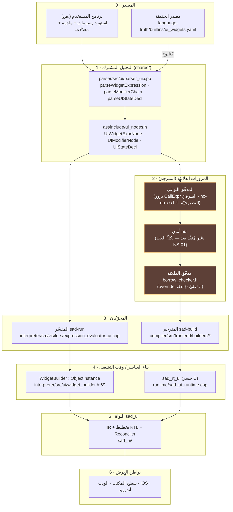
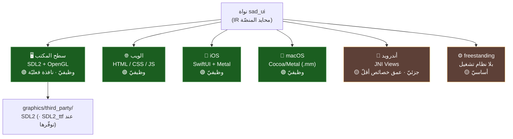
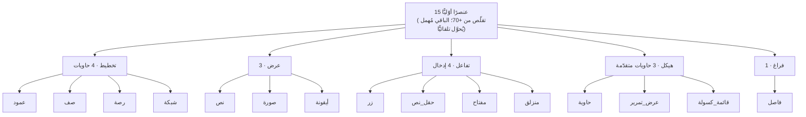
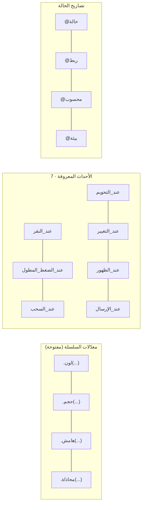
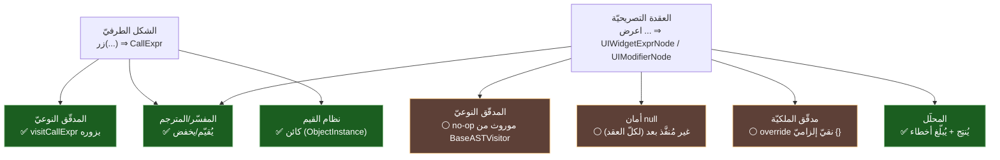

# 🧭 تقرير مسار الكود والالتزام — مكتبة الرسومات (SadUI)

> تقرير تقنيّ يتتبّع مسار الكود طبقةً طبقة، ويوثّق المنصّات والعناصر المدعومة، ويُجيب بدليل من الكود: **هل تلتزم المكتبة بنظام الأنواع والأخطاء والأمان والملكيّة؟**
>
> كلّ ادّعاء أدناه مدعوم بمسار ملفّ من مستودع الكود (`s-programming-language`).

---

## 1) طبقات الكود (من المصدر إلى الإطار)

> 🔎 الطبقة 2 ملوّنة تحذيريًّا عمدًا: مرورات المترجم الدلاليّة **لا تحلّل عقد UI التصريحيّة** (`UIWidgetExprNode`)، مع أنّ الشكل الطرفيّ `زر(...)` يُفحص نوعيًّا كـ`CallExpr` (تفصيل دقيق في §5).

---

## 2) المنصّات المدعومة (البواطن)

> ⚠️ **دقّة الحالة:** «وظيفيّ» تعني وجود باطن عرض عامل، لا «خلوّ من الفجوات». فحص آليّ لعلامات `TODO/stub` يُظهر فجوات في **كلّ** الباطنات (سطح المكتب 15، الويب 7، iOS 8، أندرويد 5، macOS 7، freestanding 7) — أيْ إنّ سطح المكتب (المُعتمَد) يحوي أكثرها، فلا تُقرأ «مكتمل» حرفيًّا. التمييز الحقيقيّ: سطح المكتب يفتح نافذة فعليّة ومتحقَّق طرفًا لطرف؛ أندرويد ناقص عمق الخصائص؛ freestanding أساسيّ.

| المنصّة | الباطن | الملفّات | الحالة | ملاحظة |
|---|---|:---:|:---:|---|
| سطح المكتب | SDL2 + OpenGL | `backends/desktop/` | 🟢 وظيفيّ | يفتح نافذة فعليّة؛ يربط `SDL2` (و`SDL2_ttf` **عند توفّرها** — غير مُورَّدة حاليًّا في الشجرة) |
| الويب | HTML/CSS/JS | `backends/web/` | 🟢 وظيفيّ | — |
| iOS | SwiftUI/Metal | `backends/ios/ios_renderer.mm` | 🟢 وظيفيّ | — |
| macOS | Cocoa/Metal | `backends/macos/macos_renderer.mm` | 🟢 وظيفيّ | كان مفقودًا من نسخة سابقة من التقرير |
| أندرويد | JNI مباشر | `backends/android/` | 🟡 جزئيّ | تغطية إنشاء 15/15 لكن عمق خصائص أقلّ |
| freestanding | بلا نظام تشغيل | `backends/freestanding/` | 🟡 أساسيّ | راسم مبسّط |

> ملاحظة ترجمة المترجم: مسار الربط المتحقَّق طرفًا لطرف هو **ويندوز/lld** (انظر تقرير إغلاق P0-3). ربط `SDL2_ttf` محروس بـ`!empty()` فيُتخطّى بصمت عند غيابه؛ وتعميم ربط الواجهات على POSIX شريحة قادمة (م-أ4ع).

---

## 3) العناصر المدعومة (الكتالوج الأوّليّ — 15، ADR-UI-02)

**المعدّلات والأحداث والحالة** (مكوّنات العنصر التصريحيّ):

| الفئة | العناصر | المصدر |
|---|---|---|
| تخطيط | عمود، صف، رصة، شبكة | `parser_ui.cpp` `knownWidgets` |
| عرض | نص، صورة، أيقونة | نفسه |
| تفاعل | زر، حقل_نص، مفتاح، منزلق | نفسه |
| هيكل | حاوية، عرض_تمرير، قائمة_كسولة | نفسه (`containerWidgets`) |
| فراغ | فاصل | نفسه |
| أحداث | 7 أحداث معروفة | `parser_ui.cpp` `knownEvents` |
| حالة | @حالة/@ربط/@محسوب/@بيئة | `parseUIStateDecl` |

> العناصر المُهملة (+55) تُقبَل بتحذير وتُحوَّل تلقائيًّا إلى الأوّليّ المعادل (`deprecatedWidgets`).

---

## 4) مسار الكود سرديًّا

1. **المصدر** يُحلَّل بالمحلّل المشترك (`shared/parser/src/ui/parser_ui.cpp`) إلى عقد AST (`shared/ast/include/ui_nodes.h`).
2. **المفسّر**: `expression_evaluator_ui.cpp` يحوّل `UIWidgetExprNode` إلى `WidgetBuilder` (يغلّف `IRNode`)، ويطبّق المعدّلات في `ui_widget_method_call.cpp`، ويَسِم القيمة كـ«كائن» عبر `ui_bridge.cpp`.
3. **المترجم**: يخفض المصانع في `builtins_ui.cpp` إلى تعليمات `BUILTIN_UI_*` (`compiler/include/frontend/sir_types.h`)، والمعدّلات في `call_method_dispatch.cpp`، ثمّ يُصدِر نداءات `sad_*` في `backend/llvm/builders/platform/ui_ops.cpp`.
4. **وقت التشغيل**: `runtime/sad_ui_runtime.cpp` يجسّر نداءات C إلى النواة `sad_ui`.
5. **النواة `sad_ui`**: IR + تخطيط RTL + Reconciler ⇒ بواطن العرض.

> الخريطة الكاملة للملفّات في [`../plan/`](../plan/)، ومخططات المعماريّة في [`../diagrams/`](../diagrams/).

---

## 5) الالتزام بالأنظمة المستعرضة (أنواع · أخطاء · أمان · ملكيّة)

> **الخلاصة:** العناصر **مواطنون من الدرجة الأولى في نظام القيم** (كائنات)، ونظام الأخطاء **موحَّد**. أمّا المرورات الدلاليّة الساكنة فلها **مساران يجب التمييز بينهما بدقّة**:
> 1. **الشكل الطرفيّ** `زر("احفظ")` (بلا `اعرض`) يُحلَّل إلى **`CallExpr`** عاديّ — والمدقّق النوعيّ **يزوره فعلًا** (`TypeChecker::visitCallExpr`، `type_checker.cpp:673`: يُحصي التعبير ويستدلّ أنواع الوسائط). فالعنصر **ليس** خارج الفحص الساكن كلّيًّا.
> 2. **عقد UI التصريحيّة** (`UIWidgetExprNode`/`UIModifierNode`) لا تُنتَج إلّا بعد الكلمة السياقيّة `اعرض` المتبوعة باسم عنصر معروف (`parser_expressions.cpp:1402`، `parser_main.cpp:1082`). **هذه** العقد تحديدًا تمرّ كلا-عمليّة في المرورات الساكنة.
>
> أيْ: الالتزام قائم على مستوى القيمة/وقت التشغيل، وقائم جزئيًّا على الفحص الساكن للشكل الطرفيّ (عبر CallExpr)، وغائب على مستوى الفحص الساكن **الخاصّ بعقد UI التصريحيّة**.

| النظام | الالتزام | الدليل من الكود |
|---|:---:|---|
| **نظام الأنواع** | ✅ قيمةً · ✅ الشكل الطرفيّ (CallExpr) · ⚠️ لا فحص خاصّ بعقد UI التصريحيّة | `WidgetBuilder : public Data::ObjectInstance` (`widget_builder.h:69`) ⇒ العنصر `Value::OBJECT` ⇒ `نوع(زر())`=«كائن». الشكل `زر(...)` يُزار عبر `visitCallExpr` (`type_checker.cpp:673`). أمّا `UIWidgetExprNode` فالأساس `ASTVisitor` يُصرّحه نقيًّا (`ast_visitor.h:947` `=0`)، و`TypeChecker : public BaseASTVisitor` (`type_checker.h:124`) يرث no-op من `BaseASTVisitor` (`ast_visitor.h:1098`) ولا يعرّف زائرًا خاصًّا |
| **نظام الأخطاء** | ✅ موحَّد | المحلّل يستخدم `consume(...)` برسائل خطأ نحويّ ثنائيّة اللغة (`parser_ui.cpp:242-316`) و`addError(...)` (`parser_ui_maps.cpp`)؛ المفسّر يرمي `ExecutionError` (كان `SEM004` رمز فشل أولويّة الموزِّع لـ`واجهة` غير القابلة للإنشاء، أُصلح في P0-2) |
| **أمان null** | 🟡 لا مُنفَّذ بعد (لكلّ العقد، لا UI فقط) | `NullSafetyAnalyzer` ليس زائرًا أصلًا — صنف مستقلّ بتعاوديّة `analyzeStmt/analyzeExpr` (`null_safety_analyzer.h:210, 245, 257`)، و**`analyze()` لا يفحص شيئًا بعد ويعيد نتيجة فارغة ناجحة** (NS-01، التوثيق في `null_safety_analyzer.h:207`). إذًا غياب فحص UI ليس استثناءً لـUI بل لأنّ التحليل كلّه لم يُبْنَ بعدُ |
| **الملكيّة (ownership/borrow)** | ❌ غير مُحلَّلة لعقد UI | `BorrowChecker : public AST::ASTVisitor` (`borrow_checker.h:124`) — يرث الأساس النقيّ، فيلزمه **إلزامًا** تعريف زوّار UI الأربعة النقيّة كـ no-op: `visitUIDeclaration`/`visitUIWidgetExpr`/`visitUIModifier`/`visitUIEventHandler` (`borrow_checker.h:226-229`، `override {}`) ⇒ تجاوز فعليّ لعقد UI (واجبٌ لقابليّة الإنشاء لا مجرّد اختيار تصميميّ) |

### أيّ مرور يلمس عقد UI؟

> 🔑 **تمييز جوهريّ:** الشكل الطرفيّ `زر("...")` (الأشيع، وهو ما يقيسه مثال `نوع(زر())`) هو **`CallExpr`** يَفحصه المدقّق النوعيّ فعلًا؛ بينما العقد التصريحيّة `UIWidgetExprNode` (بعد `اعرض`) هي وحدها التي تمرّ كلا-عمليّة. القول إنّ «الواجهات بلا فحص ساكن» مطلقًا **غير دقيق**.

### قراءة هندسيّة (تقييم أمين)

- **ليس عيبًا بالضرورة**: عقد UI تصريحيّة وتُخفَض إلى كائنات/نداءات وقت تشغيل؛ فالفحص الساكن الخاصّ بها قد يكون غير ضروريّ ما دامت تمرّ عبر نظام القيم العامّ ونظام الأنواع (الذي يَفحص الشكل الطرفيّ عبر `visitCallExpr`). يُلاحَظ أنّ أمان null لا يُطبَّق على أيّ عقدة بعدُ (مرور غير مبنيّ، NS-01)، فغيابه عن UI ليس تمييزًا ضدّ UI.
- **لكنّه فجوة محتملة**: لا يوجد فحص ساكن خاصّ بـUI (مثل: نوع وسيط معدّل، أو ملكيّة مُعالِج حدث يلتقط متغيّرًا). الأخطاء تظهر وقت التشغيل أو لا تظهر.
- **توصية للتخطيط**: إن أردنا ضمانات ساكنة للواجهات (تحقّق أنواع المعدّلات، أمان مُلتقَطات الأحداث)، فهي **شريحة تصميم مستقلّة** تُضيف زائرات UI حقيقيّة للمرورات الثلاث بدل اللا-عمليّة — تُوزَن مقابل كلفتها.

### أبعاد التزام إضافية (لم تكن مُقيَّمة)

| البُعد | الحالة | الدليل |
|---|:---:|---|
| **التزامن/أمان الخيوط** | 🟢 موجود في النواة | `command_queue.h`، `ui_event_loop.h` + ذرّيّات في `sad_ui/core/` ⇒ النواة تملك بنية طابور أوامر/حلقة أحداث (لم يُقيَّم سباقها بعد) |
| **إدارة الموارد** | 🟢 موجود | `image_cache.{h,cpp}` (تخزين مؤقّت للصور) في النواة |
| **RTL (من اليمين)** | 🟢 في التخطيط | `sad_ui/core/layout.h` + `ir.h` يحملان دلالة الاتجاه — متوافق مع طبيعة «لغة ص» العربيّة |
| **أمان null الفعليّ** | 🔴 غير مُنفَّذ | `analyze()` لا-عمليّ عالميًّا (NS-01) — ليس فجوة UI بل فجوة مرور كامل |

---

> ⚠️ محتوى **عامّ** — لا أرقام ماليّة ولا أسرار. راجع [GOVERNANCE.md](../../../GOVERNANCE.md).

