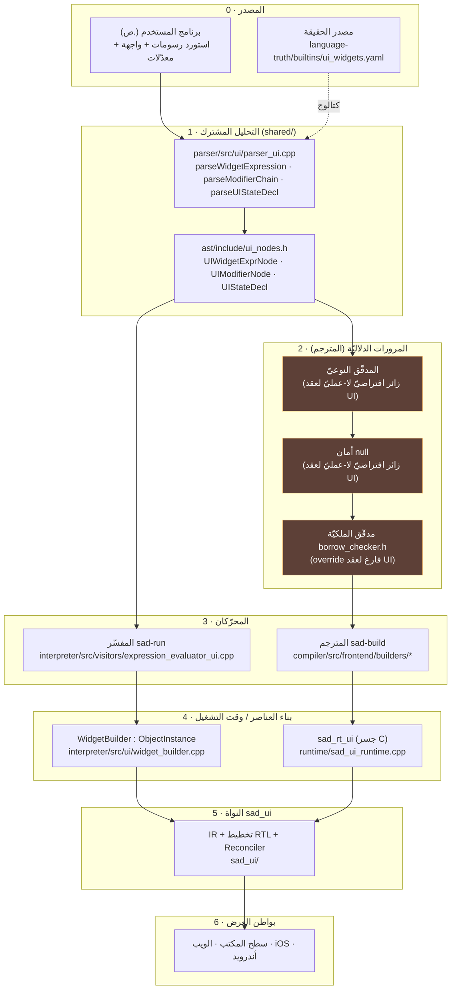
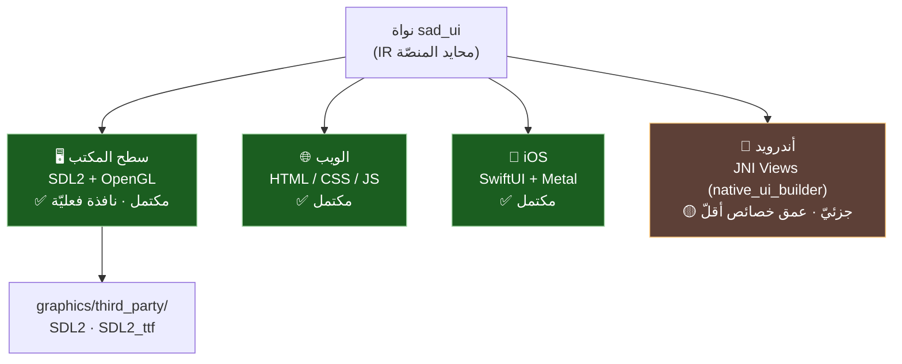
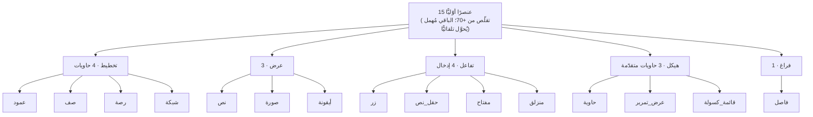
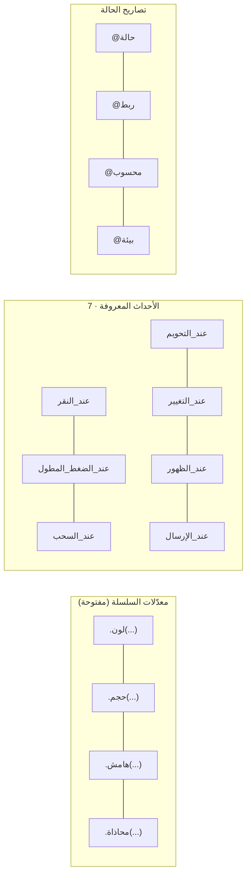
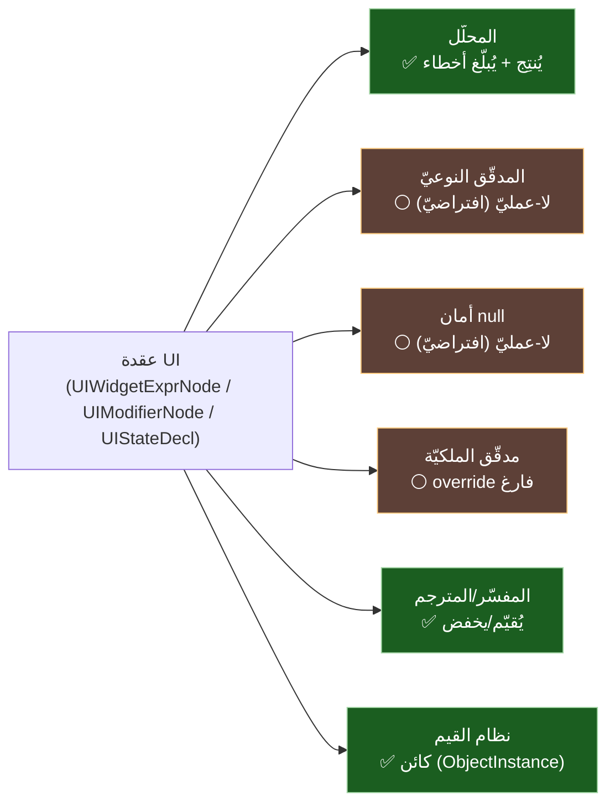

# 🧭 تقرير مسار الكود والالتزام — مكتبة الرسومات (SadUI)

> تقرير تقنيّ يتتبّع مسار الكود طبقةً طبقة، ويوثّق المنصّات والعناصر المدعومة، ويُجيب بدليل من الكود: **هل تلتزم المكتبة بنظام الأنواع والأخطاء والأمان والملكيّة؟**
>
> كلّ ادّعاء أدناه مدعوم بمسار ملفّ من مستودع الكود (`s-programming-language`).

---

## 1) طبقات الكود (من المصدر إلى الإطار)

> 🔎 الطبقة 2 ملوّنة تحذيريًّا عمدًا: مرورات المترجم الدلاليّة **لا تحلّل عقد UI** (تفصيل في §5).

---

## 2) المنصّات المدعومة (البواطن)

| المنصّة | الباطن | الحالة | ملاحظة |
|---|---|:---:|---|
| سطح المكتب | SDL2 + OpenGL | ✅ مكتمل | يفتح نافذة فعليّة؛ يربط `SDL2`/`SDL2_ttf` المُورَّدتين |
| الويب | HTML/CSS/JS | ✅ مكتمل | — |
| iOS | SwiftUI + Metal | ✅ مكتمل | — |
| أندرويد | JNI مباشر | 🟡 جزئيّ | تغطية إنشاء 15/15 لكن عمق خصائص أقلّ |

> ملاحظة ترجمة المترجم: مسار الربط المتحقَّق طرفًا لطرف هو **ويندوز/lld** (انظر تقرير إغلاق P0-3). تعميم ربط الواجهات على POSIX شريحة قادمة (م-أ4ع).

---

## 3) العناصر المدعومة (الكتالوج الأوّليّ — 15، ADR-UI-02)

**المعدّلات والأحداث والحالة** (مكوّنات العنصر التصريحيّ):

| الفئة | العناصر | المصدر |
|---|---|---|
| تخطيط | عمود، صف، رصة، شبكة | `parser_ui.cpp` `knownWidgets` |
| عرض | نص، صورة، أيقونة | نفسه |
| تفاعل | زر، حقل_نص، مفتاح، منزلق | نفسه |
| هيكل | حاوية، عرض_تمرير، قائمة_كسولة | نفسه (`containerWidgets`) |
| فراغ | فاصل | نفسه |
| أحداث | 7 أحداث معروفة | `parser_ui.cpp` `knownEvents` |
| حالة | @حالة/@ربط/@محسوب/@بيئة | `parseUIStateDecl` |

> العناصر المُهملة (+55) تُقبَل بتحذير وتُحوَّل تلقائيًّا إلى الأوّليّ المعادل (`deprecatedWidgets`).

---

## 4) مسار الكود سرديًّا

1. **المصدر** يُحلَّل بالمحلّل المشترك (`shared/parser/src/ui/parser_ui.cpp`) إلى عقد AST (`shared/ast/include/ui_nodes.h`).
2. **المفسّر**: `expression_evaluator_ui.cpp` يحوّل `UIWidgetExprNode` إلى `WidgetBuilder` (يغلّف `IRNode`)، ويطبّق المعدّلات في `ui_widget_method_call.cpp`، ويَسِم القيمة كـ«كائن» عبر `ui_bridge.cpp`.
3. **المترجم**: يخفض المصانع في `builtins_ui.cpp` إلى تعليمات `BUILTIN_UI_*` (`compiler/include/frontend/sir_types.h`)، والمعدّلات في `call_method_dispatch.cpp`، ثمّ يُصدِر نداءات `sad_*` في `backend/llvm/builders/platform/ui_ops.cpp`.
4. **وقت التشغيل**: `runtime/sad_ui_runtime.cpp` يجسّر نداءات C إلى النواة `sad_ui`.
5. **النواة `sad_ui`**: IR + تخطيط RTL + Reconciler ⇒ بواطن العرض.

> الخريطة الكاملة للملفّات في [`../plan/`](../plan/)، ومخططات المعماريّة في [`../diagrams/`](../diagrams/).

---

## 5) الالتزام بالأنظمة المستعرضة (أنواع · أخطاء · أمان · ملكيّة)

> **الخلاصة:** العناصر **مواطنون من الدرجة الأولى في نظام القيم** (كائنات)، ونظام الأخطاء **موحَّد**. لكنّ المرورات الدلاليّة الساكنة في المترجم (الأنواع/أمان null/الملكيّة) **لا تحلّل عقد UI** بل ترثها كزائرات لا-عمليّة. أيْ: الالتزام **قائم على مستوى القيمة ووقت التشغيل، غائب على مستوى الفحص الساكن الخاصّ بـUI**.

| النظام | الالتزام | الدليل من الكود |
|---|:---:|---|
| **نظام الأنواع** | ✅ قيمةً · ⚠️ لا فحص ساكن لعقد UI | `WidgetBuilder : public Data::ObjectInstance` (`widget_builder.h:69`) ⇒ العنصر `Value::OBJECT` ⇒ `نوع(زر())`=«كائن». المدقّق النوعيّ بلا زائر UI ⇒ يرث الافتراضيّ اللا-عمليّ (`ast_visitor.h:1098`) |
| **نظام الأخطاء** | ✅ موحَّد | المحلّل يستخدم `consume(...)` برسائل خطأ نحويّ ثنائيّة اللغة (`parser_ui.cpp:242-316`) و`addError(...)` (`parser_ui_maps.cpp`)؛ المفسّر يرمي `ExecutionError` (كان `SEM004` لـ`واجهة` غير القابلة للإنشاء، أُصلح في P0-2) |
| **أمان null** | 🟡 عامّ لا خاصّ | العناصر كائنات فينطبق أمان null العامّ على قيمها؛ لكنّ مرورات أمان null **بلا زائر UI** (0 تطابق) ⇒ لا فحص ساكن خاصّ بعقد UI |
| **الملكيّة (ownership/borrow)** | ❌ غير مُحلَّلة | `borrow_checker.h:227-228`: `visitUIWidgetExpr(...) override {}` و`visitUIModifier(...) override {}` ⇒ تجاوز صريح لعقد UI |

### أيّ مرور يلمس عقد UI؟

### قراءة هندسيّة (تقييم أمين)

- **ليس عيبًا بالضرورة**: عقد UI تصريحيّة وتُخفَض إلى كائنات/نداءات وقت تشغيل؛ فالفحص الساكن الخاصّ بها قد يكون غير ضروريّ ما دامت تمرّ عبر نظام القيم العامّ (الذي يُطبّق الأنواع/null على نتائجها).
- **لكنّه فجوة محتملة**: لا يوجد فحص ساكن خاصّ بـUI (مثل: نوع وسيط معدّل، أو ملكيّة مُعالِج حدث يلتقط متغيّرًا). الأخطاء تظهر وقت التشغيل أو لا تظهر.
- **توصية للتخطيط**: إن أردنا ضمانات ساكنة للواجهات (تحقّق أنواع المعدّلات، أمان مُلتقَطات الأحداث)، فهي **شريحة تصميم مستقلّة** تُضيف زائرات UI حقيقيّة للمرورات الثلاث بدل اللا-عمليّة — تُوزَن مقابل كلفتها.

---

> ⚠️ محتوى **عامّ** — لا أرقام ماليّة ولا أسرار. راجع [GOVERNANCE.md](../../../GOVERNANCE.md).

