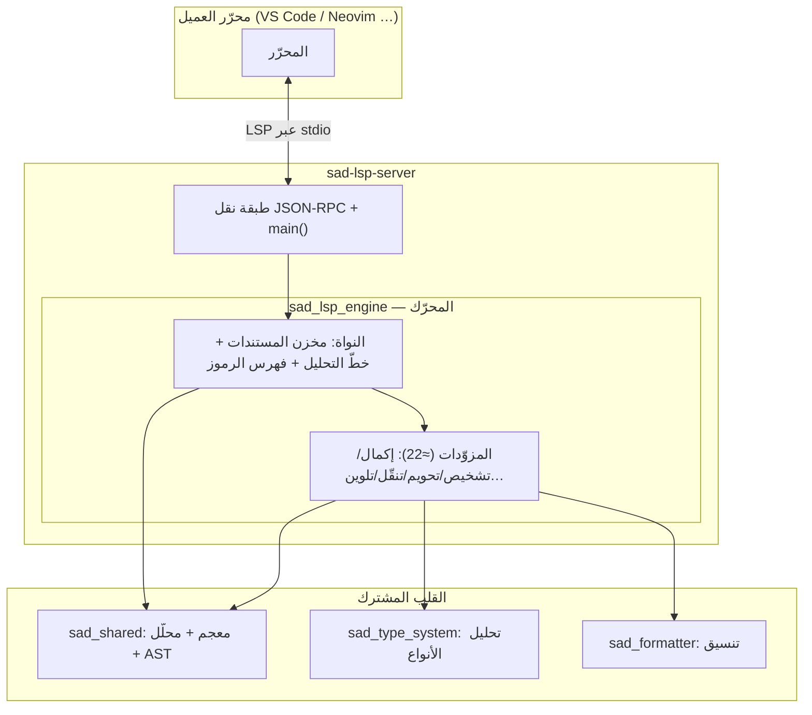
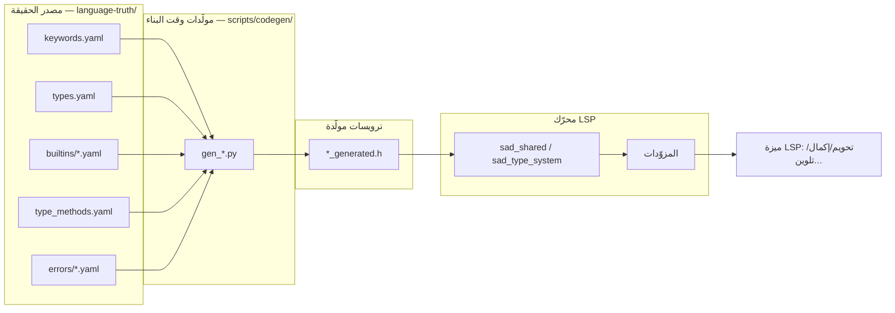
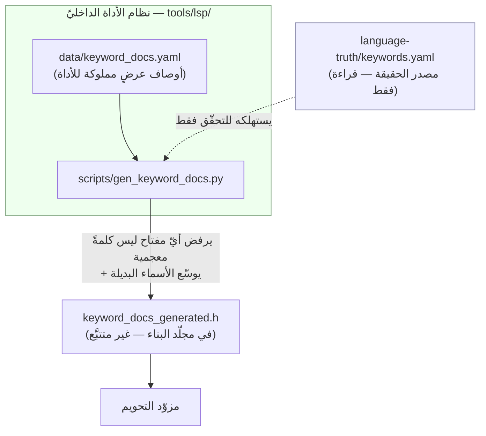
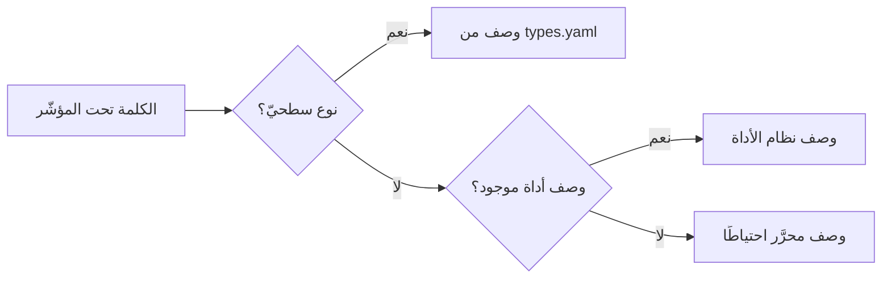
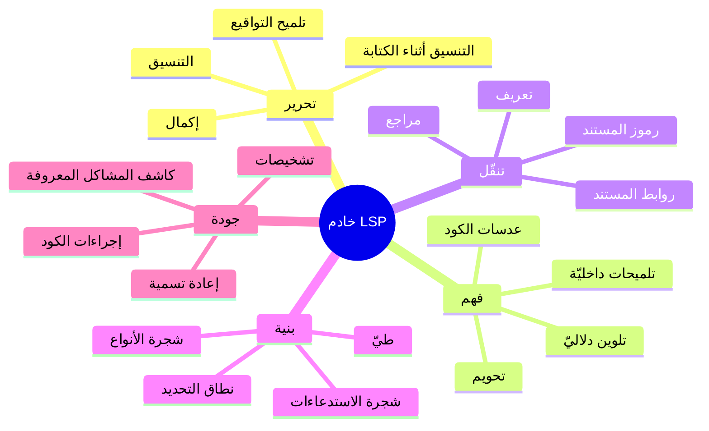
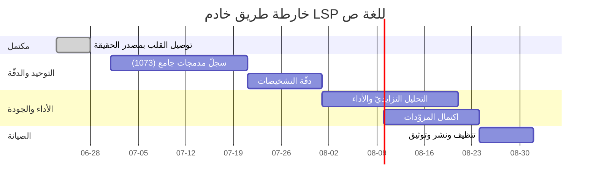
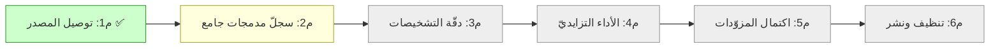

# 📊 مخططات خادم LSP للغة ص

مخططات تشغيليّة بصيغة **Mermaid** (نصّيّة، قابلة للمراجعة في PR). تغطّي: البنية، تدفّق البيانات من مصدر الحقيقة، نظام أوصاف الأداة، خريطة المزوّدات، وخارطة الطريق.

---

## 1) بنية المكوّنات

---

## 2) تدفّق البيانات — من مصدر الحقيقة إلى الميزة

> المبدأ: تغيير سطرٍ في `language-truth/` يَسري آليًّا إلى الميزة عبر إعادة التوليد — **دون تعديل كود الأداة**.

---

## 3) نظام أوصاف التحويم المملوك للأداة (يستهلك المصدر ولا يوسّعه)

### أولويّة وصف التحويم

---

## 4) خريطة المزوّدات

---

## 5) خارطة الطريق (Gantt)

---

## 6) حالة المعالم

