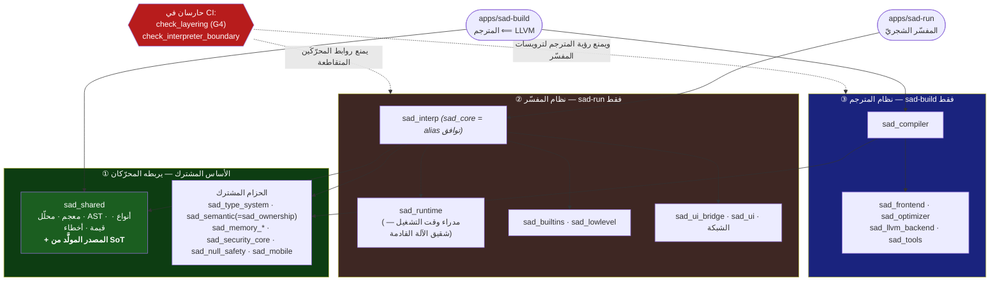
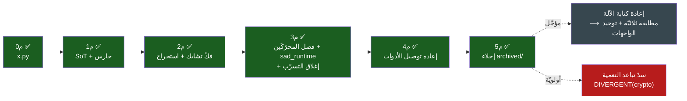

# 📐 مخطّطات القلب الموحَّد (RFC #10)

> مخطّطات Mermaid لطبقات الأهداف والحدود المفروضة وتقدّم المراحل. المرجع المعماريّ الكامل: **RFC sadlang-rfcs#10**.

---

## طبقات الأهداف والحدود المفروضة

---

## تقدّم المراحل

